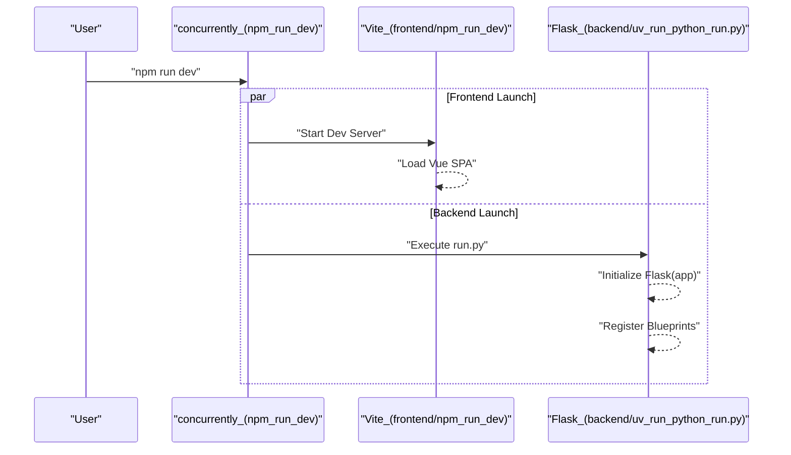

# Getting Started & Configuration

<details>
<summary>Relevant source files</summary>

The following files were used as context for generating this wiki page:

- [.dockerignore](https://github.com/666ghj/MiroFish/blob/1536a793/.dockerignore)
- [.env.example](https://github.com/666ghj/MiroFish/blob/1536a793/.env.example)
- [.github/workflows/docker-image.yml](https://github.com/666ghj/MiroFish/blob/1536a793/.github/workflows/docker-image.yml)
- [.gitignore](https://github.com/666ghj/MiroFish/blob/1536a793/.gitignore)
- [Dockerfile](https://github.com/666ghj/MiroFish/blob/1536a793/Dockerfile)
- [backend/pyproject.toml](https://github.com/666ghj/MiroFish/blob/1536a793/backend/pyproject.toml)
- [docker-compose.yml](https://github.com/666ghj/MiroFish/blob/1536a793/docker-compose.yml)
- [package-lock.json](https://github.com/666ghj/MiroFish/blob/1536a793/package-lock.json)
- [package.json](https://github.com/666ghj/MiroFish/blob/1536a793/package.json)

</details>


This page provides a comprehensive technical guide for setting up the MiroFish development environment and deploying the application using Docker. MiroFish is a decoupled full-stack application consisting of a Vue.js frontend and a Python Flask backend, integrated via a unified task management system.

## Environment Requirements

Before installation, ensure your system meets the following version requirements:

| Component | Requirement | Role |
| :--- | :--- | :--- |
| **Node.js** | `>= 18.0.0` | Powers the frontend build system and `concurrently` runner [package.json:15-18](https://github.com/666ghj/MiroFish/blob/1536a793/package.json#L15-L18). |
| **Python** | `>= 3.11` | Required for the Flask backend and OASIS simulation engine [backend/pyproject.toml:5-5](https://github.com/666ghj/MiroFish/blob/1536a793/backend/pyproject.toml#L5-L5). |
| **uv** | Latest | Fast Python package installer and resolver used in the backend [package.json:10-10](https://github.com/666ghj/MiroFish/blob/1536a793/package.json#L10-L10). |
| **npm** | Latest | Package manager for the root and frontend directories [package.json:6-6](https://github.com/666ghj/MiroFish/blob/1536a793/package.json#L6-L6). |

---

## Installation Steps

The project uses a root-level `package.json` to orchestrate dependencies across both the frontend and backend.

### 1. Clone the Repository
```bash
git clone https://github.com/666ghj/MiroFish.git
cd MiroFish
```

### 2. Install Dependencies
MiroFish provides helper scripts to automate the installation of Node modules and Python virtual environments.

*   **Complete Setup:** Runs `npm install` in the root and frontend, and `uv sync` in the backend [package.json:6-8](https://github.com/666ghj/MiroFish/blob/1536a793/package.json#L6-L8).
    ```bash
    npm run setup:all
    ```
*   **Manual Backend Setup:** Uses `uv` to create a synchronized environment based on `pyproject.toml` [backend/pyproject.toml:1-35](https://github.com/666ghj/MiroFish/blob/1536a793/backend/pyproject.toml#L1-L35).
    ```bash
    cd backend && uv sync
    ```
*   **Manual Frontend Setup:**
    ```bash
    cd frontend && npm install
    ```

### Dependency Data Flow
The following diagram illustrates how dependencies are managed across the system boundaries.

**Dependency Management Architecture**
```mermaid
graph TD
    subgraph ["Root_Directory"]
        ["package.json"] -- "npm_run_setup" --> ["node_modules_Root"]
        ["package.json"] -- "npm_run_setup:backend" --> ["Backend_Environment"]
    end

    subgraph ["Frontend_Workspace"]
        ["frontend/package.json"] -- "npm_install" --> ["frontend/node_modules"]
    end

    subgraph ["Backend_Workspace"]
        ["backend/pyproject.toml"] -- "uv_sync" --> ["venv_Python_3.11"]
        ["venv_Python_3.11"] --> ["flask_3.0.0"]
        ["venv_Python_3.11"] --> ["camel-oasis_0.2.5"]
        ["venv_Python_3.11"] --> ["zep-cloud_3.13.0"]
    end

    ["node_modules_Root"] -- "provides" --> ["concurrently"]
    ["concurrently"] -- "executes" --> ["npm_run_dev"]
```
Sources: [package.json:1-21](https://github.com/666ghj/MiroFish/blob/1536a793/package.json#L1-L21), [backend/pyproject.toml:1-35](https://github.com/666ghj/MiroFish/blob/1536a793/backend/pyproject.toml#L1-L35), [Dockerfile:13-21](https://github.com/666ghj/MiroFish/blob/1536a793/Dockerfile#L13-L21)

---

## Configuration (.env)

MiroFish requires external API keys for LLM reasoning and the Zep Cloud memory layer. Create a `.env` file in the root directory by copying `.env.example` [.env.example:1-16](https://github.com/666ghj/MiroFish/blob/1536a793/.env.example#L1-L16).

### Required Variables
| Variable | Description | Source/Recommendation |
| :--- | :--- | :--- |
| `LLM_API_KEY` | Primary API key for LLM operations. | Alibaba Bailian (qwen-plus) [.env.example:2-4](https://github.com/666ghj/MiroFish/blob/1536a793/.env.example#L2-L4). |
| `LLM_BASE_URL` | OpenAI-compatible endpoint URL. | `https://dashscope.aliyuncs.com/compatible-mode/v1` [.env.example:5-5](https://github.com/666ghj/MiroFish/blob/1536a793/.env.example#L5-L5). |
| `LLM_MODEL_NAME` | The specific model ID to use. | `qwen-plus` [.env.example:6-6](https://github.com/666ghj/MiroFish/blob/1536a793/.env.example#L6-L6). |
| `ZEP_API_KEY` | Key for Zep Cloud Knowledge Graph. | [getzep.com](https://app.getzep.com/) [.env.example:10-10](https://github.com/666ghj/MiroFish/blob/1536a793/.env.example#L10-L10). |

### Optional Acceleration
To speed up parallel operations (like persona generation), you can define a "Boost" LLM configuration [.env.example:12-16](https://github.com/666ghj/MiroFish/blob/1536a793/.env.example#L12-L16). If these keys are not present, the system defaults to the primary `LLM_API_KEY`.

Sources: [.env.example:1-16](https://github.com/666ghj/MiroFish/blob/1536a793/.env.example#L1-L16)

---

## Running the Application

### Development Mode
The `npm run dev` command uses `concurrently` to start both the Flask backend and the Vite-powered frontend simultaneously [package.json:9-9](https://github.com/666ghj/MiroFish/blob/1536a793/package.json#L9-L9).

```bash
npm run dev
```

*   **Frontend:** [http://localhost:3000](http://localhost:3000) [Dockerfile:26-26](https://github.com/666ghj/MiroFish/blob/1536a793/Dockerfile#L26-L26)
*   **Backend API:** [http://localhost:5001](http://localhost:5001) [Dockerfile:26-26](https://github.com/666ghj/MiroFish/blob/1536a793/Dockerfile#L26-L26)

### Execution Flow
The following diagram maps the startup command to the specific code entities responsible for the runtime.

**Runtime Execution Map**

Sources: [package.json:9-11](https://github.com/666ghj/MiroFish/blob/1536a793/package.json#L9-L11), [Dockerfile:28-29](https://github.com/666ghj/MiroFish/blob/1536a793/Dockerfile#L28-L29)

---

## Docker Deployment

MiroFish provides a `Dockerfile` and `docker-compose.yml` for containerized deployment.

### Dockerfile Specification
The `Dockerfile` uses a multi-stage-like approach within a Python 3.11 base:
1.  **Node.js Installation:** Installs Node.js >= 18 for frontend building [Dockerfile:3-6](https://github.com/666ghj/MiroFish/blob/1536a793/Dockerfile#L3-L6).
2.  **uv Integration:** Copies the `uv` binary from the official Astral image for fast Python dependency resolution [Dockerfile:9-9](https://github.com/666ghj/MiroFish/blob/1536a793/Dockerfile#L9-L9).
3.  **Dependency Caching:** Copies `package.json` and `pyproject.toml` files first to leverage Docker layer caching [Dockerfile:14-16](https://github.com/666ghj/MiroFish/blob/1536a793/Dockerfile#L14-L16).
4.  **Sync:** Runs `npm ci` and `uv sync --frozen` to ensure reproducible builds [Dockerfile:19-21](https://github.com/666ghj/MiroFish/blob/1536a793/Dockerfile#L19-L21).

### Docker Compose
To deploy the entire stack with a single command:

```bash
docker-compose up -d
```

**Configuration in `docker-compose.yml`:**
*   **Image:** `ghcr.io/666ghj/mirofish:latest` [docker-compose.yml:3-3](https://github.com/666ghj/MiroFish/blob/1536a793/docker-compose.yml#L3-L3).
*   **Environment:** Loads the `.env` file from the host [docker-compose.yml:7-8](https://github.com/666ghj/MiroFish/blob/1536a793/docker-compose.yml#L7-L8).
*   **Persistence:** Mounts `./backend/uploads` to `/app/backend/uploads` to persist uploaded documents and simulation logs [docker-compose.yml:13-14](https://github.com/666ghj/MiroFish/blob/1536a793/docker-compose.yml#L13-L14).
*   **Ports:** Maps `3000` (Web UI) and `5001` (API) [docker-compose.yml:10-11](https://github.com/666ghj/MiroFish/blob/1536a793/docker-compose.yml#L10-L11).

Sources: [Dockerfile:1-29](https://github.com/666ghj/MiroFish/blob/1536a793/Dockerfile#L1-L29), [docker-compose.yml:1-14](https://github.com/666ghj/MiroFish/blob/1536a793/docker-compose.yml#L1-L14), [.dockerignore:1-24](https://github.com/666ghj/MiroFish/blob/1536a793/.dockerignore#L1-L24)
