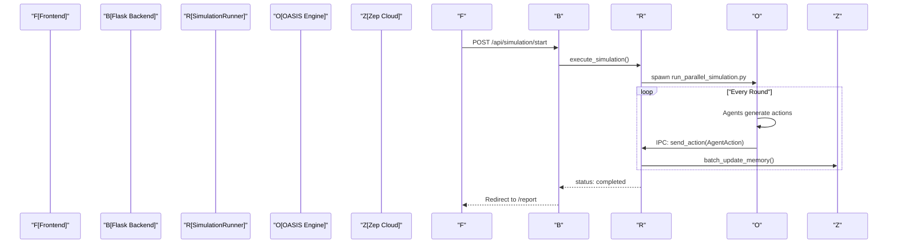

# System Architecture

<details>
<summary>Relevant source files</summary>

The following files were used as context for generating this wiki page:

- [README-EN.md](https://github.com/666ghj/MiroFish/blob/1536a793/README-EN.md)
- [README.md](https://github.com/666ghj/MiroFish/blob/1536a793/README.md)
- [backend/app/__init__.py](https://github.com/666ghj/MiroFish/blob/1536a793/backend/app/__init__.py)
- [backend/app/api/__init__.py](https://github.com/666ghj/MiroFish/blob/1536a793/backend/app/api/__init__.py)
- [backend/app/config.py](https://github.com/666ghj/MiroFish/blob/1536a793/backend/app/config.py)
- [backend/app/models/task.py](https://github.com/666ghj/MiroFish/blob/1536a793/backend/app/models/task.py)
- [backend/app/services/ontology_generator.py](https://github.com/666ghj/MiroFish/blob/1536a793/backend/app/services/ontology_generator.py)
- [backend/app/utils/logger.py](https://github.com/666ghj/MiroFish/blob/1536a793/backend/app/utils/logger.py)
- [backend/run.py](https://github.com/666ghj/MiroFish/blob/1536a793/backend/run.py)
- [static/image/shanda_logo.png](https://github.com/666ghj/MiroFish/blob/1536a793/static/image/shanda_logo.png)

</details>


The MiroFish system is built on a decoupled architecture that separates the user interface, simulation management, and knowledge processing layers. It utilizes a Node.js/Vue.js frontend for workflow orchestration and a Python/Flask backend for heavy-duty LLM processing and simulation execution. The system integrates with **Zep Cloud** for persistent GraphRAG memory and the **OASIS** engine for multi-agent social media simulation.

## High-Level Component Overview

The architecture is divided into three primary tiers:
1.  **Frontend (Port 3000)**: A Vue.js Single Page Application (SPA) that manages the five-stage simulation lifecycle.
2.  **Backend (Port 5001)**: A Flask REST API that handles document processing, graph construction, and simulation control.
3.  **External Services**: Zep Cloud (Graph Database & Memory) and OpenAI-compatible LLM providers.

### System Deployment Diagram

"System Deployment and Communication"
```mermaid
graph TD
    subgraph "Client Side (Port 3000)"
        "Vue_SPA[Vue.js SPA]"
        "Vue_Router[Vue Router]"
        "API_Client[Frontend API Layer]"
    end

    subgraph "Server Side (Port 5001)"
        "Flask_App[Flask Backend]"
        "Blueprint_Graph[/api/graph]"
        "Blueprint_Sim[/api/simulation]"
        "Blueprint_Report[/api/report]"
        "Task_Mgr[TaskManager]"
        "Sim_Runner[SimulationRunner]"
    end

    subgraph "External Infrastructure"
        "Zep_Cloud[Zep Cloud Graph Memory]"
        "LLM_API[LLM Provider / OpenAI]"
    end

    "Vue_SPA" --> "Vue_Router"
    "Vue_SPA" --> "API_Client"
    "API_Client" -- "HTTP/JSON" --> "Flask_App"
    
    "Flask_App" --> "Blueprint_Graph"
    "Flask_App" --> "Blueprint_Sim"
    "Flask_App" --> "Blueprint_Report"
    
    "Blueprint_Graph" --> "Task_Mgr"
    "Blueprint_Sim" --> "Sim_Runner"
    
    "Flask_App" -- "gRPC/REST" --> "Zep_Cloud"
    "Flask_App" -- "HTTPS" --> "LLM_API"
```
Sources: [backend/run.py:40-45](https://github.com/666ghj/MiroFish/blob/1536a793/backend/run.py#L40-L45), [backend/app/__init__.py:65-69](https://github.com/666ghj/MiroFish/blob/1536a793/backend/app/__init__.py#L65-L69), [README.md:150-156](https://github.com/666ghj/MiroFish/blob/1536a793/README.md#L150-L156)

---

## Backend Domain Architecture

The backend is organized into three distinct API blueprints, each responsible for a specific domain of the MiroFish lifecycle.

### 1. Graph Domain (`/api/graph`)
Responsible for converting raw documents into a structured Knowledge Graph.
*   **Key Services**: `OntologyGenerator` [backend/app/services/ontology_generator.py:158-162](https://github.com/666ghj/MiroFish/blob/1536a793/backend/app/services/ontology_generator.py#L158-L162), `GraphBuilderService`.
*   **Data Flow**: Document Text -> `OntologyGenerator` (LLM) -> Schema -> `GraphBuilderService` -> Zep Cloud.
*   **Asynchronous Handling**: Uses `TaskManager` [backend/app/models/task.py:54-58](https://github.com/666ghj/MiroFish/blob/1536a793/backend/app/models/task.py#L54-L58) to track long-running graph ingestion tasks.

### 2. Simulation Domain (`/api/simulation`)
Manages the preparation and execution of multi-agent social media simulations.
*   **Key Services**: `SimulationManager`, `OasisProfileGenerator`, `SimulationRunner` [backend/app/services/simulation_runner.py:46-47](https://github.com/666ghj/MiroFish/blob/1536a793/backend/app/services/simulation_runner.py#L46-L47).
*   **OASIS Integration**: Generates platform-specific profiles (Twitter CSV, Reddit JSON) and launches parallel simulation scripts via `SimulationRunner`.
*   **Persistence**: Simulation state is stored in `OASIS_SIMULATION_DATA_DIR` [backend/app/config.py:49-49](https://github.com/666ghj/MiroFish/blob/1536a793/backend/app/config.py#L49-L49).

### 3. Report Domain (`/api/report`)
Analyzes simulation results and provides an interactive interface for querying agents.
*   **Key Services**: `ReportAgent`, `ZepToolsService`.
*   **Mechanism**: Uses a ReACT reasoning loop to query Zep Cloud memory and generate insights [backend/app/config.py:61-64](https://github.com/666ghj/MiroFish/blob/1536a793/backend/app/config.py#L61-L64).

"Backend Service Logic Map"
```mermaid
graph LR
    subgraph "API Blueprints"
        "graph_bp[graph_bp]"
        "simulation_bp[simulation_bp]"
        "report_bp[report_bp]"
    end

    subgraph "Core Services"
        "OntoGen[OntologyGenerator]"
        "GraphBuild[GraphBuilderService]"
        "SimMgr[SimulationManager]"
        "SimRun[SimulationRunner]"
        "ZepMem[ZepGraphMemoryUpdater]"
    end

    "graph_bp" --> "OntoGen"
    "graph_bp" --> "GraphBuild"
    "simulation_bp" --> "SimMgr"
    "simulation_bp" --> "SimRun"
    "SimRun" --> "ZepMem"
    "report_bp" --> "ZepMem"
```
Sources: [backend/app/__init__.py:65-69](https://github.com/666ghj/MiroFish/blob/1536a793/backend/app/__init__.py#L65-L69), [backend/app/api/__init__.py:7-9](https://github.com/666ghj/MiroFish/blob/1536a793/backend/app/api/__init__.py#L7-L9)

---

## Memory Layer: Zep Cloud Integration

Zep Cloud serves as the central nervous system for MiroFish, providing persistent graph storage and retrieval.

*   **Entity Extraction**: The `ZepEntityReader` pulls nodes and edges from Zep to inform agent persona generation.
*   **Action Sync**: As agents perform actions (e.g., `CREATE_POST`, `LIKE_POST`), the `ZepGraphMemoryUpdater` converts these activities into episodes and syncs them back to Zep in batches.
*   **Configuration**: API keys and connection settings are managed via the `Config` class [backend/app/config.py:35-36](https://github.com/666ghj/MiroFish/blob/1536a793/backend/app/config.py#L35-L36).

---

## Process Lifecycle & Data Flow

The system follows a strict linear progression reflected in both the frontend routes and backend task management.

| Stage | Frontend View | Backend Blueprint | Key Code Entity |
| :--- | :--- | :--- | :--- |
| **Initialization** | `Home.vue` | N/A | `ProjectManager` |
| **Graph Build** | `MainView.vue` | `/api/graph` | `OntologyGenerator`, `GraphBuilderService` |
| **Env Setup** | `SimulationView.vue` | `/api/simulation` | `OasisProfileGenerator`, `SimulationConfigGenerator` |
| **Execution** | `SimulationRunView.vue` | `/api/simulation` | `SimulationRunner`, `ParallelIPCHandler` |
| **Analysis** | `ReportView.vue` | `/api/report` | `ReportAgent`, `ZepToolsService` |

### Detailed Execution Flow (Step 3: Simulation)
When a simulation starts, the `SimulationRunner` initiates a parallel process. Communication between the main Flask app and the simulation sub-processes is handled via an IPC (Inter-Process Communication) layer.

"Simulation IPC and Data Flow"

Sources: [backend/app/__init__.py:46-47](https://github.com/666ghj/MiroFish/blob/1536a793/backend/app/__init__.py#L46-L47), [README-EN.md:87-92](https://github.com/666ghj/MiroFish/blob/1536a793/README-EN.md#L87-L92)

---

## Technical Infrastructure

### Configuration Management
The system uses a unified `.env` file located at the project root [backend/app/config.py:11-14](https://github.com/666ghj/MiroFish/blob/1536a793/backend/app/config.py#L11-L14). The `Config` class [backend/app/config.py:20-65](https://github.com/666ghj/MiroFish/blob/1536a793/backend/app/config.py#L20-L65) loads these variables, including:
*   **LLM Settings**: `LLM_API_KEY`, `LLM_BASE_URL`, `LLM_MODEL_NAME` [backend/app/config.py:31-33](https://github.com/666ghj/MiroFish/blob/1536a793/backend/app/config.py#L31-L33).
*   **File Constraints**: `MAX_CONTENT_LENGTH` (50MB) [backend/app/config.py:39-39](https://github.com/666ghj/MiroFish/blob/1536a793/backend/app/config.py#L39-L39).
*   **OASIS Actions**: Predefined lists for Twitter (`CREATE_POST`, `REPOST`, etc.) and Reddit (`SEARCH_POSTS`, `TREND`, etc.) [backend/app/config.py:52-59](https://github.com/666ghj/MiroFish/blob/1536a793/backend/app/config.py#L52-L59).

### Logging and Error Handling
The backend implements a `RotatingFileHandler` via `setup_logger` [backend/app/utils/logger.py:30-40](https://github.com/666ghj/MiroFish/blob/1536a793/backend/app/utils/logger.py#L30-L40). It provides:
1.  **Console Logging**: Clean, high-level info for the developer [backend/app/utils/logger.py:77-82](https://github.com/666ghj/MiroFish/blob/1536a793/backend/app/utils/logger.py#L77-L82).
2.  **File Logging**: Detailed debug logs with timestamps and line numbers, stored in `/logs` [backend/app/utils/logger.py:66-75](https://github.com/666ghj/MiroFish/blob/1536a793/backend/app/utils/logger.py#L66-L75).
3.  **UTF-8 Support**: Explicit reconfiguration for Windows consoles to prevent encoding issues [backend/app/utils/logger.py:13-23](https://github.com/666ghj/MiroFish/blob/1536a793/backend/app/utils/logger.py#L13-L23).

Sources: [backend/run.py:28-34](https://github.com/666ghj/MiroFish/blob/1536a793/backend/run.py#L28-L34), [backend/app/config.py:67-74](https://github.com/666ghj/MiroFish/blob/1536a793/backend/app/config.py#L67-L74), [backend/app/utils/logger.py:1-108](https://github.com/666ghj/MiroFish/blob/1536a793/backend/app/utils/logger.py#L1-L108)
