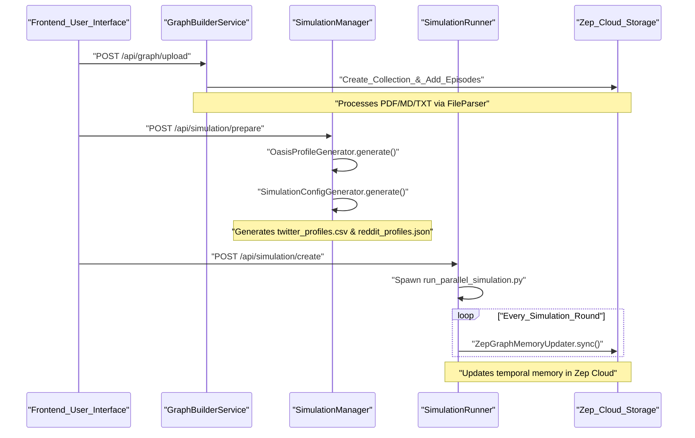

# MiroFish Overview

<details>
<summary>Relevant source files</summary>

The following files were used as context for generating this wiki page:

- [.dockerignore](https://github.com/666ghj/MiroFish/blob/1536a793/.dockerignore)
- [.github/workflows/docker-image.yml](https://github.com/666ghj/MiroFish/blob/1536a793/.github/workflows/docker-image.yml)
- [Dockerfile](https://github.com/666ghj/MiroFish/blob/1536a793/Dockerfile)
- [README-EN.md](https://github.com/666ghj/MiroFish/blob/1536a793/README-EN.md)
- [README.md](https://github.com/666ghj/MiroFish/blob/1536a793/README.md)
- [backend/pyproject.toml](https://github.com/666ghj/MiroFish/blob/1536a793/backend/pyproject.toml)
- [docker-compose.yml](https://github.com/666ghj/MiroFish/blob/1536a793/docker-compose.yml)
- [package-lock.json](https://github.com/666ghj/MiroFish/blob/1536a793/package-lock.json)
- [package.json](https://github.com/666ghj/MiroFish/blob/1536a793/package.json)
- [static/image/shanda_logo.png](https://github.com/666ghj/MiroFish/blob/1536a793/static/image/shanda_logo.png)

</details>


**MiroFish** is a next-generation swarm intelligence engine designed to create high-fidelity digital simulations of real-world scenarios. By ingesting "seed" materials—such as news articles, policy drafts, or financial reports—MiroFish automatically constructs a parallel world populated by thousands of autonomous agents. These agents possess independent personalities, long-term memories, and behavioral logic, allowing them to interact and evolve socially to predict future outcomes. [README.md:27-32](https://github.com/666ghj/MiroFish/blob/1536a793/README.md#L27-L32), [README-EN.md:27-32](https://github.com/666ghj/MiroFish/blob/1536a793/README-EN.md#L27-L32)

The system serves as a "digital sandbox" where users can observe emergent behaviors from a "God's-eye view" and inject variables to test policy risks, public relations strategies, or creative narratives. [README-EN.md:38-41](https://github.com/666ghj/MiroFish/blob/1536a793/README-EN.md#L38-L41)

## 🔄 The Five-Stage Simulation Lifecycle

MiroFish operates through a structured workflow that transitions from raw data to deep analytical insights:

1.  **Graph Building**: Extraction of entities and relationships from source documents to build a Knowledge Graph (GraphRAG) and inject collective memory. [README-EN.md:88](https://github.com/666ghj/MiroFish/blob/1536a793/README-EN.md#L88)
2.  **Environment Setup**: Generation of agent personas and platform configurations (Twitter/Reddit) based on the extracted ontology. [README-EN.md:89](https://github.com/666ghj/MiroFish/blob/1536a793/README-EN.md#L89)
3.  **Simulation Execution**: Parallel execution of multi-agent interactions across simulated social platforms, with dynamic temporal memory updates. [README-EN.md:90](https://github.com/666ghj/MiroFish/blob/1536a793/README-EN.md#L90)
4.  **Report Generation**: The `ReportAgent` uses a specialized toolset to analyze simulation logs and generate comprehensive predictive reports. [README-EN.md:91](https://github.com/666ghj/MiroFish/blob/1536a793/README-EN.md#L91)
5.  **Deep Interaction**: A post-simulation phase where users can chat directly with any agent or the `ReportAgent` to explore specific nuances. [README-EN.md:92](https://github.com/666ghj/MiroFish/blob/1536a793/README-EN.md#L92)

Sources: [README.md:86-93](https://github.com/666ghj/MiroFish/blob/1536a793/README.md#L86-L93), [README-EN.md:87-92](https://github.com/666ghj/MiroFish/blob/1536a793/README-EN.md#L87-L92)

---

## 🛠 Tech Stack

MiroFish utilizes a decoupled architecture combining modern web technologies with advanced AI orchestration:

| Component | Technology |
| :--- | :--- |
| **Frontend** | Vue.js 3, Vite, D3.js (Visualization), Tailwind CSS |
| **Backend** | Python 3.11+, Flask (REST API), UV (Package Management) |
| **Simulation Engine** | [OASIS](https://github.com/camel-ai/oasis) (by CAMEL-AI) |
| **Memory Layer** | Zep Cloud (GraphRAG & Episode Storage) |
| **LLM Orchestration** | OpenAI-compatible SDK (supports GPT-4o, Qwen-plus, etc.) |

Sources: [package.json:1-21](https://github.com/666ghj/MiroFish/blob/1536a793/package.json#L1-L21), [backend/pyproject.toml:11-35](https://github.com/666ghj/MiroFish/blob/1536a793/backend/pyproject.toml#L11-L35), [Dockerfile:1-11](https://github.com/666ghj/MiroFish/blob/1536a793/Dockerfile#L1-L11)

---

## 🏗 System Integration

The system is split into a **Node.js-based frontend** (port 3000) and a **Python/Flask backend** (port 5001). The frontend provides a step-by-step wizard to guide the user through the simulation lifecycle, while the backend manages long-running tasks like document processing, LLM-based persona generation, and simulation execution. [package.json:9-11](https://github.com/666ghj/MiroFish/blob/1536a793/package.json#L9-L11), [docker-compose.yml:9-11](https://github.com/666ghj/MiroFish/blob/1536a793/docker-compose.yml#L9-L11)

### High-Level Component Interaction

This diagram illustrates how the primary code entities bridge the gap between user intent and the underlying simulation engine.

**Diagram: System Entity Mapping**
```mermaid
graph TD
    subgraph "Frontend_Vue_App"
        [UI_Components] --> ["API_Modules (frontend/src/api/)"]
        ["Store_State"] -.-> [UI_Components]
    end

    subgraph "Backend_Flask_Server"
        ["API_Modules (frontend/src/api/)"] -- "REST_Requests" --> ["Blueprints (backend/app/api/)"]
        ["Blueprints (backend/app/api/)"] --> ["SimulationManager (backend/app/services/simulation_manager.py)"]
        ["Blueprints (backend/app/api/)"] --> ["GraphBuilderService (backend/app/services/graph_builder_service.py)"]
        
        ["SimulationManager (backend/app/services/simulation_manager.py)"] --> ["SimulationRunner (backend/app/services/simulation_runner.py)"]
        ["SimulationRunner (backend/app/services/simulation_runner.py)"] -- "Subprocess_Spawn" --> ["OASIS_Scripts (run_parallel_simulation.py)"]
    end

    subgraph "External_Cloud_Services"
        ["GraphBuilderService (backend/app/services/graph_builder_service.py)"] -- "GraphRAG_Storage" --> ["Zep_Cloud_API"]
        ["SimulationRunner (backend/app/services/simulation_runner.py)"] -- "LLM_Inference" --> ["LLM_Provider_Endpoint"]
    end
```
Sources: [package.json:9-11](https://github.com/666ghj/MiroFish/blob/1536a793/package.json#L9-L11), [Dockerfile:26-29](https://github.com/666ghj/MiroFish/blob/1536a793/Dockerfile#L26-L29), [README-EN.md:118-128](https://github.com/666ghj/MiroFish/blob/1536a793/README-EN.md#L118-L128)

### Simulation Workflow Logic

The following diagram maps the logical stages of the simulation to the specific backend services and configuration entities defined in the code.

**Diagram: Workflow to Code Mapping**

Sources: [README-EN.md:87-92](https://github.com/666ghj/MiroFish/blob/1536a793/README-EN.md#L87-L92), [backend/pyproject.toml:20-24](https://github.com/666ghj/MiroFish/blob/1536a793/backend/pyproject.toml#L20-L24), [docker-compose.yml:13-14](https://github.com/666ghj/MiroFish/blob/1536a793/docker-compose.yml#L13-L14)

---

## 📖 Major Child Sections

For detailed technical documentation, please refer to the following sub-pages:

*   **[Getting Started & Configuration](1-1-getting-started-configuration.md)**: Step-by-step setup guide covering environment variables like `LLM_API_KEY` and `ZEP_API_KEY`, dependency installation via `npm` and `uv`, and deployment options including Docker. [README-EN.md:94-178](https://github.com/666ghj/MiroFish/blob/1536a793/README-EN.md#L94-L178)
*   **[System Architecture](1-2-system-architecture.md)**: Deep dive into the backend architecture, the three primary API blueprints (`graph`, `simulation`, `report`), and the integration of the OASIS engine and Zep Cloud. [README-EN.md:191-193](https://github.com/666ghj/MiroFish/blob/1536a793/README-EN.md#L191-L193)
