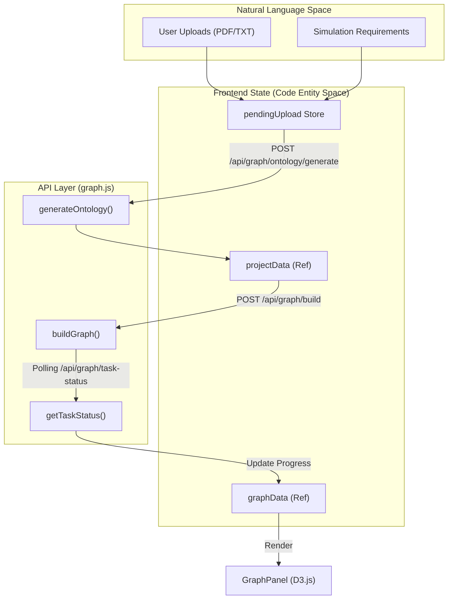
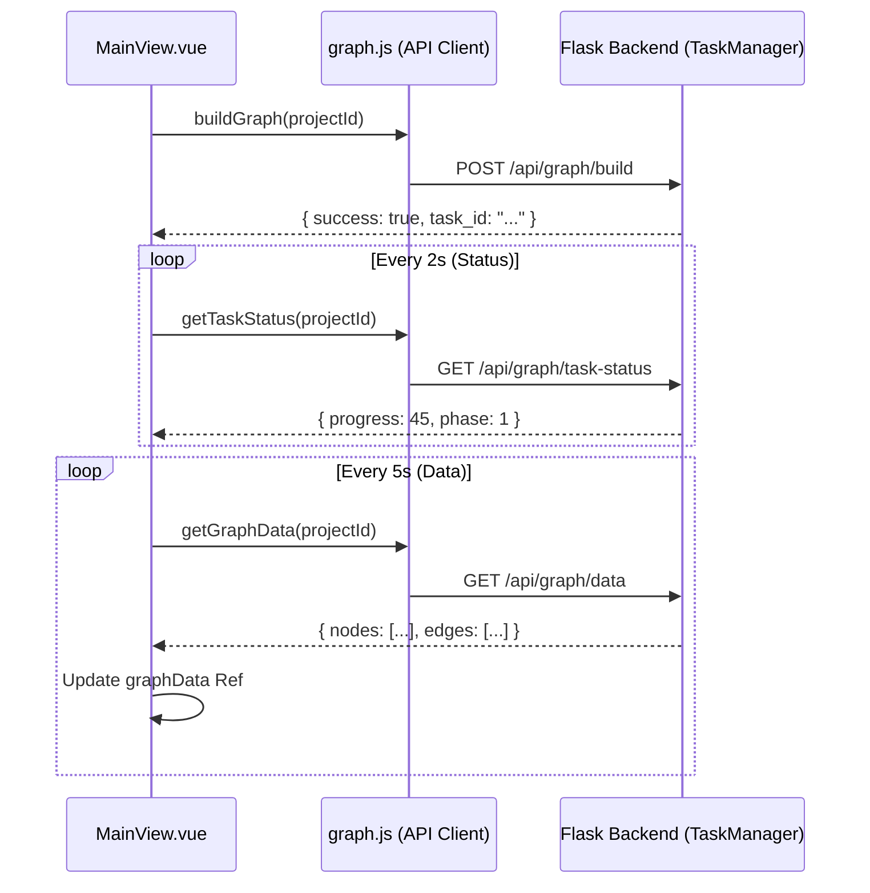

# Graph Construction UI (Step 1)

Relevant source files

The following files were used as context for generating this wiki page:

- [frontend/src/components/GraphPanel.vue](https://github.com/666ghj/MiroFish/blob/1536a793/frontend/src/components/GraphPanel.vue)
- [frontend/src/components/Step1GraphBuild.vue](https://github.com/666ghj/MiroFish/blob/1536a793/frontend/src/components/Step1GraphBuild.vue)
- [frontend/src/views/MainView.vue](https://github.com/666ghj/MiroFish/blob/1536a793/frontend/src/views/MainView.vue)

This page details the implementation of the first stage of the MiroFish simulation lifecycle: Knowledge Graph construction. This phase involves transforming raw uploaded documents into a structured GraphRAG (Retrieval-Augmented Generation) memory layer using LLM-driven ontology generation and entity extraction.

## Overview of Step 1 Workflow

The Graph Construction UI is primarily managed by `MainView.vue`, which acts as the layout orchestrator, and `Step1GraphBuild.vue`, which provides the step-by-step controls. The process is divided into two major phases: **Ontology Generation** and **Graph Building**.

### Component Hierarchy
- **MainView.vue**: The parent container managing the split-view layout and global polling state [frontend/src/views/MainView.vue:36-73](https://github.com/666ghj/MiroFish/blob/1536a793/frontend/src/views/MainView.vue#L36-L73).
- **GraphPanel.vue**: A D3.js-based visualization component that renders the knowledge graph in real-time [frontend/src/components/GraphPanel.vue:1-20](https://github.com/666ghj/MiroFish/blob/1536a793/frontend/src/components/GraphPanel.vue#L1-L20).
- **Step1GraphBuild.vue**: The functional workbench for Step 1, displaying ontology tags, build progress, and navigation to Step 2 [frontend/src/components/Step1GraphBuild.vue:1-168](https://github.com/666ghj/MiroFish/blob/1536a793/frontend/src/components/Step1GraphBuild.vue#L1-L168).

### Data Flow: Natural Language to Graph Entities
The following diagram illustrates how natural language requirements and documents are processed into code entities and visualized in the UI.

**Data Transformation Diagram**

**Sources:** [frontend/src/views/MainView.vue:180-230](https://github.com/666ghj/MiroFish/blob/1536a793/frontend/src/views/MainView.vue#L180-L230), [frontend/src/api/graph.js:1-30](https://github.com/666ghj/MiroFish/blob/1536a793/frontend/src/api/graph.js#L1-L30), [frontend/src/store/pendingUpload.js:1-20](https://github.com/666ghj/MiroFish/blob/1536a793/frontend/src/store/pendingUpload.js#L1-L20)

---

## Split-View Layout Implementation

`MainView.vue` implements a dynamic layout system using three modes: `graph`, `split`, and `workbench` [frontend/src/views/MainView.vue:90-94](https://github.com/666ghj/MiroFish/blob/1536a793/frontend/src/views/MainView.vue#L90-L94).

- **Split Mode**: The default view where `GraphPanel` (Left) and `Step1GraphBuild` (Right) share the screen 50/50 [frontend/src/views/MainView.vue:116-122](https://github.com/666ghj/MiroFish/blob/1536a793/frontend/src/views/MainView.vue#L116-L122).
- **Graph Mode**: Maximizes the `GraphPanel` to 100% width [frontend/src/views/MainView.vue:114](https://github.com/666ghj/MiroFish/blob/1536a793/frontend/src/views/MainView.vue#L114).
- **Workbench Mode**: Maximizes the functional step component to 100% width [frontend/src/views/MainView.vue:120](https://github.com/666ghj/MiroFish/blob/1536a793/frontend/src/views/MainView.vue#L120).

The transition is handled via CSS transforms and opacity for smooth UI scaling [frontend/src/views/MainView.vue:113-123](https://github.com/666ghj/MiroFish/blob/1536a793/frontend/src/views/MainView.vue#L113-L123).

---

## Phase 1: Ontology Generation

When a project is initialized with `projectId === 'new'`, the system retrieves files from the `pendingUpload` store and calls the `generateOntology` API [frontend/src/views/MainView.vue:189-210](https://github.com/666ghj/MiroFish/blob/1536a793/frontend/src/views/MainView.vue#L189-L210).

1.  **UI State**: `currentPhase` is set to `0` [frontend/src/views/MainView.vue:199](https://github.com/666ghj/MiroFish/blob/1536a793/frontend/src/views/MainView.vue#L199).
2.  **Display**: `Step1GraphBuild.vue` renders the "Ontology Generation" card as active [frontend/src/components/Step1GraphBuild.vue:5-15](https://github.com/666ghj/MiroFish/blob/1536a793/frontend/src/components/Step1GraphBuild.vue#L5-L15).
3.  **Result**: Once the LLM returns the ontology, it is stored in `projectData.ontology`. The UI displays generated `entity_types` and `edge_types` as clickable tags [frontend/src/components/Step1GraphBuild.vue:77-104](https://github.com/666ghj/MiroFish/blob/1536a793/frontend/src/components/Step1GraphBuild.vue#L77-L104).
4.  **Interaction**: Users can click tags to view descriptions and attributes in a detail overlay [frontend/src/components/Step1GraphBuild.vue:31-74](https://github.com/666ghj/MiroFish/blob/1536a793/frontend/src/components/Step1GraphBuild.vue#L31-L74).

**Sources:** [frontend/src/views/MainView.vue:199-216](https://github.com/666ghj/MiroFish/blob/1536a793/frontend/src/views/MainView.vue#L199-L216), [frontend/src/components/Step1GraphBuild.vue:77-104](https://github.com/666ghj/MiroFish/blob/1536a793/frontend/src/components/Step1GraphBuild.vue#L77-L104)

---

## Phase 2: Graph Building & Dual Polling

After ontology generation, the system automatically triggers `handleBuildGraph()` [frontend/src/views/MainView.vue:223-238](https://github.com/666ghj/MiroFish/blob/1536a793/frontend/src/views/MainView.vue#L223-L238). This initiates a long-running backend task. To keep the UI responsive, `MainView.vue` implements a **Dual Polling Mechanism**.

### Polling Logic
1.  **Task Status Polling (`pollTimer`)**: Calls `getTaskStatus(projectId)` every 2 seconds to update the percentage progress and phase transitions [frontend/src/views/MainView.vue:246-267](https://github.com/666ghj/MiroFish/blob/1536a793/frontend/src/views/MainView.vue#L246-L267).
2.  **Graph Data Polling (`graphPollTimer`)**: Calls `getGraphData(projectId)` every 5 seconds to fetch the latest nodes and edges extracted by the backend [frontend/src/views/MainView.vue:273-288](https://github.com/666ghj/MiroFish/blob/1536a793/frontend/src/views/MainView.vue#L273-L288).

**Polling Sequence Diagram**

**Sources:** [frontend/src/views/MainView.vue:240-288](https://github.com/666ghj/MiroFish/blob/1536a793/frontend/src/views/MainView.vue#L240-L288), [frontend/src/api/graph.js:20-35](https://github.com/666ghj/MiroFish/blob/1536a793/frontend/src/api/graph.js#L20-L35)

---

## GraphPanel Visualization (D3.js)

The `GraphPanel.vue` component is responsible for rendering the Knowledge Graph using an SVG-based D3 force-directed layout.

### Key Features
- **Real-time Updates**: The graph re-renders whenever the `graphData` prop changes [frontend/src/components/GraphPanel.vue:41-43](https://github.com/666ghj/MiroFish/blob/1536a793/frontend/src/components/GraphPanel.vue#L41-L43).
- **Entity Distinction**: Nodes are colored based on their `entityType` [frontend/src/components/GraphPanel.vue:55-57](https://github.com/666ghj/MiroFish/blob/1536a793/frontend/src/components/GraphPanel.vue#L55-L57).
- **Self-Loop Grouping**: Multiple relationships from a node to itself are grouped into a single visual element to reduce clutter [frontend/src/components/GraphPanel.vue:107-112](https://github.com/666ghj/MiroFish/blob/1536a793/frontend/src/components/GraphPanel.vue#L107-L112).
- **Detail Panel**: Clicking a node or edge populates `selectedItem`, showing UUIDs, attributes, summaries, and associated "Episodes" (source text chunks) [frontend/src/components/GraphPanel.vue:62-101](https://github.com/666ghj/MiroFish/blob/1536a793/frontend/src/components/GraphPanel.vue#L62-L101).

### Visual Indicators
- **Building Hint**: A pulse animation appears while `currentPhase === 1`, indicating that the GraphRAG is actively ingesting data [frontend/src/components/GraphPanel.vue:23-31](https://github.com/666ghj/MiroFish/blob/1536a793/frontend/src/components/GraphPanel.vue#L23-L31).
- **Finished Hint**: A suggestion to manually refresh appears after building to ensure the final community summaries are loaded [frontend/src/components/GraphPanel.vue:34-49](https://github.com/666ghj/MiroFish/blob/1536a793/frontend/src/components/GraphPanel.vue#L34-L49).

**Sources:** [frontend/src/components/GraphPanel.vue:23-145](https://github.com/666ghj/MiroFish/blob/1536a793/frontend/src/components/GraphPanel.vue#L23-L145), [frontend/src/views/MainView.vue:40-47](https://github.com/666ghj/MiroFish/blob/1536a793/frontend/src/views/MainView.vue#L40-L47)

---

## Transition to Step 2

Once the backend reports `currentPhase === 2` (Complete), the "Next Step" button in `Step1GraphBuild.vue` is enabled [frontend/src/components/Step1GraphBuild.vue:161-167](https://github.com/666ghj/MiroFish/blob/1536a793/frontend/src/components/Step1GraphBuild.vue#L161-L167). Clicking this calls `handleNextStep` in the parent, incrementing `currentStep` and mounting the `Step2EnvSetup.vue` component [frontend/src/views/MainView.vue:159-169](https://github.com/666ghj/MiroFish/blob/1536a793/frontend/src/views/MainView.vue#L159-L169).

**Sources:** [frontend/src/views/MainView.vue:159-169](https://github.com/666ghj/MiroFish/blob/1536a793/frontend/src/views/MainView.vue#L159-L169), [frontend/src/components/Step1GraphBuild.vue:161-168](https://github.com/666ghj/MiroFish/blob/1536a793/frontend/src/components/Step1GraphBuild.vue#L161-L168)
