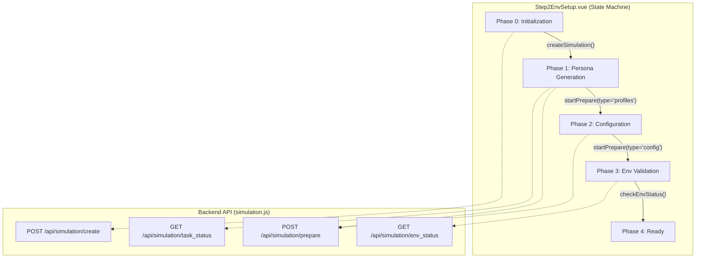
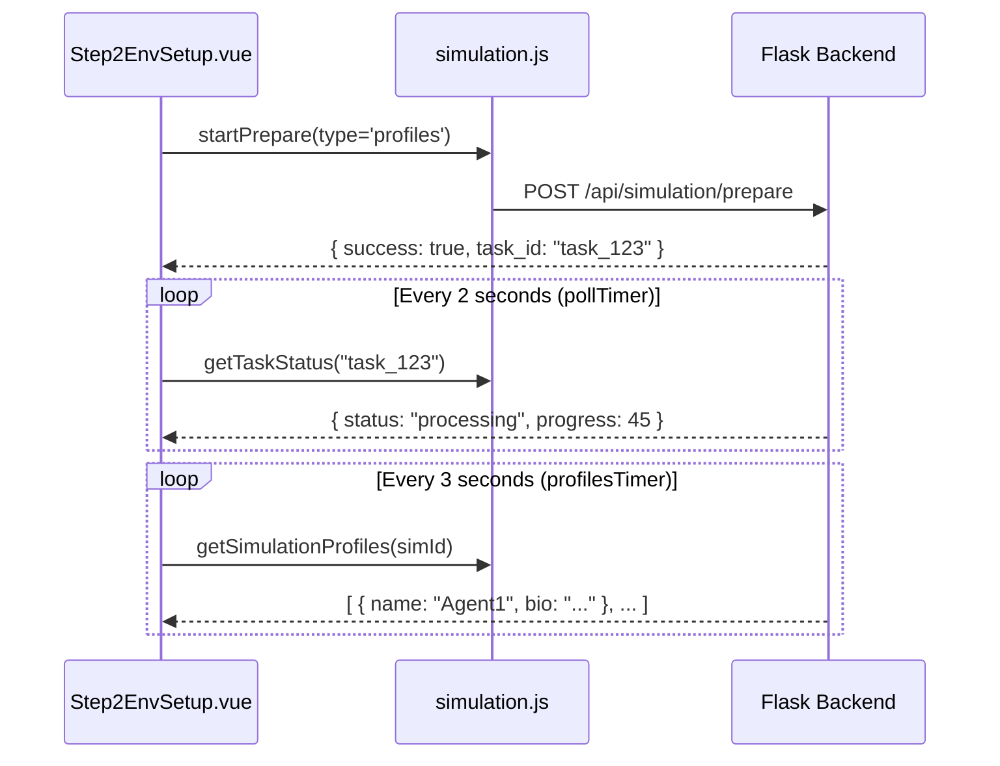

# Environment Setup UI (Step 2)

Relevant source files

The following files were used as context for generating this wiki page:

- [frontend/src/components/Step2EnvSetup.vue](https://github.com/666ghj/MiroFish/blob/1536a793/frontend/src/components/Step2EnvSetup.vue)
- [frontend/src/views/SimulationView.vue](https://github.com/666ghj/MiroFish/blob/1536a793/frontend/src/views/SimulationView.vue)

The **Environment Setup UI** represents the second stage of the MiroFish simulation lifecycle. It transitions the project from a static Knowledge Graph into a dynamic simulation environment by generating AI agent personas, configuring platform-specific parameters (Twitter/Reddit), and initializing the simulation engine. This stage is primarily handled by `SimulationView.vue` as the layout container and `Step2EnvSetup.vue` as the functional state machine.

### Core Responsibilities
*   **Persona Generation**: Transforming entities from the Zep Knowledge Graph into detailed agent profiles with biographies and interests [frontend/src/components/Step2EnvSetup.vue:59-62](https://github.com/666ghj/MiroFish/blob/1536a793/frontend/src/components/Step2EnvSetup.vue#L59-L62).
*   **Platform Configuration**: Defining simulation parameters such as time dilation, peak activity hours, and platform-specific rules [frontend/src/components/Step2EnvSetup.vue:131-134](https://github.com/666ghj/MiroFish/blob/1536a793/frontend/src/components/Step2EnvSetup.vue#L131-L134).
*   **Asynchronous Polling**: Managing long-running backend tasks (LLM generation) via status polling [frontend/src/components/Step2EnvSetup.vue:534-580](https://github.com/666ghj/MiroFish/blob/1536a793/frontend/src/components/Step2EnvSetup.vue#L534-L580).
*   **Safety Lifecycle**: Ensuring active simulation processes are terminated if a user regresses to this setup step [frontend/src/views/SimulationView.vue:179-220](https://github.com/666ghj/MiroFish/blob/1536a793/frontend/src/views/SimulationView.vue#L179-L220).

---

### Component Architecture & Data Flow

`SimulationView.vue` acts as the parent orchestrator, managing the split-pane layout between the D3.js `GraphPanel` and the setup workflow.

#### Layout Management
The view supports three modes defined in `SimulationView.vue`:
1.  **`graph`**: Maximizes the Knowledge Graph visualization [frontend/src/views/SimulationView.vue:95-95](https://github.com/666ghj/MiroFish/blob/1536a793/frontend/src/views/SimulationView.vue#L95-L95).
2.  **`workbench`**: Maximizes the `Step2EnvSetup` control panel [frontend/src/views/SimulationView.vue:101-101](https://github.com/666ghj/MiroFish/blob/1536a793/frontend/src/views/SimulationView.vue#L101-L101).
3.  **`split`**: Default 50/50 view for simultaneous monitoring [frontend/src/views/SimulationView.vue:97-97](https://github.com/666ghj/MiroFish/blob/1536a793/frontend/src/views/SimulationView.vue#L97-L97).

#### Data Synchronization
| Entity | Source | Usage |
| :--- | :--- | :--- |
| `projectData` | `getProject` | Provides `project_id` and `graph_id` for context [frontend/src/views/SimulationView.vue:248-250](https://github.com/666ghj/MiroFish/blob/1536a793/frontend/src/views/SimulationView.vue#L248-L250). |
| `graphData` | `getGraphData` | Populates the `GraphPanel` visualization [frontend/src/views/SimulationView.vue:274-275](https://github.com/666ghj/MiroFish/blob/1536a793/frontend/src/views/SimulationView.vue#L274-L275). |
| `systemLogs` | Local State | Captures real-time feedback from the setup process [frontend/src/views/SimulationView.vue:118-124](https://github.com/666ghj/MiroFish/blob/1536a793/frontend/src/views/SimulationView.vue#L118-L124). |

**Sources:** [frontend/src/views/SimulationView.vue:82-105](https://github.com/666ghj/MiroFish/blob/1536a793/frontend/src/views/SimulationView.vue#L82-L105), [frontend/src/views/SimulationView.vue:238-278](https://github.com/666ghj/MiroFish/blob/1536a793/frontend/src/views/SimulationView.vue#L238-L278)

---

### The Five-Phase State Machine

`Step2EnvSetup.vue` implements a linear state machine represented by the `phase` ref [frontend/src/components/Step2EnvSetup.vue:338-338](https://github.com/666ghj/MiroFish/blob/1536a793/frontend/src/components/Step2EnvSetup.vue#L338-L338). Each phase corresponds to a specific backend operation.

#### Phase Transition Logic
| Phase | Title | API Endpoint | Description |
| :--- | :--- | :--- | :--- |
| **0** | Instance Init | `/api/simulation/create` | Initializes the simulation record in the database [frontend/src/components/Step2EnvSetup.vue:18-21](https://github.com/666ghj/MiroFish/blob/1536a793/frontend/src/components/Step2EnvSetup.vue#L18-L21). |
| **1** | Agent Persona | `/api/simulation/prepare` | Generates profiles (Twitter/Reddit) from graph entities [frontend/src/components/Step2EnvSetup.vue:59-62](https://github.com/666ghj/MiroFish/blob/1536a793/frontend/src/components/Step2EnvSetup.vue#L59-L62). |
| **2** | Config Gen | `/api/simulation/prepare` | LLM determines time flow, frequency, and platform rules [frontend/src/components/Step2EnvSetup.vue:131-134](https://github.com/666ghj/MiroFish/blob/1536a793/frontend/src/components/Step2EnvSetup.vue#L131-L134). |
| **3** | Env Ready | `getEnvStatus` | Validates that the backend environment is ready for execution [frontend/src/components/Step2EnvSetup.vue:219-222](https://github.com/666ghj/MiroFish/blob/1536a793/frontend/src/components/Step2EnvSetup.vue#L219-L222). |
| **4** | Final Review | N/A | User reviews configuration before launching Step 3 [frontend/src/components/Step2EnvSetup.vue:261-264](https://github.com/666ghj/MiroFish/blob/1536a793/frontend/src/components/Step2EnvSetup.vue#L261-L264). |

#### State Machine Visualization
The following diagram bridges the UI phases to the underlying API calls and state variables.

**UI State to API Mapping**

**Sources:** [frontend/src/components/Step2EnvSetup.vue:421-510](https://github.com/666ghj/MiroFish/blob/1536a793/frontend/src/components/Step2EnvSetup.vue#L421-L510), [frontend/src/components/Step2EnvSetup.vue:534-580](https://github.com/666ghj/MiroFish/blob/1536a793/frontend/src/components/Step2EnvSetup.vue#L534-L580)

---

### Polling Mechanisms

Because LLM generation is time-intensive, the UI utilizes three distinct polling loops to maintain responsiveness.

1.  **`pollTimer`**: Monitors the global task status for the current `taskId`. It updates `prepareProgress` and triggers the next phase upon completion [frontend/src/components/Step2EnvSetup.vue:545-560](https://github.com/666ghj/MiroFish/blob/1536a793/frontend/src/components/Step2EnvSetup.vue#L545-L560).
2.  **`profilesTimer`**: Specifically fetches the list of generated agent profiles at regular intervals, allowing the UI to populate the "Agent List" incrementally as they are created [frontend/src/components/Step2EnvSetup.vue:512-525](https://github.com/666ghj/MiroFish/blob/1536a793/frontend/src/components/Step2EnvSetup.vue#L512-L525).
3.  **`configTimer`**: Periodically checks for the existence of `simulation_config.json` to populate the platform parameter cards [frontend/src/components/Step2EnvSetup.vue:527-532](https://github.com/666ghj/MiroFish/blob/1536a793/frontend/src/components/Step2EnvSetup.vue#L527-L532).

**Polling Logic Flow**

**Sources:** [frontend/src/components/Step2EnvSetup.vue:534-580](https://github.com/666ghj/MiroFish/blob/1536a793/frontend/src/components/Step2EnvSetup.vue#L534-L580), [frontend/src/components/Step2EnvSetup.vue:512-532](https://github.com/666ghj/MiroFish/blob/1536a793/frontend/src/components/Step2EnvSetup.vue#L512-L532)

---

### Safety Cleanup Lifecycle

A critical feature of `SimulationView.vue` is the prevention of orphaned processes. If a user returns to Step 2 from a running simulation (Step 3), the frontend automatically detects and terminates the active environment.

#### Termination Logic
Upon mounting, `SimulationView.vue` calls `checkAndStopRunningSimulation()`:
1.  **Check Alive**: Calls `getEnvStatus` to see if the simulation engine is active [frontend/src/views/SimulationView.vue:184-184](https://github.com/666ghj/MiroFish/blob/1536a793/frontend/src/views/SimulationView.vue#L184-L184).
2.  **Graceful Shutdown**: Attempts `closeSimulationEnv` with a 10-second timeout [frontend/src/views/SimulationView.vue:191-194](https://github.com/666ghj/MiroFish/blob/1536a793/frontend/src/views/SimulationView.vue#L191-L194).
3.  **Force Stop**: If graceful shutdown fails, it calls `stopSimulation` to kill backend processes [frontend/src/views/SimulationView.vue:225-236](https://github.com/666ghj/MiroFish/blob/1536a793/frontend/src/views/SimulationView.vue#L225-L236).

**Sources:** [frontend/src/views/SimulationView.vue:179-220](https://github.com/666ghj/MiroFish/blob/1536a793/frontend/src/views/SimulationView.vue#L179-L220), [frontend/src/api/simulation.js:46-60](https://github.com/666ghj/MiroFish/blob/1536a793/frontend/src/api/simulation.js#L46-L60)

---

### Key Component Properties

#### Step2EnvSetup.vue Props
| Prop | Type | Description |
| :--- | :--- | :--- |
| `simulationId` | String | The unique ID of the current simulation instance [frontend/src/components/Step2EnvSetup.vue:326-326](https://github.com/666ghj/MiroFish/blob/1536a793/frontend/src/components/Step2EnvSetup.vue#L326-L326). |
| `projectData` | Object | Metadata including `project_id` and simulation requirements [frontend/src/components/Step2EnvSetup.vue:327-327](https://github.com/666ghj/MiroFish/blob/1536a793/frontend/src/components/Step2EnvSetup.vue#L327-L327). |
| `graphData` | Object | The current Knowledge Graph state used for entity reference [frontend/src/components/Step2EnvSetup.vue:328-328](https://github.com/666ghj/MiroFish/blob/1536a793/frontend/src/components/Step2EnvSetup.vue#L328-L328). |

#### Configuration Display
The UI renders a detailed summary of the `simulationConfig` once generated, including:
*   **Time Config**: `total_simulation_hours`, `minutes_per_round`, and `peak_hours` [frontend/src/components/Step2EnvSetup.vue:143-162](https://github.com/666ghj/MiroFish/blob/1536a793/frontend/src/components/Step2EnvSetup.vue#L143-L162).
*   **Platform Params**: Twitter-specific (e.g., `reply_probability`) and Reddit-specific (e.g., `subreddits`) settings [frontend/src/components/Step2EnvSetup.vue:170-195](https://github.com/666ghj/MiroFish/blob/1536a793/frontend/src/components/Step2EnvSetup.vue#L170-L195).

**Sources:** [frontend/src/components/Step2EnvSetup.vue:137-210](https://github.com/666ghj/MiroFish/blob/1536a793/frontend/src/components/Step2EnvSetup.vue#L137-L210), [frontend/src/components/Step2EnvSetup.vue:325-335](https://github.com/666ghj/MiroFish/blob/1536a793/frontend/src/components/Step2EnvSetup.vue#L325-L335)
