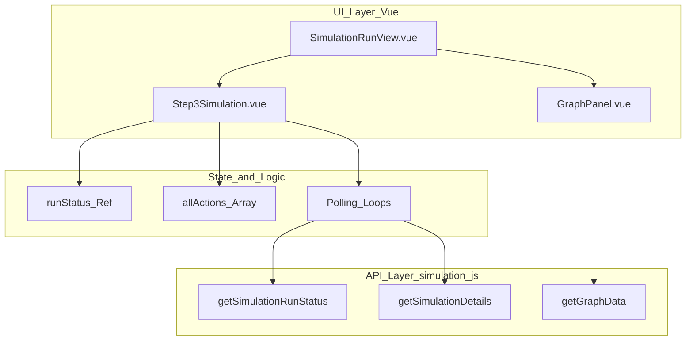
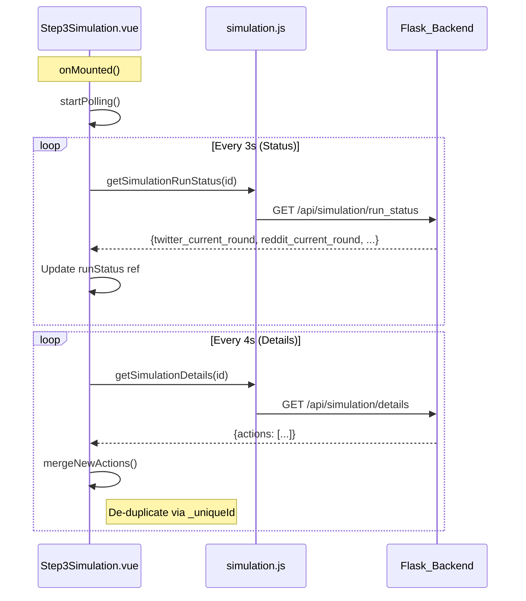

# Simulation Execution UI (Step 3)

Relevant source files

The following files were used as context for generating this wiki page:

- [frontend/src/components/Step3Simulation.vue](https://github.com/666ghj/MiroFish/blob/1536a793/frontend/src/components/Step3Simulation.vue)
- [frontend/src/views/ReportView.vue](https://github.com/666ghj/MiroFish/blob/1536a793/frontend/src/views/ReportView.vue)
- [frontend/src/views/SimulationRunView.vue](https://github.com/666ghj/MiroFish/blob/1536a793/frontend/src/views/SimulationRunView.vue)

The Simulation Execution UI is the central interface for monitoring the live OASIS simulation. It provides a real-time, dual-platform action feed, tracks round-based progression, and visualizes the evolving knowledge graph as agents interact. This stage transitions the system from environment setup to data generation and eventually to automated report synthesis.

## View Structure and Layout

The execution phase is managed by `SimulationRunView.vue`, which implements a split-pane layout to provide both high-level graph visualization and granular action monitoring.

*   **Graph Panel (Left):** Displays the `GraphPanel.vue` component, which renders the current state of the knowledge graph [frontend/src/views/SimulationRunView.vue:38-48](https://github.com/666ghj/MiroFish/blob/1536a793/frontend/src/views/SimulationRunView.vue#L38-L48). It supports dynamic refreshing as new entities and relations are discovered during the simulation [frontend/src/views/SimulationRunView.vue:242-261](https://github.com/666ghj/MiroFish/blob/1536a793/frontend/src/views/SimulationRunView.vue#L242-L261).
*   **Simulation Panel (Right):** Hosts `Step3Simulation.vue`, the primary driver for execution logic, polling, and the action timeline [frontend/src/views/SimulationRunView.vue:50-64](https://github.com/666ghj/MiroFish/blob/1536a793/frontend/src/views/SimulationRunView.vue#L50-L64).
*   **View Modes:** Users can switch between `graph` (full graph), `split` (50/50), and `workbench` (full simulation feed) views [frontend/src/views/SimulationRunView.vue:10-21](https://github.com/666ghj/MiroFish/blob/1536a793/frontend/src/views/SimulationRunView.vue#L10-L21).

### UI Entity Mapping

The following diagram maps UI concepts to their implementation components and data sources.

**Simulation UI to Code Entity Mapping**

Sources: [frontend/src/views/SimulationRunView.vue:69-75](https://github.com/666ghj/MiroFish/blob/1536a793/frontend/src/views/SimulationRunView.vue#L69-L75), [frontend/src/components/Step3Simulation.vue:1-106](https://github.com/666ghj/MiroFish/blob/1536a793/frontend/src/components/Step3Simulation.vue#L1-L106)

## Execution Lifecycle & Polling

The simulation execution is driven by two primary polling loops initiated in the `onMounted` hook of `Step3Simulation.vue` [frontend/src/components/Step3Simulation.vue:1233-1245](https://github.com/666ghj/MiroFish/blob/1536a793/frontend/src/components/Step3Simulation.vue#L1233-L1245).

1.  **Status Polling (`pollStatus`):** Calls `getSimulationRunStatus` every 3 seconds to update the high-level progress, including current rounds for Twitter (Info Plaza) and Reddit (Topic Community), and whether the simulation processes are still alive [frontend/src/components/Step3Simulation.vue:1134-1180](https://github.com/666ghj/MiroFish/blob/1536a793/frontend/src/components/Step3Simulation.vue#L1134-L1180).
2.  **Detail Polling (`pollDetails`):** Calls `getSimulationDetails` every 4 seconds to fetch the actual action logs (posts, comments, likes) generated by the agents [frontend/src/components/Step3Simulation.vue:1182-1231](https://github.com/666ghj/MiroFish/blob/1536a793/frontend/src/components/Step3Simulation.vue#L1182-L1231).

### Action De-duplication and Sorting
As the frontend polls the backend for details, it must merge new actions into the existing local state without creating duplicates. The component uses a unique ID strategy:
*   It checks for `action.id` or `action._uniqueId` [frontend/src/components/Step3Simulation.vue:1208-1215](https://github.com/666ghj/MiroFish/blob/1536a793/frontend/src/components/Step3Simulation.vue#L1208-L1215).
*   If no ID exists, it generates one using a combination of `timestamp`, `agent_id`, and `action_type` [frontend/src/components/Step3Simulation.vue:1210-1212](https://github.com/666ghj/MiroFish/blob/1536a793/frontend/src/components/Step3Simulation.vue#L1210-L1212).
*   The `chronologicalActions` computed property sorts all merged actions by timestamp to ensure a coherent timeline [frontend/src/components/Step3Simulation.vue:1089-1092](https://github.com/666ghj/MiroFish/blob/1536a793/frontend/src/components/Step3Simulation.vue#L1089-L1092).

**Data Flow: Polling to UI**

Sources: [frontend/src/components/Step3Simulation.vue:1134-1231](https://github.com/666ghj/MiroFish/blob/1536a793/frontend/src/components/Step3Simulation.vue#L1134-L1231), [frontend/src/api/simulation.js:1-50](https://github.com/666ghj/MiroFish/blob/1536a793/frontend/src/api/simulation.js#L1-L50)

## The Dual-Timeline Feed

The UI renders actions in a platform-specific manner within a unified vertical timeline.

| Platform | Display Name | Available Actions Tracked |
| :--- | :--- | :--- |
| **Twitter** | Info Plaza | POST, LIKE, REPOST, QUOTE, FOLLOW, IDLE |
| **Reddit** | Topic Community | POST, COMMENT, LIKE, DISLIKE, SEARCH, TREND, FOLLOW, MUTE, REFRESH, IDLE |

Actions are rendered using a `TransitionGroup` for smooth entry [frontend/src/components/Step3Simulation.vue:130-136](https://github.com/666ghj/MiroFish/blob/1536a793/frontend/src/components/Step3Simulation.vue#L130-L136). Each card displays the agent's name, platform icon, action type, and the content of the message [frontend/src/components/Step3Simulation.vue:141-175](https://github.com/666ghj/MiroFish/blob/1536a793/frontend/src/components/Step3Simulation.vue#L141-L175).

### Auto-Scrolling Logic
To ensure the most recent events are visible, the component implements an auto-scroll mechanism. If the user is already at the bottom of the container, the view automatically scrolls to accommodate new actions [frontend/src/components/Step3Simulation.vue:1254-1265](https://github.com/666ghj/MiroFish/blob/1536a793/frontend/src/components/Step3Simulation.vue#L1254-L1265).

## Transition to Report Generation

Once the simulation completes (or the user decides to stop early), the interface facilitates the transition to **Step 4: Report Generation**.

1.  **Completion Detection:** The UI monitors `runStatus.twitter_completed` and `runStatus.reddit_completed` [frontend/src/components/Step3Simulation.vue:7-17](https://github.com/666ghj/MiroFish/blob/1536a793/frontend/src/components/Step3Simulation.vue#L7-L17).
2.  **Manual Trigger:** The user clicks "开始生成结果报告" (Start Generating Result Report) [frontend/src/components/Step3Simulation.vue:94-102](https://github.com/666ghj/MiroFish/blob/1536a793/frontend/src/components/Step3Simulation.vue#L94-L102).
3.  **Process:**
    *   The component calls `handleNextStep` [frontend/src/components/Step3Simulation.vue:1274-1310](https://github.com/666ghj/MiroFish/blob/1536a793/frontend/src/components/Step3Simulation.vue#L1274-L1310).
    *   It invokes the `createReport` API [frontend/src/api/report.js:1-15](https://github.com/666ghj/MiroFish/blob/1536a793/frontend/src/api/report.js#L1-L15).
    *   Upon success, it routes the user to `ReportView.vue` with the new `reportId` [frontend/src/components/Step3Simulation.vue:1303-1306](https://github.com/666ghj/MiroFish/blob/1536a793/frontend/src/components/Step3Simulation.vue#L1303-L1306).

### Safety and Cleanup
If a user attempts to navigate back to Step 2, `SimulationRunView.vue` performs a cleanup routine:
*   It calls `stopGraphRefresh()` to halt polling [frontend/src/views/SimulationRunView.vue:152](https://github.com/666ghj/MiroFish/blob/1536a793/frontend/src/views/SimulationRunView.vue#L152).
*   It attempts to gracefully close the simulation environment via `closeSimulationEnv` [frontend/src/views/SimulationRunView.vue:161-165](https://github.com/666ghj/MiroFish/blob/1536a793/frontend/src/views/SimulationRunView.vue#L161-L165).
*   If graceful closure fails, it triggers a forced stop via `stopSimulation` [frontend/src/views/SimulationRunView.vue:169-173](https://github.com/666ghj/MiroFish/blob/1536a793/frontend/src/views/SimulationRunView.vue#L169-L173).

Sources: [frontend/src/views/SimulationRunView.vue:147-193](https://github.com/666ghj/MiroFish/blob/1536a793/frontend/src/views/SimulationRunView.vue#L147-L193), [frontend/src/components/Step3Simulation.vue:1274-1310](https://github.com/666ghj/MiroFish/blob/1536a793/frontend/src/components/Step3Simulation.vue#L1274-L1310)
