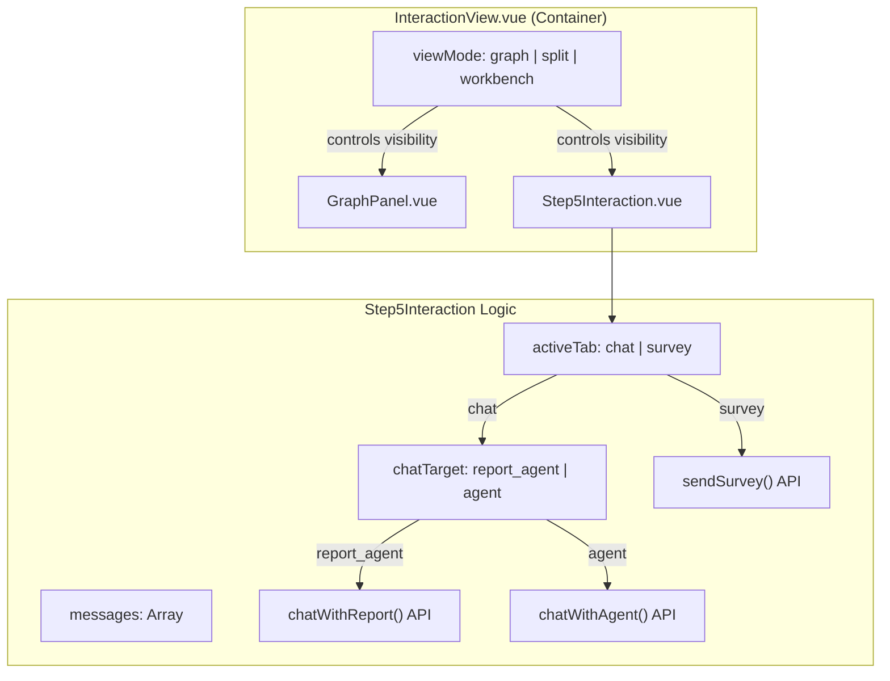
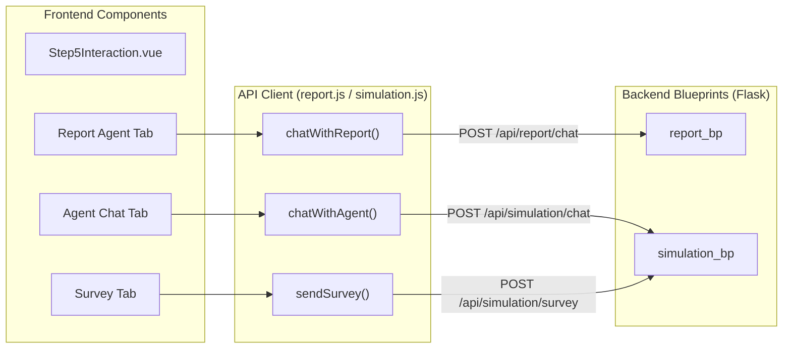

# Report & Interaction UI (Steps 4 & 5)

Relevant source files

The following files were used as context for generating this wiki page:

- [frontend/src/components/Step4Report.vue](https://github.com/666ghj/MiroFish/blob/1536a793/frontend/src/components/Step4Report.vue)
- [frontend/src/components/Step5Interaction.vue](https://github.com/666ghj/MiroFish/blob/1536a793/frontend/src/components/Step5Interaction.vue)
- [frontend/src/views/InteractionView.vue](https://github.com/666ghj/MiroFish/blob/1536a793/frontend/src/views/InteractionView.vue)

This page details the implementation of the final stages of the MiroFish simulation lifecycle: **Report Generation** (Step 4) and **Deep Interaction** (Step 5). These stages transition the user from passive observation of a simulation to active analysis and direct engagement with the simulated world and its agents.

## Overview

The reporting and interaction phase is handled by three primary components:
1.  **Step4Report.vue**: Manages the real-time generation of the structured prediction report. It visualizes the Report Agent's reasoning process through a workflow timeline and tool-output displays.
2.  **Step5Interaction.vue**: Provides a "Workbench" for interacting with the simulation results. It includes three modes: Report Agent Chat, Individual Agent Chat, and Global Surveys.
3.  **InteractionView.vue**: The top-level container that manages the layout switching between the Knowledge Graph, the Workbench, and a split-view.

---

## Step 4: Report Generation Implementation

Step 4 focuses on the `ReportAgent`'s execution. The UI polls for incremental logs and structured tool outputs to show the user exactly how the final report is being constructed.

### Real-time Polling & Data Flow
The frontend uses `setInterval` to fetch incremental updates from the backend.

| Function | Purpose | API Endpoint |
| :--- | :--- | :--- |
| `pollStatus` | Checks the overall generation state and report outline. | `/api/report/generate/status` |
| `pollAgentLogs` | Fetches incremental agent reasoning logs (ReACT steps). | `/api/report/:id/agent-log` |
| `pollConsoleLogs`| Fetches raw system/console logs for debugging. | `/api/report/:id/console-log` |

**Sources:** [frontend/src/components/Step4Report.vue:274-320](https://github.com/666ghj/MiroFish/blob/1536a793/frontend/src/components/Step4Report.vue#L274-L320), [frontend/src/api/report.js:15-35](https://github.com/666ghj/MiroFish/blob/1536a793/frontend/src/api/report.js#L15-L35)

### Workflow Timeline Visualization
The `Step4Report.vue` component transforms raw agent logs into a visual timeline. It filters logs based on the `action` field (e.g., `call_tool`, `tool_output`, `thought`) to render different UI elements [frontend/src/components/Step4Report.vue:142-180](https://github.com/666ghj/MiroFish/blob/1536a793/frontend/src/components/Step4Report.vue#L142-L180).

- **Structured Tool Rendering**: When the agent uses a tool, the UI renders specialized display components based on the `tool_name` [frontend/src/components/Step4Report.vue:185-210](https://github.com/666ghj/MiroFish/blob/1536a793/frontend/src/components/Step4Report.vue#L185-L210):
    - `InsightDisplay`: Renders entity-specific insights generated via `InsightForge`.
    - `PanoramaDisplay`: Visualizes broad search results across the graph from `PanoramaSearch`.
    - `InterviewDisplay`: Shows the transcript of the Report Agent interviewing a simulation agent via `InterviewSubAgent`.

### Report Section Streaming
The report is generated section-by-section. The `generatedSections` object stores the content of each section as it is completed, which is then rendered using `renderMarkdown` [frontend/src/components/Step4Report.vue:51-62](https://github.com/666ghj/MiroFish/blob/1536a793/frontend/src/components/Step4Report.vue#L51-L62).

**Sources:** [frontend/src/components/Step4Report.vue:20-65](https://github.com/666ghj/MiroFish/blob/1536a793/frontend/src/components/Step4Report.vue#L20-L65), [frontend/src/components/Step4Report.vue:350-375](https://github.com/666ghj/MiroFish/blob/1536a793/frontend/src/components/Step4Report.vue#L350-L375)

---

## Step 5: Interaction Workbench

The Interaction Workbench (`Step5Interaction.vue`) allows users to query the simulated environment using three distinct interaction models.

### Interaction Modes
1.  **Report Agent Chat**: Users can ask follow-up questions about the generated report. The `ReportAgent` uses its existing tools (GraphRAG, Zep memory) to answer [frontend/src/components/Step5Interaction.vue:93-102](https://github.com/666ghj/MiroFish/blob/1536a793/frontend/src/components/Step5Interaction.vue#L93-L102).
2.  **Individual Agent Chat**: Users select a specific agent profile from the `profiles` list and initiate a direct 1-on-1 conversation [frontend/src/components/Step5Interaction.vue:103-133](https://github.com/666ghj/MiroFish/blob/1536a793/frontend/src/components/Step5Interaction.vue#L103-L133).
3.  **Survey Mode**: Users can broadcast a survey question to the entire world to gather statistical or qualitative feedback [frontend/src/components/Step5Interaction.vue:135-145](https://github.com/666ghj/MiroFish/blob/1536a793/frontend/src/components/Step5Interaction.vue#L135-L145).

### Component Architecture (Step 5)

Title: Step 5 Interaction Logic and View Management

**Sources:** [frontend/src/views/InteractionView.vue:82-105](https://github.com/666ghj/MiroFish/blob/1536a793/frontend/src/views/InteractionView.vue#L82-L105), [frontend/src/components/Step5Interaction.vue:478-550](https://github.com/666ghj/MiroFish/blob/1536a793/frontend/src/components/Step5Interaction.vue#L478-L550)

---

## Technical Detail: Data Synchronization

The transition between Steps 4 and 5 relies on the `reportId` and `simulationId`. `InteractionView.vue` acts as the data coordinator, fetching the necessary project and graph metadata based on the `reportId` provided in the URL route.

### Initialization Sequence
1.  `InteractionView` is mounted and watches the `reportId` from `route.params` [frontend/src/views/InteractionView.vue:203-208](https://github.com/666ghj/MiroFish/blob/1536a793/frontend/src/views/InteractionView.vue#L203-L208).
2.  `loadReportData()` calls `getReport(currentReportId)` to retrieve the associated `simulation_id` [frontend/src/views/InteractionView.vue:141-150](https://github.com/666ghj/MiroFish/blob/1536a793/frontend/src/views/InteractionView.vue#L141-L150).
3.  The `simulation_id` is then used to fetch the `project_id` and the final `graph_id` via `getSimulation` and `getProject` [frontend/src/views/InteractionView.vue:152-167](https://github.com/666ghj/MiroFish/blob/1536a793/frontend/src/views/InteractionView.vue#L152-L167).
4.  The knowledge graph is loaded into `GraphPanel` via `loadGraph(graphId)` [frontend/src/views/InteractionView.vue:180-194](https://github.com/666ghj/MiroFish/blob/1536a793/frontend/src/views/InteractionView.vue#L180-L194).

### Code Entity Mapping

Title: Mapping UI Interaction to Backend API Entities

**Sources:** [frontend/src/api/report.js:49-51](https://github.com/666ghj/MiroFish/blob/1536a793/frontend/src/api/report.js#L49-L51), [frontend/src/api/simulation.js:35-45](https://github.com/666ghj/MiroFish/blob/1536a793/frontend/src/api/simulation.js#L35-L45), [frontend/src/components/Step5Interaction.vue:834-860](https://github.com/666ghj/MiroFish/blob/1536a793/frontend/src/components/Step5Interaction.vue#L834-L860), [frontend/src/views/InteractionView.vue:64-71](https://github.com/666ghj/MiroFish/blob/1536a793/frontend/src/views/InteractionView.vue#L64-L71)

---

## UI Layout Management

`InteractionView.vue` provides a `viewMode` state that dynamically adjusts the CSS widths and visibility of the graph and interaction panels using computed styles `leftPanelStyle` and `rightPanelStyle` [frontend/src/views/InteractionView.vue:94-104](https://github.com/666ghj/MiroFish/blob/1536a793/frontend/src/views/InteractionView.vue#L94-L104).

| View Mode | Graph Width | Workbench Width | Description |
| :--- | :--- | :--- | :--- |
| `graph` | 100% | 0% | Full-screen D3.js graph visualization. |
| `split` | 50% | 50% | Side-by-side view for context-aware chatting. |
| `workbench` | 0% | 100% | Focused interaction environment (Default for Step 5). |

**Sources:** [frontend/src/views/InteractionView.vue:82-105](https://github.com/666ghj/MiroFish/blob/1536a793/frontend/src/views/InteractionView.vue#L82-L105), [frontend/src/views/InteractionView.vue:11-20](https://github.com/666ghj/MiroFish/blob/1536a793/frontend/src/views/InteractionView.vue#L11-L20)

### Interaction Logs
The system maintains a `systemLogs` array in `InteractionView.vue` which is updated via events (`@add-log`) from the child interaction component [frontend/src/views/InteractionView.vue:56](https://github.com/666ghj/MiroFish/blob/1536a793/frontend/src/views/InteractionView.vue#L56). This ensures that all technical events (API calls, data loading) are captured in a central console [frontend/src/views/InteractionView.vue:119-125](https://github.com/666ghj/MiroFish/blob/1536a793/frontend/src/views/InteractionView.vue#L119-L125).

**Sources:** [frontend/src/views/InteractionView.vue:119-125](https://github.com/666ghj/MiroFish/blob/1536a793/frontend/src/views/InteractionView.vue#L119-L125), [frontend/src/components/Step5Interaction.vue:56](https://github.com/666ghj/MiroFish/blob/1536a793/frontend/src/components/Step5Interaction.vue#L56)
