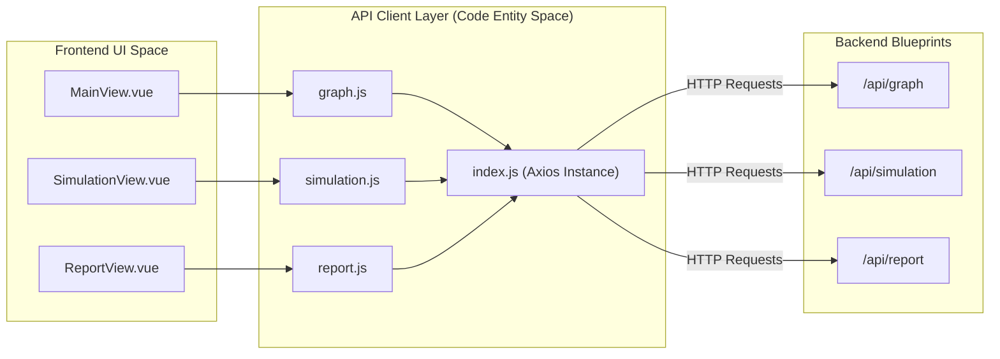
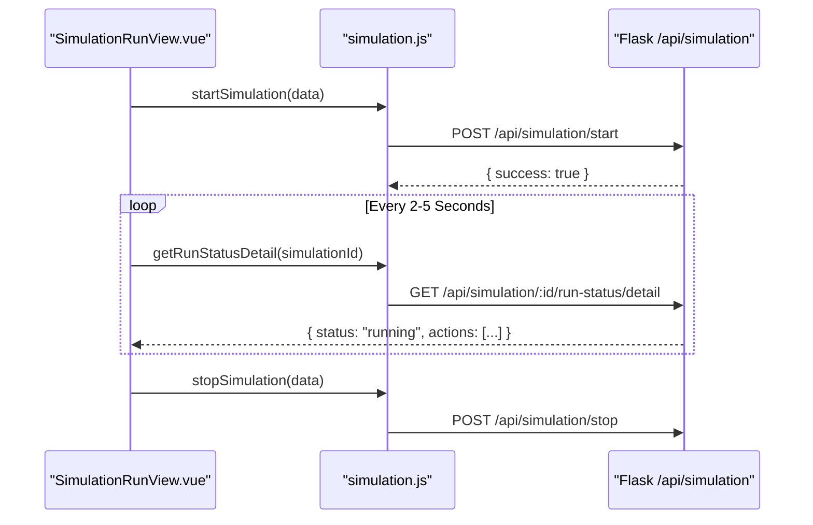

# Frontend API Client Layer

<details>
<summary>Relevant source files</summary>

The following files were used as context for generating this wiki page:

- [frontend/.gitignore](https://github.com/666ghj/MiroFish/blob/1536a793/frontend/.gitignore)
- [frontend/src/api/graph.js](https://github.com/666ghj/MiroFish/blob/1536a793/frontend/src/api/graph.js)
- [frontend/src/api/index.js](https://github.com/666ghj/MiroFish/blob/1536a793/frontend/src/api/index.js)
- [frontend/src/api/report.js](https://github.com/666ghj/MiroFish/blob/1536a793/frontend/src/api/report.js)
- [frontend/src/api/simulation.js](https://github.com/666ghj/MiroFish/blob/1536a793/frontend/src/api/simulation.js)
- [frontend/src/assets/logo/MiroFish_logo_compressed.jpeg](https://github.com/666ghj/MiroFish/blob/1536a793/frontend/src/assets/logo/MiroFish_logo_compressed.jpeg)
- [frontend/src/router/index.js](https://github.com/666ghj/MiroFish/blob/1536a793/frontend/src/router/index.js)

</details>


The Frontend API Client Layer serves as the communication bridge between the Vue.js single-page application and the Flask backend services. It abstracts HTTP request logic, handles cross-cutting concerns like exponential backoff retries, and provides type-safe wrappers for the three primary backend domains: Knowledge Graph, Simulation Management, and Report Generation.

## Base Configuration and Interceptors

The core of the client layer is an Axios instance configured in `frontend/src/api/index.js`. This module defines the base URL (defaulting to `http://localhost:5001`), a 5-minute timeout to accommodate long-running LLM tasks, and standardized interceptors for error handling [frontend/src/api/index.js:4-10](https://github.com/666ghj/MiroFish/blob/1536a793/frontend/src/api/index.js#L4-L10).

### Request Reliability
To handle transient network issues or backend cold starts, the layer implements `requestWithRetry`. This utility uses an exponential backoff strategy (`delay * Math.pow(2, i)`) to retry failed requests up to a specified maximum [frontend/src/api/index.js:54-65](https://github.com/666ghj/MiroFish/blob/1536a793/frontend/src/api/index.js#L54-L65).

### Data Flow Architecture
The following diagram illustrates how the API client layer mediates between UI components and the backend blueprints.

**Diagram: Frontend-Backend Communication Flow**

**Sources:** [frontend/src/api/index.js:4-67](https://github.com/666ghj/MiroFish/blob/1536a793/frontend/src/api/index.js#L4-L67), [frontend/src/api/graph.js:1-71](https://github.com/666ghj/MiroFish/blob/1536a793/frontend/src/api/graph.js#L1-L71), [frontend/src/api/simulation.js:1-187](https://github.com/666ghj/MiroFish/blob/1536a793/frontend/src/api/simulation.js#L1-L187), [frontend/src/api/report.js:1-52](https://github.com/666ghj/MiroFish/blob/1536a793/frontend/src/api/report.js#L1-L52)

---

## Graph API Module (`graph.js`)

The `graph.js` module handles the initial stages of the MiroFish lifecycle: document ingestion and knowledge graph construction.

| Function | Endpoint | Purpose |
| :--- | :--- | :--- |
| `generateOntology` | `/api/graph/ontology/generate` | Uploads files and simulation requirements to generate a graph schema [frontend/src/api/graph.js:8-19](https://github.com/666ghj/MiroFish/blob/1536a793/frontend/src/api/graph.js#L8-L19). |
| `buildGraph` | `/api/graph/build` | Triggers the Zep ingestion process for the provided project [frontend/src/api/graph.js:26-34](https://github.com/666ghj/MiroFish/blob/1536a793/frontend/src/api/graph.js#L26-L34). |
| `getTaskStatus` | `/api/graph/task/:taskId` | Polls the status of asynchronous graph building tasks [frontend/src/api/graph.js:41-46](https://github.com/666ghj/MiroFish/blob/1536a793/frontend/src/api/graph.js#L41-L46). |
| `getGraphData` | `/api/graph/data/:graphId` | Retrieves the nodes and edges for D3.js visualization [frontend/src/api/graph.js:53-58](https://github.com/666ghj/MiroFish/blob/1536a793/frontend/src/api/graph.js#L53-L58). |

**Sources:** [frontend/src/api/graph.js:1-71](https://github.com/666ghj/MiroFish/blob/1536a793/frontend/src/api/graph.js#L1-L71)

---

## Simulation API Module (`simulation.js`)

This module manages the lifecycle of the OASIS simulation, including environment setup, agent profile generation, and execution control.

### Environment Preparation
Simulation preparation involves extracting entities and generating platform-specific profiles.
*   **`prepareSimulation`**: Initiates the asynchronous task to generate agent personas [frontend/src/api/simulation.js:15-17](https://github.com/666ghj/MiroFish/blob/1536a793/frontend/src/api/simulation.js#L15-L17).
*   **`getSimulationProfilesRealtime`**: Allows the UI to poll for partially generated profiles during the "Environment Setup" phase [frontend/src/api/simulation.js:49-51](https://github.com/666ghj/MiroFish/blob/1536a793/frontend/src/api/simulation.js#L49-L51).
*   **`getSimulationConfigRealtime`**: Fetches the simulation configuration (time, events, platforms) as it is being built [frontend/src/api/simulation.js:66-68](https://github.com/666ghj/MiroFish/blob/1536a793/frontend/src/api/simulation.js#L66-L68).

### Execution and Monitoring
*   **`startSimulation`**: Launches the parallel simulation scripts on the backend [frontend/src/api/simulation.js:83-85](https://github.com/666ghj/MiroFish/blob/1536a793/frontend/src/api/simulation.js#L83-L85).
*   **`getRunStatusDetail`**: Fetches the current round, status, and the most recent agent actions for the live feed [frontend/src/api/simulation.js:107-109](https://github.com/666ghj/MiroFish/blob/1536a793/frontend/src/api/simulation.js#L107-L109).
*   **`getSimulationTimeline`**: Retrieves a round-by-round summary of events [frontend/src/api/simulation.js:130-136](https://github.com/666ghj/MiroFish/blob/1536a793/frontend/src/api/simulation.js#L130-L136).
*   **`closeSimulationEnv`**: Gracefully shuts down the simulation processes [frontend/src/api/simulation.js:159-161](https://github.com/666ghj/MiroFish/blob/1536a793/frontend/src/api/simulation.js#L159-L161).

**Diagram: Simulation State Management Entities**

**Sources:** [frontend/src/api/simulation.js:83-109](https://github.com/666ghj/MiroFish/blob/1536a793/frontend/src/api/simulation.js#L83-L109), [frontend/src/api/simulation.js:91-93](https://github.com/666ghj/MiroFish/blob/1536a793/frontend/src/api/simulation.js#L91-L93), [frontend/src/api/simulation.js:159-161](https://github.com/666ghj/MiroFish/blob/1536a793/frontend/src/api/simulation.js#L159-L161)

---

## Report API Module (`report.js`)

The `report.js` module facilitates the analysis phase, where the `ReportAgent` synthesizes simulation data into structured insights.

*   **`generateReport`**: Triggers the ReACT-based reasoning loop to create the final report [frontend/src/api/report.js:7-9](https://github.com/666ghj/MiroFish/blob/1536a793/frontend/src/api/report.js#L7-L9).
*   **`getReportStatus`**: Polls the current state of report generation [frontend/src/api/report.js:15-17](https://github.com/666ghj/MiroFish/blob/1536a793/frontend/src/api/report.js#L15-L17).
*   **`getAgentLog`**: Provides incremental polling of the `ReportAgent` internal thought process and tool usage logs [frontend/src/api/report.js:24-26](https://github.com/666ghj/MiroFish/blob/1536a793/frontend/src/api/report.js#L24-L26).
*   **`chatWithReport`**: Supports the "Interaction Workbench" by sending user queries to the Report Agent for retrieval-augmented conversation [frontend/src/api/report.js:49-51](https://github.com/666ghj/MiroFish/blob/1536a793/frontend/src/api/report.js#L49-L51).

**Sources:** [frontend/src/api/report.js:1-52](https://github.com/666ghj/MiroFish/blob/1536a793/frontend/src/api/report.js#L1-L52)

---

## Global Data Models

Requests and responses follow a consistent shape defined by the `service` interceptor [frontend/src/api/index.js:24-35](https://github.com/666ghj/MiroFish/blob/1536a793/frontend/src/api/index.js#L24-L35).

### Standard Response Shape
```json
{
  "success": true,
  "data": { ... },
  "message": "Operation successful",
  "error": null
}
```

### Simulation History
The `getSimulationHistory` function in `simulation.js` is used to populate the landing page with previous simulation records, including their associated project details [frontend/src/api/simulation.js:184-186](https://github.com/666ghj/MiroFish/blob/1536a793/frontend/src/api/simulation.js#L184-L186). These historical records allow users to jump directly to existing reports or simulations via the router [frontend/src/router/index.js:9-45](https://github.com/666ghj/MiroFish/blob/1536a793/frontend/src/router/index.js#L9-L45).

**Sources:** [frontend/src/api/index.js:24-35](https://github.com/666ghj/MiroFish/blob/1536a793/frontend/src/api/index.js#L24-L35), [frontend/src/api/simulation.js:184-186](https://github.com/666ghj/MiroFish/blob/1536a793/frontend/src/api/simulation.js#L184-L186), [frontend/src/router/index.js:9-45](https://github.com/666ghj/MiroFish/blob/1536a793/frontend/src/router/index.js#L9-L45)
