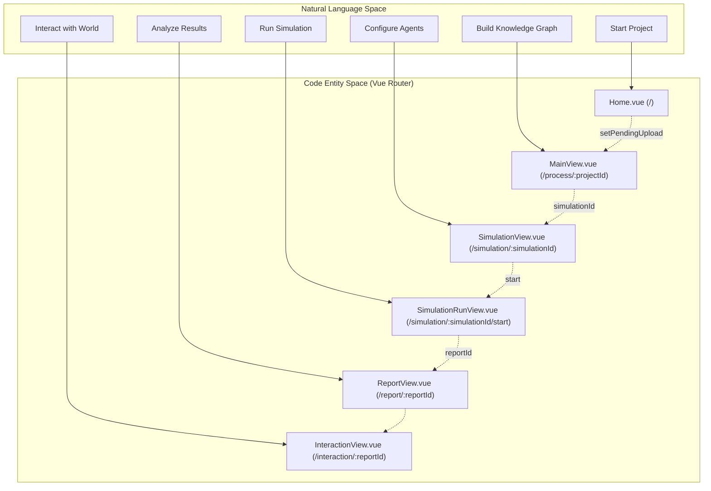

# Frontend Application

Relevant source files

The following files were used as context for generating this wiki page:

- [frontend/index.html](https://github.com/666ghj/MiroFish/blob/1536a793/frontend/index.html)
- [frontend/package-lock.json](https://github.com/666ghj/MiroFish/blob/1536a793/frontend/package-lock.json)
- [frontend/package.json](https://github.com/666ghj/MiroFish/blob/1536a793/frontend/package.json)
- [frontend/src/App.vue](https://github.com/666ghj/MiroFish/blob/1536a793/frontend/src/App.vue)
- [frontend/src/api/report.js](https://github.com/666ghj/MiroFish/blob/1536a793/frontend/src/api/report.js)
- [frontend/src/api/simulation.js](https://github.com/666ghj/MiroFish/blob/1536a793/frontend/src/api/simulation.js)
- [frontend/src/assets/logo/MiroFish_logo_left.jpeg](https://github.com/666ghj/MiroFish/blob/1536a793/frontend/src/assets/logo/MiroFish_logo_left.jpeg)
- [frontend/src/main.js](https://github.com/666ghj/MiroFish/blob/1536a793/frontend/src/main.js)
- [frontend/src/router/index.js](https://github.com/666ghj/MiroFish/blob/1536a793/frontend/src/router/index.js)
- [frontend/src/store/pendingUpload.js](https://github.com/666ghj/MiroFish/blob/1536a793/frontend/src/store/pendingUpload.js)
- [frontend/src/views/Home.vue](https://github.com/666ghj/MiroFish/blob/1536a793/frontend/src/views/Home.vue)
- [frontend/vite.config.js](https://github.com/666ghj/MiroFish/blob/1536a793/frontend/vite.config.js)

The MiroFish frontend is a Single Page Application (SPA) built with **Vue.js 3** and **Vite**. It serves as the primary interface for managing the end-to-end simulation lifecycle, from document ingestion to interactive report analysis. The application follows a structured five-step workflow, guiding users through graph construction, environment setup, execution, and final interaction.

## Core Technology Stack

The frontend is decoupled from the backend and communicates via a RESTful API layer.

| Category | Technology | Purpose |
| :--- | :--- | :--- |
| **Framework** | `Vue.js 3` | Component-based UI architecture [[frontend/package.json:14-14]]() |
| **Routing** | `Vue Router 4` | SPA navigation and view management [[frontend/src/router/index.js:1-7]]() |
| **Build Tool** | `Vite` | Development server and bundling [[frontend/package.json:19-19]]() |
| **HTTP Client** | `Axios` | Backend API communication with retry logic [[frontend/package.json:12-12]]() |
| **Visualization** | `D3.js` | Knowledge graph rendering and animation [[frontend/package.json:13-13]]() |

Sources: [[frontend/package.json:1-22]](), [[frontend/src/router/index.js:1-53]]()

## Routing & View Hierarchy

The application uses `vue-router` to manage the transition between simulation stages. Each route corresponds to a major phase of the MiroFish workflow.

### Navigation Map
The following diagram maps the logical application flow to the specific Vue components and route definitions.

**Application Flow to Code Entity Mapping**

Sources: [[frontend/src/router/index.js:9-45]](), [[frontend/src/store/pendingUpload.js:13-17]]()

## Five-Step Workflow UI

The UI is organized around a linear progression model described in the `workflow-list` [[frontend/src/views/Home.vue:81-117]](), ensuring that complex backend operations are presented clearly.

### 1. Project Initialization
The landing page handles the ingestion of "Reality Seeds" (PDF, MD, TXT files) [[frontend/src/views/Home.vue:128-128]]() and the initial simulation requirement. It uses a temporary store, `pendingUpload`, to stage data before a project ID is generated.
*   **For details, see [Home & Project Initialization](2-1-home-project-initialization.md)**
*   **Key Files:** `Home.vue`, `pendingUpload.js`

### 2. Graph Construction
This phase visualizes the transformation of unstructured text into a structured knowledge graph (Step 1: Graph Build). It features a split-view layout with a real-time D3.js graph panel.
*   **For details, see [Graph Construction UI (Step 1)](2-2-graph-construction-ui-step-1.md)**
*   **Key Files:** `MainView.vue`, `Step1GraphBuild.vue`

### 3. Environment Setup
Users configure simulation parameters and monitor the generation of agent personas (Step 2: Env Setup). The UI manages a multi-phase state machine for profile and config generation.
*   **For details, see [Environment Setup UI (Step 2)](2-3-environment-setup-ui-step-2.md)**
*   **Key Files:** `SimulationView.vue`, `Step2EnvSetup.vue`

### 4. Simulation Execution
A dual-timeline interface displays live actions from Twitter and Reddit agents (Step 3: Simulation). The UI performs high-frequency polling to render agent activities [[frontend/src/api/simulation.js:107-109]]().
*   **For details, see [Simulation Execution UI (Step 3)](2-4-simulation-execution-ui-step-3.md)**
*   **Key Files:** `SimulationRunView.vue`, `Step3Simulation.vue`

### 5. Report & Interaction
The final stages provide an interactive workbench. Users can read generated analysis (Step 4: Report) and conduct direct interviews with agents or the Report Agent (Step 5: Interaction).
*   **For details, see [Report & Interaction UI (Steps 4 & 5)](2-5-report-interaction-ui-steps-4-5.md)**
*   **Key Files:** `ReportView.vue`, `InteractionView.vue`, `Step4Report.vue`, `Step5Interaction.vue`

Sources: [[frontend/src/views/Home.vue:77-118]](), [[frontend/src/router/index.js:9-45]]()

## Shared Infrastructure

### API Client Layer
All backend communication is centralized in the `src/api/` directory, mirroring the backend's blueprint structure:
*   **Simulation API:** Handles environment preparation, profile generation, and execution control [[frontend/src/api/simulation.js:7-186]]().
*   **Report API:** Manages report generation status, log streaming, and agent chat [[frontend/src/api/report.js:7-51]]().
*   **Retry Logic:** Uses `requestWithRetry` to handle transient network issues during heavy LLM tasks [[frontend/src/api/index.js:1-10]]().
*   **For details, see [Frontend API Client Layer](2-6-frontend-api-client-layer.md)**

### State Management
While simple state is handled via Vue's `reactive` and `ref` in components, cross-page data (like files pending upload) is managed in dedicated store modules like `pendingUpload.js` [[frontend/src/store/pendingUpload.js:7-11]]().

Sources: [[frontend/src/api/simulation.js:1-188]](), [[frontend/src/api/report.js:1-52]](), [[frontend/src/store/pendingUpload.js:1-34]]()
