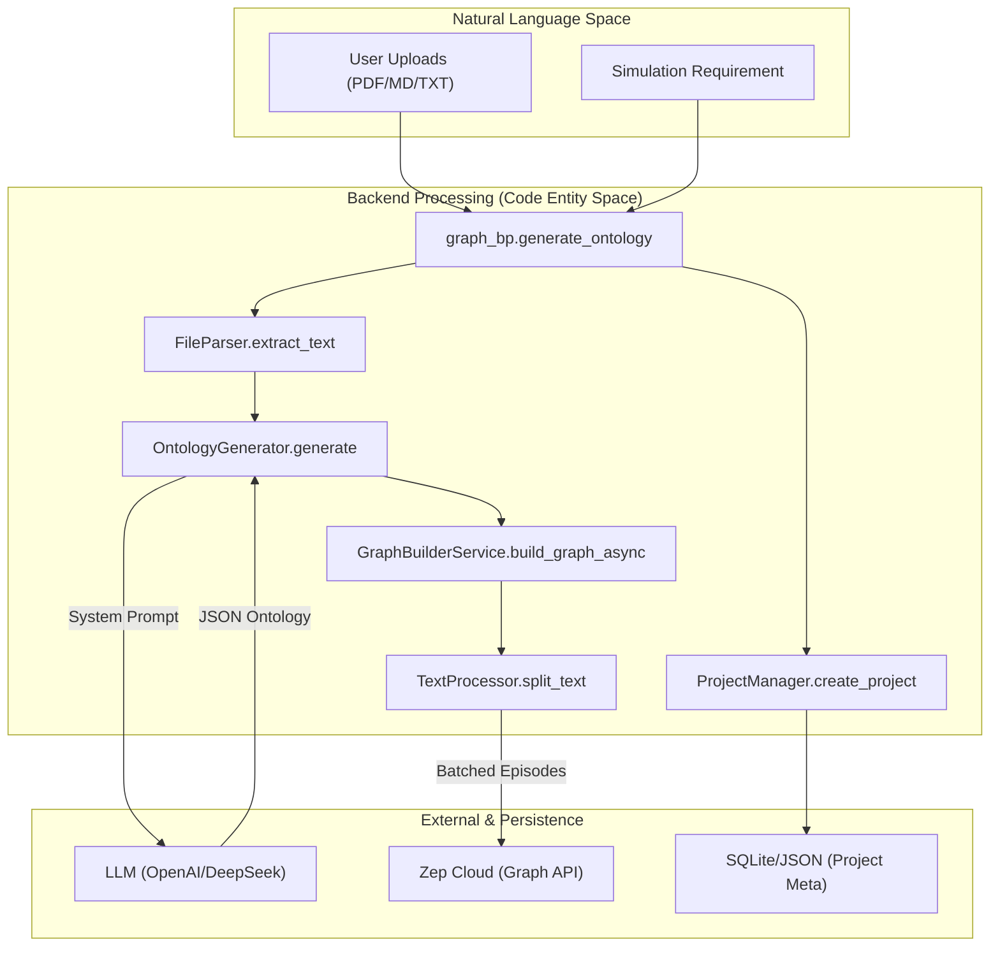
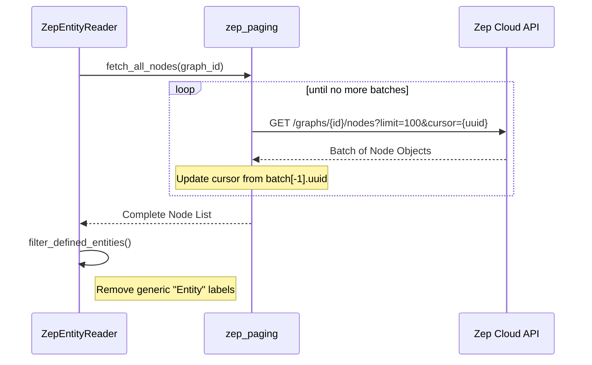

# Knowledge Graph Construction (GraphRAG)

Relevant source files

The following files were used as context for generating this wiki page:

- [backend/app/api/graph.py](https://github.com/666ghj/MiroFish/blob/1536a793/backend/app/api/graph.py)
- [backend/app/models/__init__.py](https://github.com/666ghj/MiroFish/blob/1536a793/backend/app/models/__init__.py)
- [backend/app/models/project.py](https://github.com/666ghj/MiroFish/blob/1536a793/backend/app/models/project.py)
- [backend/app/services/graph_builder.py](https://github.com/666ghj/MiroFish/blob/1536a793/backend/app/services/graph_builder.py)
- [backend/app/services/ontology_generator.py](https://github.com/666ghj/MiroFish/blob/1536a793/backend/app/services/ontology_generator.py)
- [backend/app/services/text_processor.py](https://github.com/666ghj/MiroFish/blob/1536a793/backend/app/services/text_processor.py)
- [backend/app/services/zep_entity_reader.py](https://github.com/666ghj/MiroFish/blob/1536a793/backend/app/services/zep_entity_reader.py)
- [backend/app/utils/file_parser.py](https://github.com/666ghj/MiroFish/blob/1536a793/backend/app/utils/file_parser.py)
- [backend/app/utils/logger.py](https://github.com/666ghj/MiroFish/blob/1536a793/backend/app/utils/logger.py)
- [backend/app/utils/zep_paging.py](https://github.com/666ghj/MiroFish/blob/1536a793/backend/app/utils/zep_paging.py)
- [backend/requirements.txt](https://github.com/666ghj/MiroFish/blob/1536a793/backend/requirements.txt)
- [backend/run.py](https://github.com/666ghj/MiroFish/blob/1536a793/backend/run.py)
- [backend/uv.lock](https://github.com/666ghj/MiroFish/blob/1536a793/backend/uv.lock)

The Knowledge Graph Construction phase is the foundational step of the MiroFish simulation pipeline. It transforms unstructured documents (PDF, Markdown, TXT) into a structured, queryable knowledge graph hosted on Zep Cloud. This process involves two primary stages: **Ontology Generation**, where an LLM defines the schema based on simulation requirements, and **Graph Building**, where text is chunked, entities/relationships are extracted, and data is ingested into the graph database.

## 1. System Architecture & Data Flow

The graph construction logic is encapsulated within the `graph_bp` Flask blueprint [backend/app/api/graph.py:11-11](https://github.com/666ghj/MiroFish/blob/1536a793/backend/app/api/graph.py#L11-L11). It coordinates between the `ProjectManager` for persistence and specialized service classes for LLM and Zep interactions.

### 1.1 Implementation Overview
The workflow follows a sequential state machine managed by `ProjectStatus` [backend/app/models/project.py:17-23](https://github.com/666ghj/MiroFish/blob/1536a793/backend/app/models/project.py#L17-L23):
1.  **File Upload & Text Extraction**: Files are processed by `FileParser` [backend/app/utils/file_parser.py:67-76](https://github.com/666ghj/MiroFish/blob/1536a793/backend/app/utils/file_parser.py#L67-L76).
2.  **Ontology Generation**: `OntologyGenerator` uses an LLM to create a schema based on simulation requirements [backend/app/services/ontology_generator.py:167-183](https://github.com/666ghj/MiroFish/blob/1536a793/backend/app/services/ontology_generator.py#L167-L183).
3.  **Asynchronous Graph Build**: `GraphBuilderService` handles chunking and Zep ingestion in a background thread [backend/app/services/graph_builder.py:53-94](https://github.com/666ghj/MiroFish/blob/1536a793/backend/app/services/graph_builder.py#L53-L94).
4.  **Graph Retrieval**: `ZepEntityReader` fetches the resulting nodes and edges for frontend visualization and downstream simulation setup [backend/app/services/zep_entity_reader.py:71-79](https://github.com/666ghj/MiroFish/blob/1536a793/backend/app/services/zep_entity_reader.py#L71-L79).

### 1.2 Data Flow Diagram (NL to Code Entity)
The following diagram illustrates how natural language documents are transformed into code-managed entities and eventually Zep Graph objects.

**Graph Construction Pipeline**

**Sources:** [backend/app/api/graph.py:121-235](https://github.com/666ghj/MiroFish/blob/1536a793/backend/app/api/graph.py#L121-L235), [backend/app/services/ontology_generator.py:167-172](https://github.com/666ghj/MiroFish/blob/1536a793/backend/app/services/ontology_generator.py#L167-L172), [backend/app/services/graph_builder.py:53-61](https://github.com/666ghj/MiroFish/blob/1536a793/backend/app/services/graph_builder.py#L53-L61), [backend/app/utils/file_parser.py:67-76](https://github.com/666ghj/MiroFish/blob/1536a793/backend/app/utils/file_parser.py#L67-L76), [backend/app/models/project.py:133-165](https://github.com/666ghj/MiroFish/blob/1536a793/backend/app/models/project.py#L133-L165)

---

## 2. Document Processing & Ontology Generation

### 2.1 File Parsing
The `FileParser` class supports `.pdf`, `.md`, and `.txt` formats [backend/app/utils/file_parser.py:64-64](https://github.com/666ghj/MiroFish/blob/1536a793/backend/app/utils/file_parser.py#L64-L64). It utilizes `PyMuPDF` (fitz) for PDF extraction [backend/app/utils/file_parser.py:100-100](https://github.com/666ghj/MiroFish/blob/1536a793/backend/app/utils/file_parser.py#L100-L100). For text-based files, it implements a multi-stage encoding fallback strategy (UTF-8 -> `charset_normalizer` -> `chardet` -> Replace) to prevent decoding crashes [backend/app/utils/file_parser.py:11-58](https://github.com/666ghj/MiroFish/blob/1536a793/backend/app/utils/file_parser.py#L11-L58).

### 2.2 LLM-Driven Ontology
The `OntologyGenerator` constructs a specialized system prompt `ONTOLOGY_SYSTEM_PROMPT` that enforces strict rules for social simulation [backend/app/services/ontology_generator.py:12-38](https://github.com/666ghj/MiroFish/blob/1536a793/backend/app/services/ontology_generator.py#L12-L38):
*   **Entity Constraints**: Entities must be "vocal" actors (individuals, organizations, media) capable of social interaction [backend/app/services/ontology_generator.py:23-32](https://github.com/666ghj/MiroFish/blob/1536a793/backend/app/services/ontology_generator.py#L23-L32).
*   **Schema Structure**: Exactly 10 entity types, including two mandatory "fallback" types: `Person` and `Organization` [backend/app/services/ontology_generator.py:77-85](https://github.com/666ghj/MiroFish/blob/1536a793/backend/app/services/ontology_generator.py#L77-L85).
*   **Reserved Keywords**: The generator ensures attributes do not conflict with Zep reserved names like `uuid`, `created_at`, or `summary` [backend/app/services/ontology_generator.py:111-111](https://github.com/666ghj/MiroFish/blob/1536a793/backend/app/services/ontology_generator.py#L111-L111).

**Sources:** [backend/app/utils/file_parser.py:11-58](https://github.com/666ghj/MiroFish/blob/1536a793/backend/app/utils/file_parser.py#L11-L58), [backend/app/services/ontology_generator.py:158-162](https://github.com/666ghj/MiroFish/blob/1536a793/backend/app/services/ontology_generator.py#L158-L162), [backend/app/services/ontology_generator.py:247-253](https://github.com/666ghj/MiroFish/blob/1536a793/backend/app/services/ontology_generator.py#L247-L253)

---

## 3. Asynchronous Graph Construction

Graph building is a long-running process handled by `GraphBuilderService._build_graph_worker` in a background thread [backend/app/services/graph_builder.py:96-106](https://github.com/666ghj/MiroFish/blob/1536a793/backend/app/services/graph_builder.py#L96-L106).

### 3.1 Text Chunking
The `TextProcessor` (invoked via `split_text`) divides the extracted text into segments. It attempts to split at natural sentence boundaries (e.g., `。`, `.\n`, `\n\n`) to preserve semantic integrity [backend/app/utils/file_parser.py:172-179](https://github.com/666ghj/MiroFish/blob/1536a793/backend/app/utils/file_parser.py#L172-L179). The default `chunk_size` is 500 characters with a 50-character overlap [backend/app/services/graph_builder.py:58-59](https://github.com/666ghj/MiroFish/blob/1536a793/backend/app/services/graph_builder.py#L58-L59).

### 3.2 Zep Ingestion Workflow
1.  **Graph Creation**: A unique `graph_id` is generated with the prefix `mirofish_` [backend/app/services/graph_builder.py:189-189](https://github.com/666ghj/MiroFish/blob/1536a793/backend/app/services/graph_builder.py#L189-L189).
2.  **Ontology Mapping**: The LLM-generated JSON is converted into Zep `EntityModel` and `EdgeModel` objects using dynamic Pydantic class creation [backend/app/services/graph_builder.py:219-235](https://github.com/666ghj/MiroFish/blob/1536a793/backend/app/services/graph_builder.py#L219-L235).
3.  **Batch Processing**: Text chunks are sent to Zep as `EpisodeData` in batches (default size 3) to optimize network throughput [backend/app/services/graph_builder.py:58-60](https://github.com/666ghj/MiroFish/blob/1536a793/backend/app/services/graph_builder.py#L58-L60).
4.  **Polling for Completion**: The service waits for Zep to process episodes by checking their status before marking the task as complete [backend/app/services/graph_builder.py:157-164](https://github.com/666ghj/MiroFish/blob/1536a793/backend/app/services/graph_builder.py#L157-L164).

**Sources:** [backend/app/services/graph_builder.py:39-43](https://github.com/666ghj/MiroFish/blob/1536a793/backend/app/services/graph_builder.py#L39-L43), [backend/app/services/graph_builder.py:115-148](https://github.com/666ghj/MiroFish/blob/1536a793/backend/app/services/graph_builder.py#L115-L148), [backend/app/utils/file_parser.py:147-162](https://github.com/666ghj/MiroFish/blob/1536a793/backend/app/utils/file_parser.py#L147-L162)

---

## 4. Graph Retrieval & Pagination

Retrieving large graphs from Zep requires handling cursor-based pagination. This logic is centralized in `zep_paging.py`.

### 4.1 Paging Logic
Zep's API uses a `uuid_cursor` for fetching nodes and edges [backend/app/utils/zep_paging.py:3-4](https://github.com/666ghj/MiroFish/blob/1536a793/backend/app/utils/zep_paging.py#L3-L4). The `fetch_all_nodes` and `fetch_all_edges` functions abstract this by:
1.  Requesting a page of size `limit` (default 100) [backend/app/utils/zep_paging.py:73-73](https://github.com/666ghj/MiroFish/blob/1536a793/backend/app/utils/zep_paging.py#L73-L73).
2.  Extracting the UUID of the last item in the batch to use as the next cursor [backend/app/utils/zep_paging.py:97-97](https://github.com/666ghj/MiroFish/blob/1536a793/backend/app/utils/zep_paging.py#L97-L97).
3.  Implementing exponential backoff retries via `_fetch_page_with_retry` to handle transient `InternalServerError` or network timeouts [backend/app/utils/zep_paging.py:26-40](https://github.com/666ghj/MiroFish/blob/1536a793/backend/app/utils/zep_paging.py#L26-L40).

### 4.2 Entity Filtering
The `ZepEntityReader` filters raw graph data to provide the frontend with a clean visualization. It specifically isolates nodes that have labels beyond the default `Entity` or `Node` tags, ensuring only entities defined in the ontology are emphasized [backend/app/services/zep_entity_reader.py:215-227](https://github.com/666ghj/MiroFish/blob/1536a793/backend/app/services/zep_entity_reader.py#L215-L227).

**Zep Retrieval Interaction**

**Sources:** [backend/app/utils/zep_paging.py:59-66](https://github.com/666ghj/MiroFish/blob/1536a793/backend/app/utils/zep_paging.py#L59-L66), [backend/app/utils/zep_paging.py:105-111](https://github.com/666ghj/MiroFish/blob/1536a793/backend/app/utils/zep_paging.py#L105-L111), [backend/app/services/zep_entity_reader.py:71-79](https://github.com/666ghj/MiroFish/blob/1536a793/backend/app/services/zep_entity_reader.py#L71-L79), [backend/app/services/zep_entity_reader.py:127-139](https://github.com/666ghj/MiroFish/blob/1536a793/backend/app/services/zep_entity_reader.py#L127-L139)

---

## 5. Key Classes & Functions

| Class/Function | File | Responsibility |
| :--- | :--- | :--- |
| `OntologyGenerator` | `ontology_generator.py` | Uses LLM to transform requirements into a 10-type social actor schema [backend/app/services/ontology_generator.py:158-162](https://github.com/666ghj/MiroFish/blob/1536a793/backend/app/services/ontology_generator.py#L158-L162). |
| `GraphBuilderService` | `graph_builder.py` | Orchestrates the async creation of Zep graphs and batch ingestion of text [backend/app/services/graph_builder.py:39-43](https://github.com/666ghj/MiroFish/blob/1536a793/backend/app/services/graph_builder.py#L39-L43). |
| `FileParser` | `file_parser.py` | Extracts raw text from multiple document formats with encoding detection [backend/app/utils/file_parser.py:61-62](https://github.com/666ghj/MiroFish/blob/1536a793/backend/app/utils/file_parser.py#L61-L62). |
| `ZepEntityReader` | `zep_entity_reader.py` | High-level wrapper for reading and filtering graph data for simulation use [backend/app/services/zep_entity_reader.py:71-79](https://github.com/666ghj/MiroFish/blob/1536a793/backend/app/services/zep_entity_reader.py#L71-L79). |
| `fetch_all_nodes` | `zep_paging.py` | Low-level utility for exhaustive node retrieval with cursor management [backend/app/utils/zep_paging.py:59-60](https://github.com/666ghj/MiroFish/blob/1536a793/backend/app/utils/zep_paging.py#L59-L60). |
| `ProjectManager` | `project.py` | Persists project metadata, ontology, and task IDs to local JSON/storage [backend/app/models/project.py:101-102](https://github.com/666ghj/MiroFish/blob/1536a793/backend/app/models/project.py#L101-L102). |

**Sources:** [backend/app/services/ontology_generator.py:158-162](https://github.com/666ghj/MiroFish/blob/1536a793/backend/app/services/ontology_generator.py#L158-L162), [backend/app/services/graph_builder.py:39-43](https://github.com/666ghj/MiroFish/blob/1536a793/backend/app/services/graph_builder.py#L39-L43), [backend/app/utils/file_parser.py:61-62](https://github.com/666ghj/MiroFish/blob/1536a793/backend/app/utils/file_parser.py#L61-L62), [backend/app/services/zep_entity_reader.py:71-79](https://github.com/666ghj/MiroFish/blob/1536a793/backend/app/services/zep_entity_reader.py#L71-L79), [backend/app/utils/zep_paging.py:59-60](https://github.com/666ghj/MiroFish/blob/1536a793/backend/app/utils/zep_paging.py#L59-L60), [backend/app/models/project.py:101-102](https://github.com/666ghj/MiroFish/blob/1536a793/backend/app/models/project.py#L101-L102)
