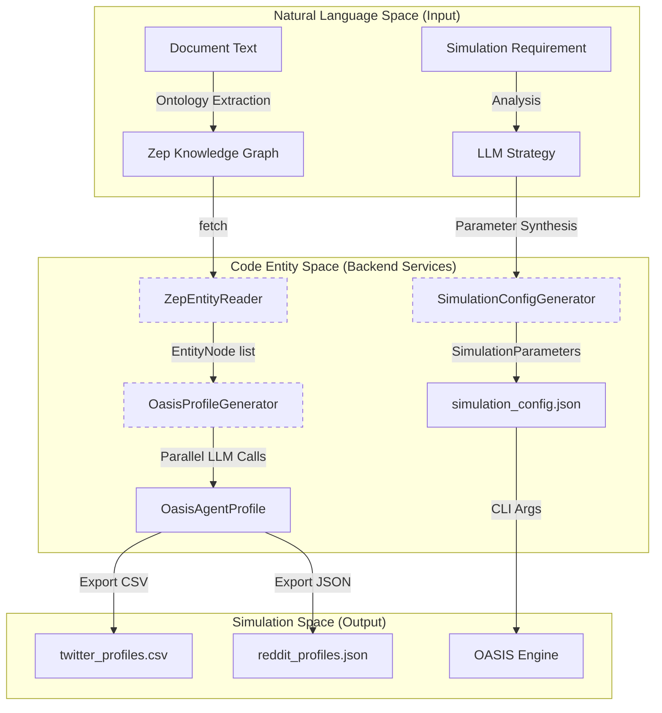
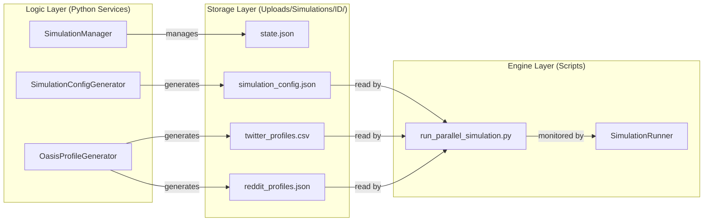

# Simulation Preparation & Management

Relevant source files

The following files were used as context for generating this wiki page:

- [backend/app/api/simulation.py](https://github.com/666ghj/MiroFish/blob/1536a793/backend/app/api/simulation.py)
- [backend/app/services/oasis_profile_generator.py](https://github.com/666ghj/MiroFish/blob/1536a793/backend/app/services/oasis_profile_generator.py)
- [backend/app/services/simulation_config_generator.py](https://github.com/666ghj/MiroFish/blob/1536a793/backend/app/services/simulation_config_generator.py)
- [backend/app/services/simulation_manager.py](https://github.com/666ghj/MiroFish/blob/1536a793/backend/app/services/simulation_manager.py)
- [frontend/src/components/HistoryDatabase.vue](https://github.com/666ghj/MiroFish/blob/1536a793/frontend/src/components/HistoryDatabase.vue)

The **Simulation Preparation & Management** layer is responsible for transforming static Knowledge Graph data into a dynamic social simulation environment. This process involves extracting entities from Zep Cloud, generating detailed psychological personas via LLMs, and synthesizing complex simulation parameters (timing, events, and platform-specific logic) to drive the OASIS simulation engine.

## 1. Preparation Workflow Overview

The preparation phase is triggered via the `/api/simulation/prepare/<simulation_id>` endpoint [backend/app/api/simulation.py:302-303](https://github.com/666ghj/MiroFish/blob/1536a793/backend/app/api/simulation.py#L302-L303). It follows a structured pipeline managed by the `SimulationManager` [backend/app/services/simulation_manager.py:114-123](https://github.com/666ghj/MiroFish/blob/1536a793/backend/app/services/simulation_manager.py#L114-L123).

### Data Flow: From Graph to Simulation
The diagram below illustrates how natural language requirements and graph entities are converted into structured simulation configurations.

**Graph-to-Persona Transformation Map**

**Sources:** [backend/app/services/simulation_manager.py:114-123](https://github.com/666ghj/MiroFish/blob/1536a793/backend/app/services/simulation_manager.py#L114-L123), [backend/app/services/oasis_profile_generator.py:142-152](https://github.com/666ghj/MiroFish/blob/1536a793/backend/app/services/oasis_profile_generator.py#L142-L152), [backend/app/services/simulation_config_generator.py:199-210](https://github.com/666ghj/MiroFish/blob/1536a793/backend/app/services/simulation_config_generator.py#L199-L210)

---

## 2. Core Components

### 2.1 SimulationManager
The `SimulationManager` acts as the central orchestrator for the preparation lifecycle. It maintains the `SimulationState` [backend/app/services/simulation_manager.py:43-76](https://github.com/666ghj/MiroFish/blob/1536a793/backend/app/services/simulation_manager.py#L43-L76), which tracks the transition from `CREATED` to `READY` status [backend/app/services/simulation_manager.py:24-34](https://github.com/666ghj/MiroFish/blob/1536a793/backend/app/services/simulation_manager.py#L24-L34).

*   **Key Function:** `prepare_simulation_data` [backend/app/services/simulation_manager.py:255-256](https://github.com/666ghj/MiroFish/blob/1536a793/backend/app/services/simulation_manager.py#L255-L256).
    1.  **Entity Extraction:** Uses `ZepEntityReader` to fetch nodes from Zep Cloud [backend/app/services/simulation_manager.py:274-282](https://github.com/666ghj/MiroFish/blob/1536a793/backend/app/services/simulation_manager.py#L274-L282).
    2.  **Profile Generation:** Invokes `OasisProfileGenerator` to create personas [backend/app/services/simulation_manager.py:290-295](https://github.com/666ghj/MiroFish/blob/1536a793/backend/app/services/simulation_manager.py#L290-L295).
    3.  **Config Generation:** Invokes `SimulationConfigGenerator` to determine simulation logic [backend/app/services/simulation_manager.py:300-305](https://github.com/666ghj/MiroFish/blob/1536a793/backend/app/services/simulation_manager.py#L300-L305).
    4.  **Persistence:** Saves state to `state.json` [backend/app/services/simulation_manager.py:144-154](https://github.com/666ghj/MiroFish/blob/1536a793/backend/app/services/simulation_manager.py#L144-L154) and config to `simulation_config.json` [backend/app/services/simulation_manager.py:315-316](https://github.com/666ghj/MiroFish/blob/1536a793/backend/app/services/simulation_manager.py#L315-L316) in the simulation's upload directory.

**Sources:** [backend/app/services/simulation_manager.py:24-34](https://github.com/666ghj/MiroFish/blob/1536a793/backend/app/services/simulation_manager.py#L24-L34), [backend/app/services/simulation_manager.py:114-154](https://github.com/666ghj/MiroFish/blob/1536a793/backend/app/services/simulation_manager.py#L114-L154), [backend/app/services/simulation_manager.py:255-325](https://github.com/666ghj/MiroFish/blob/1536a793/backend/app/services/simulation_manager.py#L255-L325)

### 2.2 OasisProfileGenerator
This service converts `EntityNode` objects into `OasisAgentProfile` data structures [backend/app/services/oasis_profile_generator.py:28-58](https://github.com/666ghj/MiroFish/blob/1536a793/backend/app/services/oasis_profile_generator.py#L28-L58). It distinguishes between **Individual** (e.g., student, professor) [backend/app/services/oasis_profile_generator.py:169-172](https://github.com/666ghj/MiroFish/blob/1536a793/backend/app/services/oasis_profile_generator.py#L169-L172) and **Group** (e.g., university, NGO) entities [backend/app/services/oasis_profile_generator.py:174-178](https://github.com/666ghj/MiroFish/blob/1536a793/backend/app/services/oasis_profile_generator.py#L174-L178).

*   **Parallel Generation:** To handle large numbers of agents, it uses LLM prompts to generate detailed MBTI, age, gender, and social media bios for each entity [backend/app/services/oasis_profile_generator.py:46-53](https://github.com/666ghj/MiroFish/blob/1536a793/backend/app/services/oasis_profile_generator.py#L46-L53).
*   **Platform Formatting:** 
    *   `to_twitter_format()`: Outputs fields like `friend_count` and `statuses_count` [backend/app/services/oasis_profile_generator.py:88-116](https://github.com/666ghj/MiroFish/blob/1536a793/backend/app/services/oasis_profile_generator.py#L88-L116).
    *   `to_reddit_format()`: Outputs fields like `karma` [backend/app/services/oasis_profile_generator.py:60-86](https://github.com/666ghj/MiroFish/blob/1536a793/backend/app/services/oasis_profile_generator.py#L60-L86).

**Sources:** [backend/app/services/oasis_profile_generator.py:142-152](https://github.com/666ghj/MiroFish/blob/1536a793/backend/app/services/oasis_profile_generator.py#L142-L152), [backend/app/services/oasis_profile_generator.py:211-227](https://github.com/666ghj/MiroFish/blob/1536a793/backend/app/services/oasis_profile_generator.py#L211-L227), [backend/app/services/oasis_profile_generator.py:168-178](https://github.com/666ghj/MiroFish/blob/1536a793/backend/app/services/oasis_profile_generator.py#L168-L178)

### 2.3 SimulationConfigGenerator
The `SimulationConfigGenerator` uses a multi-step LLM strategy to avoid context window limits and ensure high-fidelity simulation parameters [backend/app/services/simulation_config_generator.py:5-11](https://github.com/666ghj/MiroFish/blob/1536a793/backend/app/services/simulation_config_generator.py#L5-L11).

*   **Time Configuration:** Implements `CHINA_TIMEZONE_CONFIG` to simulate realistic activity cycles (e.g., peak hours between 19:00-22:00) [backend/app/services/simulation_config_generator.py:27-47](https://github.com/666ghj/MiroFish/blob/1536a793/backend/app/services/simulation_config_generator.py#L27-L47).
*   **Agent Activity:** Assigns `activity_level`, `sentiment_bias`, and `influence_weight` to each agent [backend/app/services/simulation_config_generator.py:50-80](https://github.com/666ghj/MiroFish/blob/1536a793/backend/app/services/simulation_config_generator.py#L50-L80).
*   **Event Injection:** Generates `initial_posts` and `scheduled_events` based on the user's simulation requirements [backend/app/services/simulation_config_generator.py:112-126](https://github.com/666ghj/MiroFish/blob/1536a793/backend/app/services/simulation_config_generator.py#L112-L126).

**Sources:** [backend/app/services/simulation_config_generator.py:146-192](https://github.com/666ghj/MiroFish/blob/1536a793/backend/app/services/simulation_config_generator.py#L146-L192), [backend/app/services/simulation_config_generator.py:206-210](https://github.com/666ghj/MiroFish/blob/1536a793/backend/app/services/simulation_config_generator.py#L206-L210), [backend/app/services/simulation_config_generator.py:27-47](https://github.com/666ghj/MiroFish/blob/1536a793/backend/app/services/simulation_config_generator.py#L27-L47)

---

## 3. API Endpoints & Implementation

The simulation preparation logic is exposed via the `simulation_bp` blueprint [backend/app/api/simulation.py:10](https://github.com/666ghj/MiroFish/blob/1536a793/backend/app/api/simulation.py#L10).

| Endpoint | Method | Service Call | Description |
| :--- | :--- | :--- | :--- |
| `/create` | POST | `SimulationManager.create_simulation` | Initializes a new simulation entry and directory [backend/app/api/simulation.py:164-228](https://github.com/666ghj/MiroFish/blob/1536a793/backend/app/api/simulation.py#L164-L228). |
| `/prepare/<sim_id>` | POST | `SimulationManager.prepare_simulation_data` | Starts the async task for entity extraction and persona generation [backend/app/api/simulation.py:302-348](https://github.com/666ghj/MiroFish/blob/1536a793/backend/app/api/simulation.py#L302-L348). |
| `/status/<sim_id>` | GET | `SimulationManager._load_simulation_state` | Returns the current preparation progress and generated counts [backend/app/api/simulation.py:351-378](https://github.com/666ghj/MiroFish/blob/1536a793/backend/app/api/simulation.py#L351-L378). |
| `/entities/<graph_id>` | GET | `ZepEntityReader.filter_defined_entities` | Retrieves filtered entities from Zep for UI preview [backend/app/api/simulation.py:47-89](https://github.com/666ghj/MiroFish/blob/1536a793/backend/app/api/simulation.py#L47-L89). |

**Sources:** [backend/app/api/simulation.py:12-15](https://github.com/666ghj/MiroFish/blob/1536a793/backend/app/api/simulation.py#L12-L15), [backend/app/api/simulation.py:164-378](https://github.com/666ghj/MiroFish/blob/1536a793/backend/app/api/simulation.py#L164-L378), [backend/app/services/zep_entity_reader.py:17-23](https://github.com/666ghj/MiroFish/blob/1536a793/backend/app/services/zep_entity_reader.py#L17-L23)

---

## 4. Execution Lifecycle

The following diagram bridges the backend service classes with the physical file outputs required by the OASIS engine.

**Service-to-File Entity Mapping**

**Sources:** [backend/app/services/simulation_manager.py:125-129](https://github.com/666ghj/MiroFish/blob/1536a793/backend/app/services/simulation_manager.py#L125-L129), [backend/app/services/simulation_manager.py:144-154](https://github.com/666ghj/MiroFish/blob/1536a793/backend/app/services/simulation_manager.py#L144-L154), [backend/app/services/simulation_config_generator.py:175-192](https://github.com/666ghj/MiroFish/blob/1536a793/backend/app/services/simulation_config_generator.py#L175-L192)

### Preparation Phases
1.  **Entity Fetching:** `ZepEntityReader` uses `get_entities_by_type` to pull nodes from the Zep Graph [backend/app/api/simulation.py:125-159](https://github.com/666ghj/MiroFish/blob/1536a793/backend/app/api/simulation.py#L125-L159).
2.  **Persona Synthesis:** `OasisProfileGenerator` runs batches of LLM calls to create detailed bios. If an entity is "University of X", the LLM generates a "University Spokesperson" persona [backend/app/services/oasis_profile_generator.py:174-178](https://github.com/666ghj/MiroFish/blob/1536a793/backend/app/services/oasis_profile_generator.py#L174-L178).
3.  **Configuration Synthesis:** `SimulationConfigGenerator` determines the `total_simulation_hours` and `minutes_per_round` to optimize the simulation speed [backend/app/services/simulation_config_generator.py:83-110](https://github.com/666ghj/MiroFish/blob/1536a793/backend/app/services/simulation_config_generator.py#L83-L110).

**Sources:** [backend/app/services/simulation_manager.py:255-325](https://github.com/666ghj/MiroFish/blob/1536a793/backend/app/services/simulation_manager.py#L255-L325), [backend/app/services/simulation_config_generator.py:242-252](https://github.com/666ghj/MiroFish/blob/1536a793/backend/app/services/simulation_config_generator.py#L242-L252), [backend/app/services/oasis_profile_generator.py:211-227](https://github.com/666ghj/MiroFish/blob/1536a793/backend/app/services/oasis_profile_generator.py#L211-L227)
