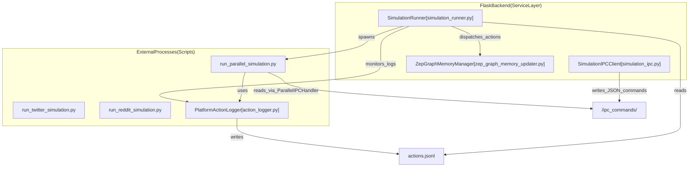
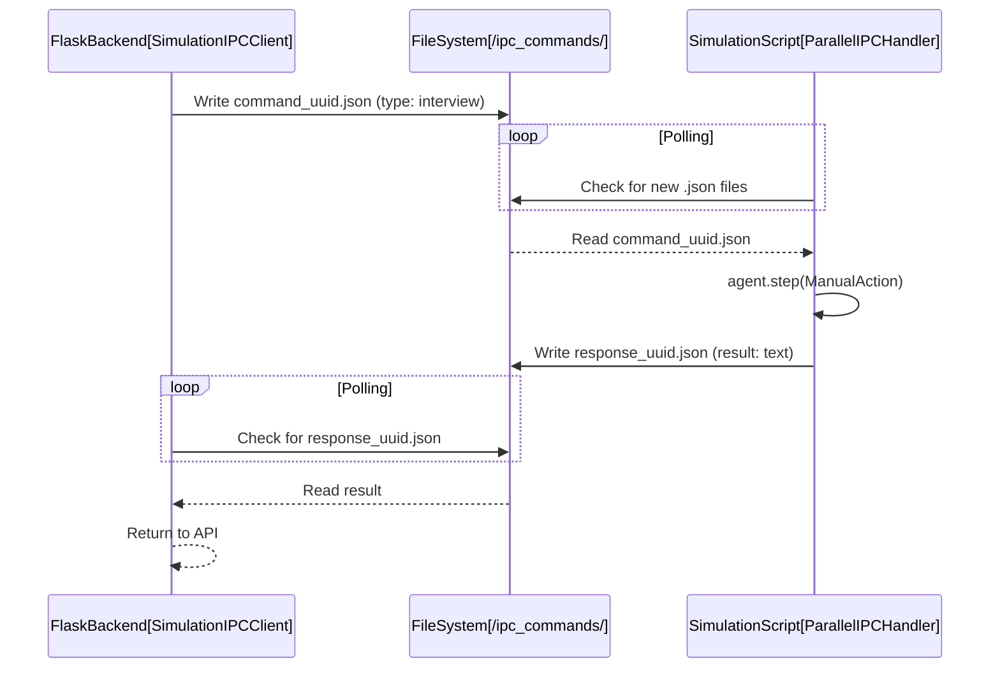

# Simulation Execution Engine

Relevant source files

The following files were used as context for generating this wiki page:

- [backend/app/services/simulation_ipc.py](https://github.com/666ghj/MiroFish/blob/1536a793/backend/app/services/simulation_ipc.py)
- [backend/app/services/simulation_runner.py](https://github.com/666ghj/MiroFish/blob/1536a793/backend/app/services/simulation_runner.py)
- [backend/app/services/zep_graph_memory_updater.py](https://github.com/666ghj/MiroFish/blob/1536a793/backend/app/services/zep_graph_memory_updater.py)
- [backend/scripts/action_logger.py](https://github.com/666ghj/MiroFish/blob/1536a793/backend/scripts/action_logger.py)
- [backend/scripts/run_parallel_simulation.py](https://github.com/666ghj/MiroFish/blob/1536a793/backend/scripts/run_parallel_simulation.py)
- [backend/scripts/run_reddit_simulation.py](https://github.com/666ghj/MiroFish/blob/1536a793/backend/scripts/run_reddit_simulation.py)
- [backend/scripts/run_twitter_simulation.py](https://github.com/666ghj/MiroFish/blob/1536a793/backend/scripts/run_twitter_simulation.py)

The Simulation Execution Engine is the core component responsible for orchestrating the lifecycle of OASIS-based social simulations. It manages parallel processes for different social platforms (Twitter and Reddit), handles real-time inter-process communication (IPC) for agent interaction, and ensures that agent activities are logged and synchronized with the Zep Cloud knowledge graph.

## 1. System Architecture & Component Mapping

The engine operates as a bridge between the Flask backend services and the standalone OASIS simulation scripts. It uses a decoupled architecture where the simulation logic runs in independent subprocesses while the backend monitors status and injects commands.

### Code Entity Mapping
The following diagram maps high-level engine responsibilities to specific classes and scripts within the codebase.

**Execution Engine Entity Map**

Sources: [backend/app/services/simulation_runner.py:195-204](https://github.com/666ghj/MiroFish/blob/1536a793/backend/app/services/simulation_runner.py#L195-L204), [backend/scripts/run_parallel_simulation.py:1-26](https://github.com/666ghj/MiroFish/blob/1536a793/backend/scripts/run_parallel_simulation.py#L1-L26), [backend/app/services/simulation_ipc.py:95-100](https://github.com/666ghj/MiroFish/blob/1536a793/backend/app/services/simulation_ipc.py#L95-L100)

## 2. Process Lifecycle Management

The `SimulationRunner` class manages the execution state of simulations. It is responsible for starting the simulation scripts as subprocesses and maintaining a `SimulationRunState` object for real-time tracking.

### Key Lifecycle Methods
- **`start_simulation`**: Prepares the environment, initializes the action queue, and spawns the `run_parallel_simulation.py` script using `subprocess.Popen` [backend/app/services/simulation_runner.py:316-410](https://github.com/666ghj/MiroFish/blob/1536a793/backend/app/services/simulation_runner.py#L316-L410).
- **`stop_simulation`**: Sends a `CLOSE_ENV` command via IPC and terminates the subprocess if it doesn't exit gracefully [backend/app/services/simulation_runner.py:530-564](https://github.com/666ghj/MiroFish/blob/1536a793/backend/app/services/simulation_runner.py#L530-L564).
- **`_monitor_process`**: A background thread that reads the subprocess standard output and updates the internal state [backend/app/services/simulation_runner.py:657-690](https://github.com/666ghj/MiroFish/blob/1536a793/backend/app/services/simulation_runner.py#L657-L690).

### Simulation Run States
The engine tracks simulation progress through the `RunnerStatus` enum: `IDLE`, `STARTING`, `RUNNING`, `PAUSED`, `STOPPING`, `STOPPED`, `COMPLETED`, `FAILED` [backend/app/services/simulation_runner.py:35-43](https://github.com/666ghj/MiroFish/blob/1536a793/backend/app/services/simulation_runner.py#L35-L43).

Sources: [backend/app/services/simulation_runner.py:35-43](https://github.com/666ghj/MiroFish/blob/1536a793/backend/app/services/simulation_runner.py#L35-L43), [backend/app/services/simulation_runner.py:316-410](https://github.com/666ghj/MiroFish/blob/1536a793/backend/app/services/simulation_runner.py#L316-L410), [backend/app/services/simulation_runner.py:530-564](https://github.com/666ghj/MiroFish/blob/1536a793/backend/app/services/simulation_runner.py#L530-L564)

## 3. Parallel Simulation Execution

MiroFish supports concurrent simulation on multiple platforms. The `run_parallel_simulation.py` script acts as a master orchestrator for the OASIS environment.

### Execution Flow
1. **Environment Setup**: Configures UTF-8 encoding for Windows compatibility by monkey-patching `builtins.open` and setting `PYTHONUTF8` environment variables [backend/scripts/run_parallel_simulation.py:35-65](https://github.com/666ghj/MiroFish/blob/1536a793/backend/scripts/run_parallel_simulation.py#L35-L65). It also disables redundant OASIS logging [backend/scripts/run_parallel_simulation.py:120-139](https://github.com/666ghj/MiroFish/blob/1536a793/backend/scripts/run_parallel_simulation.py#L120-L139).
2. **Parallel Tasks**: Uses `asyncio.gather` to run Twitter and Reddit simulation loops concurrently [backend/scripts/run_parallel_simulation.py:463-485](https://github.com/666ghj/MiroFish/blob/1536a793/backend/scripts/run_parallel_simulation.py#L463-L485).
3. **Action Logging**: Every agent action (e.g., `CREATE_POST`, `LIKE_POST`) is recorded into platform-specific `actions.jsonl` files via the `PlatformActionLogger` [backend/scripts/action_logger.py:43-63](https://github.com/666ghj/MiroFish/blob/1536a793/backend/scripts/action_logger.py#L43-L63).
4. **Wait Mode**: After the defined simulation rounds finish, the script enters a "Wait Mode" instead of exiting, allowing the user to perform "Interviews" with agents [backend/scripts/run_parallel_simulation.py:518-535](https://github.com/666ghj/MiroFish/blob/1536a793/backend/scripts/run_parallel_simulation.py#L518-L535).

Sources: [backend/scripts/run_parallel_simulation.py:35-65](https://github.com/666ghj/MiroFish/blob/1536a793/backend/scripts/run_parallel_simulation.py#L35-L65), [backend/scripts/run_parallel_simulation.py:463-485](https://github.com/666ghj/MiroFish/blob/1536a793/backend/scripts/run_parallel_simulation.py#L463-L485), [backend/scripts/action_logger.py:22-37](https://github.com/666ghj/MiroFish/blob/1536a793/backend/scripts/action_logger.py#L22-L37)

## 4. Inter-Process Communication (IPC) Layer

Because the simulation runs in a separate process, the Flask backend communicates with it using a file-based IPC mechanism defined in `simulation_ipc.py`.

### IPC Mechanism
- **Command Dispatch**: `SimulationIPCClient` writes a JSON file containing a unique `command_id` and `command_type` (e.g., `INTERVIEW`, `BATCH_INTERVIEW`, `CLOSE_ENV`) to the `ipc_commands/` directory [backend/app/services/simulation_ipc.py:139-151](https://github.com/666ghj/MiroFish/blob/1536a793/backend/app/services/simulation_ipc.py#L139-L151).
- **Command Handling**: The `ParallelIPCHandler` inside the simulation script polls this directory. When a command is detected, it executes the action within the OASIS environment using `ManualAction` [backend/scripts/run_parallel_simulation.py:217-245](https://github.com/666ghj/MiroFish/blob/1536a793/backend/scripts/run_parallel_simulation.py#L217-L245), [backend/scripts/run_twitter_simulation.py:226-231](https://github.com/666ghj/MiroFish/blob/1536a793/backend/scripts/run_twitter_simulation.py#L226-L231).
- **Response Retrieval**: Once completed, the simulation script writes a response to `ipc_responses/`. The backend polls this file to return the result to the frontend [backend/app/services/simulation_ipc.py:154-172](https://github.com/666ghj/MiroFish/blob/1536a793/backend/app/services/simulation_ipc.py#L154-L172).

**IPC Sequence Diagram**

Sources: [backend/app/services/simulation_ipc.py:95-123](https://github.com/666ghj/MiroFish/blob/1536a793/backend/app/services/simulation_ipc.py#L95-L123), [backend/scripts/run_parallel_simulation.py:217-245](https://github.com/666ghj/MiroFish/blob/1536a793/backend/scripts/run_parallel_simulation.py#L217-L245), [backend/app/services/simulation_ipc.py:25-30](https://github.com/666ghj/MiroFish/blob/1536a793/backend/app/services/simulation_ipc.py#L25-L30)

## 5. Action Logging and Graph Synchronization

As agents perform actions, the engine ensures these activities are persisted and reflected in the Knowledge Graph.

### Action Logging
The `PlatformActionLogger` generates structured JSONL entries for every event:
- **`log_simulation_start`**: Metadata about the run including `total_rounds` and `agents_count` [backend/scripts/action_logger.py:92-103](https://github.com/666ghj/MiroFish/blob/1536a793/backend/scripts/action_logger.py#L92-L103).
- **`log_round_start/end`**: Boundaries for simulation time steps [backend/scripts/action_logger.py:68-90](https://github.com/666ghj/MiroFish/blob/1536a793/backend/scripts/action_logger.py#L68-L90).
- **`log_action`**: Specific details including `agent_id`, `action_type`, and `action_args` (e.g., post content, author name) [backend/scripts/action_logger.py:43-63](https://github.com/666ghj/MiroFish/blob/1536a793/backend/scripts/action_logger.py#L43-L63).

### Zep Memory Synchronization
The `ZepGraphMemoryManager` monitors the action logs. It converts structured actions into natural language "episodes" using `AgentActivity.to_episode_text()` and pushes them to Zep Cloud [backend/app/services/zep_graph_memory_updater.py:24-61](https://github.com/666ghj/MiroFish/blob/1536a793/backend/app/services/zep_graph_memory_updater.py#L24-L61).
- **Transformation Logic**: Actions like `CREATE_COMMENT` or `REPOST` are mapped to descriptive strings. For instance, a `LIKE_POST` action is transformed into: `"{agent_name}: 点赞了{post_author}的帖子：「{post_content}」"` [backend/app/services/zep_graph_memory_updater.py:69-81](https://github.com/666ghj/MiroFish/blob/1536a793/backend/app/services/zep_graph_memory_updater.py#L69-L81), [backend/app/services/zep_graph_memory_updater.py:136-150](https://github.com/666ghj/MiroFish/blob/1536a793/backend/app/services/zep_graph_memory_updater.py#L136-L150).

Sources: [backend/scripts/action_logger.py:43-63](https://github.com/666ghj/MiroFish/blob/1536a793/backend/scripts/action_logger.py#L43-L63), [backend/app/services/zep_graph_memory_updater.py:34-61](https://github.com/666ghj/MiroFish/blob/1536a793/backend/app/services/zep_graph_memory_updater.py#L34-L61), [backend/app/services/zep_graph_memory_updater.py:136-150](https://github.com/666ghj/MiroFish/blob/1536a793/backend/app/services/zep_graph_memory_updater.py#L136-L150)

## 6. Cleanup and Recovery

The engine implements robust cleanup to prevent orphaned simulation processes.
- **`atexit` Registration**: `SimulationRunner` registers a cleanup function to kill all active subprocesses when the Flask server shuts down [backend/app/services/simulation_runner.py:276-302](https://github.com/666ghj/MiroFish/blob/1536a793/backend/app/services/simulation_runner.py#L276-L302).
- **Signal Handling**: Simulation scripts handle `SIGINT` and `SIGTERM` to ensure platform environments are closed properly before exiting [backend/scripts/run_parallel_simulation.py:537-561](https://github.com/666ghj/MiroFish/blob/1536a793/backend/scripts/run_parallel_simulation.py#L537-L561).
- **Status Persistence**: The simulation state is saved to `run_state.json` in the project's upload directory, allowing the backend to recover the status of a simulation even after a restart [backend/app/services/simulation_runner.py:230-245](https://github.com/666ghj/MiroFish/blob/1536a793/backend/app/services/simulation_runner.py#L230-L245).

Sources: [backend/app/services/simulation_runner.py:276-302](https://github.com/666ghj/MiroFish/blob/1536a793/backend/app/services/simulation_runner.py#L276-L302), [backend/scripts/run_parallel_simulation.py:537-561](https://github.com/666ghj/MiroFish/blob/1536a793/backend/scripts/run_parallel_simulation.py#L537-L561), [backend/app/services/simulation_runner.py:207-210](https://github.com/666ghj/MiroFish/blob/1536a793/backend/app/services/simulation_runner.py#L207-L210)
