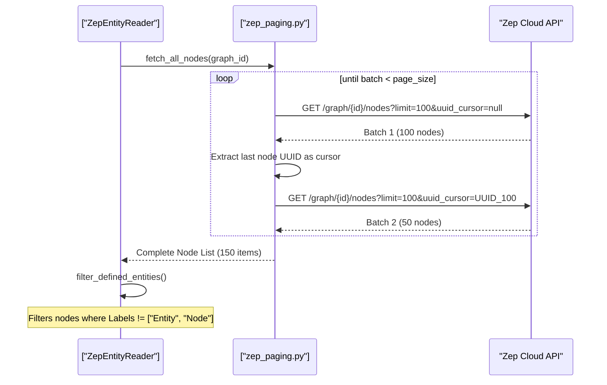
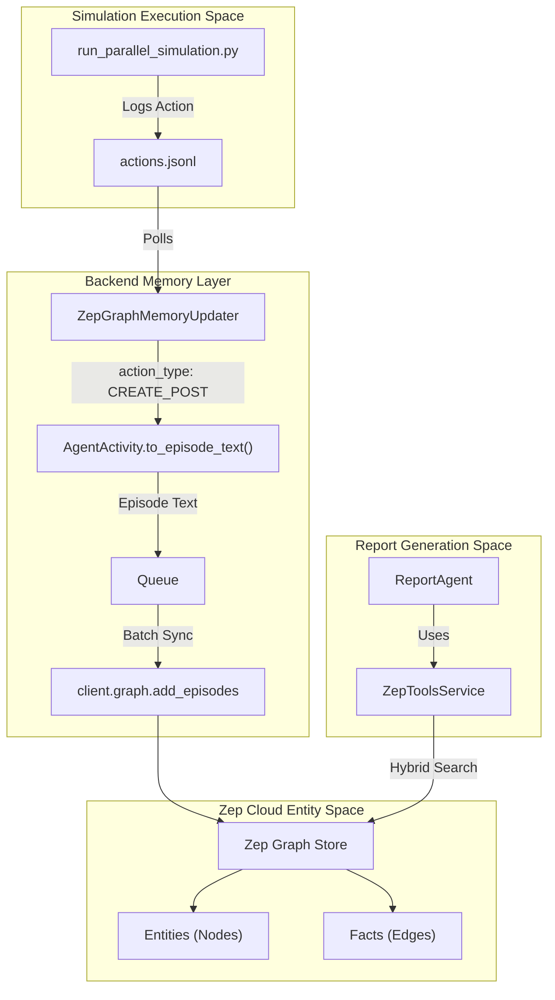

# Zep Memory Integration

Relevant source files

The following files were used as context for generating this wiki page:

- [backend/app/services/graph_builder.py](https://github.com/666ghj/MiroFish/blob/1536a793/backend/app/services/graph_builder.py)
- [backend/app/services/zep_entity_reader.py](https://github.com/666ghj/MiroFish/blob/1536a793/backend/app/services/zep_entity_reader.py)
- [backend/app/services/zep_graph_memory_updater.py](https://github.com/666ghj/MiroFish/blob/1536a793/backend/app/services/zep_graph_memory_updater.py)
- [backend/app/utils/retry.py](https://github.com/666ghj/MiroFish/blob/1536a793/backend/app/utils/retry.py)
- [backend/app/utils/zep_paging.py](https://github.com/666ghj/MiroFish/blob/1536a793/backend/app/utils/zep_paging.py)
- [backend/scripts/run_parallel_simulation.py](https://github.com/666ghj/MiroFish/blob/1536a793/backend/scripts/run_parallel_simulation.py)

The Zep Memory Integration layer provides the persistent long-term memory for MiroFish. It facilitates the synchronization of agent actions from the simulation environment into the Zep Cloud Knowledge Graph and provides high-level retrieval tools for the `ReportAgent`. This integration ensures that every interaction in the simulated Twitter and Reddit environments contributes to a structured, queryable graph of facts, entities, and relationships.

## ZepGraphMemoryUpdater

The `ZepGraphMemoryUpdater` is responsible for monitoring agent activities and converting them into natural language "episodes" that Zep can ingest to update its knowledge graph.

### Activity Conversion Logic
When an agent performs an action (e.g., `CREATE_POST`, `LIKE_POST`), the `AgentActivity` dataclass [backend/app/services/zep_graph_memory_updater.py:24-32](https://github.com/666ghj/MiroFish/blob/1536a793/backend/app/services/zep_graph_memory_updater.py#L24-L32) converts the raw action arguments into a descriptive text string via `to_episode_text()` [backend/app/services/zep_graph_memory_updater.py:34-61](https://github.com/666ghj/MiroFish/blob/1536a793/backend/app/services/zep_graph_memory_updater.py#L34-L61). This conversion uses specific templates for different action types to ensure Zep's NLP engine can extract relevant entities:

| Action Type | Description Logic | Source |
| :--- | :--- | :--- |
| `CREATE_POST` | Captures post content: "发布了一条帖子：「{content}」" | [backend/app/services/zep_graph_memory_updater.py:63-67](https://github.com/666ghj/MiroFish/blob/1536a793/backend/app/services/zep_graph_memory_updater.py#L63-L67) |
| `LIKE_POST` | Captures author and content: "点赞了{author}的帖子：「{content}」" | [backend/app/services/zep_graph_memory_updater.py:69-80](https://github.com/666ghj/MiroFish/blob/1536a793/backend/app/services/zep_graph_memory_updater.py#L69-L80) |
| `REPOST` | Captures original author/content: "转发了{author}的帖子：「{content}」" | [backend/app/services/zep_graph_memory_updater.py:95-106](https://github.com/666ghj/MiroFish/blob/1536a793/backend/app/services/zep_graph_memory_updater.py#L95-L106) |
| `FOLLOW` | Captures target: "关注了用户「{target_user_name}」" | [backend/app/services/zep_graph_memory_updater.py:128-134](https://github.com/666ghj/MiroFish/blob/1536a793/backend/app/services/zep_graph_memory_updater.py#L128-L134) |
| `CREATE_COMMENT` | Captures context: "在{author}的帖子「{post}」下评论道：「{content}」" | [backend/app/services/zep_graph_memory_updater.py:136-150](https://github.com/666ghj/MiroFish/blob/1536a793/backend/app/services/zep_graph_memory_updater.py#L136-L150) |

### Batch Processing and Syncing
To optimize API usage and handle high-frequency simulation events, the updater employs a background thread and a `Queue` [backend/app/services/zep_graph_memory_updater.py:13](https://github.com/666ghj/MiroFish/blob/1536a793/backend/app/services/zep_graph_memory_updater.py#L13). 

1.  **Queueing**: The `add_activity` method pushes new `AgentActivity` objects into the internal queue [backend/app/services/zep_graph_memory_updater.py:270-285](https://github.com/666ghj/MiroFish/blob/1536a793/backend/app/services/zep_graph_memory_updater.py#L270-L285).
2.  **Worker Loop**: The `_update_worker` runs continuously, gathering activities until a `batch_size` (default 5) is reached or a timeout occurs [backend/app/services/zep_graph_memory_updater.py:313-345](https://github.com/666ghj/MiroFish/blob/1536a793/backend/app/services/zep_graph_memory_updater.py#L313-L345).
3.  **Zep Ingestion**: The batch is converted to `EpisodeData` and sent to `client.graph.add_episodes` [backend/app/services/zep_graph_memory_updater.py:355-359](https://github.com/666ghj/MiroFish/blob/1536a793/backend/app/services/zep_graph_memory_updater.py#L355-L359).

**Sources:** `backend/app/services/zep_graph_memory_updater.py`

## Cursor-Based Pagination Utilities

Because Zep Cloud limits the number of nodes or edges returned in a single request, the `zep_paging` utility implements robust cursor-based navigation to ensure MiroFish can visualize or process the entire graph.

### Implementation Details
The utility handles `InternalServerError` and network timeouts using an exponential backoff strategy [backend/app/utils/zep_paging.py:26-56](https://github.com/666ghj/MiroFish/blob/1536a793/backend/app/utils/zep_paging.py#L26-L56).

*   **`fetch_all_nodes`**: Iteratively calls `client.graph.node.get_by_graph_id` [backend/app/utils/zep_paging.py:79](https://github.com/666ghj/MiroFish/blob/1536a793/backend/app/utils/zep_paging.py#L79). It extracts the `uuid_` from the last item in a batch to use as the `uuid_cursor` for the next request [backend/app/utils/zep_paging.py:97](https://github.com/666ghj/MiroFish/blob/1536a793/backend/app/utils/zep_paging.py#L97). It respects a `max_items` limit (default 2000) [backend/app/utils/zep_paging.py:21](https://github.com/666ghj/MiroFish/blob/1536a793/backend/app/utils/zep_paging.py#L21).
*   **`fetch_all_edges`**: Similar logic using `client.graph.edge.get_by_graph_id` [backend/app/utils/zep_paging.py:125](https://github.com/666ghj/MiroFish/blob/1536a793/backend/app/utils/zep_paging.py#L125).

### Data Flow: Pagination Logic
The following diagram illustrates how the `ZepEntityReader` uses `zep_paging` to aggregate a complete graph state for the simulation preparation phase.

Title: Zep Pagination and Entity Retrieval

**Sources:** `backend/app/utils/zep_paging.py`, `backend/app/services/zep_entity_reader.py`

## ZepToolsService and Hybrid Search

The `ZepToolsService` provides the `ReportAgent` with specialized tools for querying simulation results. It abstracts complex graph traversals into three primary search patterns.

### 1. InsightForge (Deep Semantic Search)
`InsightForge` is the most sophisticated tool. It uses an LLM to decompose a complex query into sub-queries, then performs multi-dimensional retrieval.
*   **Sub-query Generation**: Generates 3-5 specific questions based on the main query and simulation requirements.
*   **Semantic Retrieval**: Calls `client.graph.search` for each sub-query to find relevant facts.

### 2. PanoramaSearch (Broad Graph Search)
`PanoramaSearch` is designed to capture the "full picture," including historical facts. It retrieves the evolution of entities over the course of the simulation.

### 3. QuickSearch (Simple Retrieval)
A direct wrapper around `client.graph.search` for basic fact retrieval with a specified limit.

### Data Structure Mapping
The service maps Zep Cloud entities to local Python Dataclasses for consistent processing:

| Code Entity | Maps to Zep Concept | Key Attributes |
| :--- | :--- | :--- |
| `EntityNode` | Graph Node | `uuid`, `labels`, `summary`, `attributes` [backend/app/services/zep_entity_reader.py:23-29](https://github.com/666ghj/MiroFish/blob/1536a793/backend/app/services/zep_entity_reader.py#L23-L29) |
| `GraphInfo` | Graph Metadata | `graph_id`, `node_count`, `edge_count` [backend/app/services/graph_builder.py:23-28](https://github.com/666ghj/MiroFish/blob/1536a793/backend/app/services/graph_builder.py#L23-L28) |

**Sources:** `backend/app/services/zep_entity_reader.py`, `backend/app/services/graph_builder.py`

## System Integration: Simulation to Memory

This diagram bridges the **Simulation Execution** (Natural Language Space) to the **Zep Memory Persistence** (Code Entity Space).

Title: Simulation Action to Zep Knowledge Graph Flow

**Sources:** `backend/scripts/run_parallel_simulation.py`, `backend/app/services/zep_graph_memory_updater.py`, `backend/app/utils/zep_paging.py`
