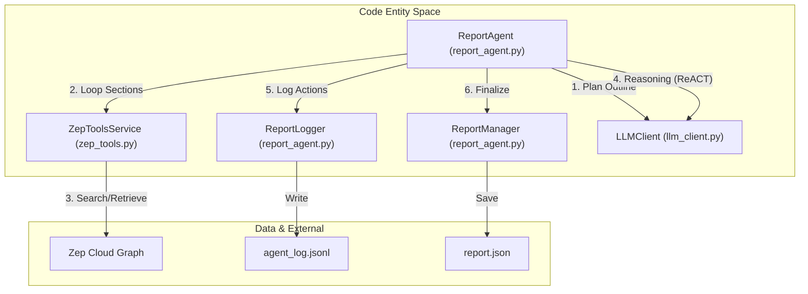
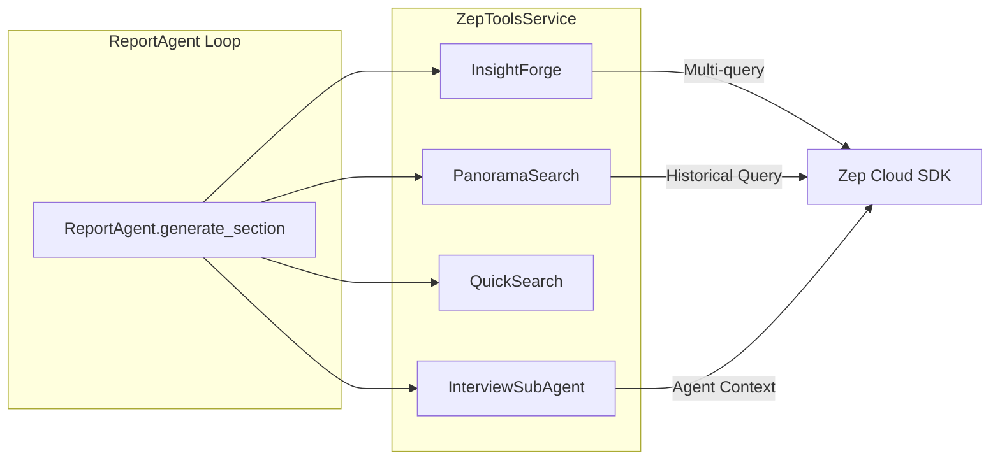

# Report Agent & Analysis

Relevant source files

The following files were used as context for generating this wiki page:

- [backend/app/api/report.py](https://github.com/666ghj/MiroFish/blob/1536a793/backend/app/api/report.py)
- [backend/app/services/report_agent.py](https://github.com/666ghj/MiroFish/blob/1536a793/backend/app/services/report_agent.py)
- [backend/app/services/zep_tools.py](https://github.com/666ghj/MiroFish/blob/1536a793/backend/app/services/zep_tools.py)

The **Report Agent** is the final stage of the MiroFish pipeline, responsible for synthesizing the raw social media simulation data and the initial knowledge graph into a structured, multi-chapter analysis report. It utilizes a **ReACT (Reasoning and Acting)** loop to autonomously query the Zep Graph memory, perform deep insights analysis, and generate content that addresses the specific simulation requirements.

### 1. Report Agent Architecture

The `ReportAgent` class [backend/app/services/report_agent.py:134-138](https://github.com/666ghj/MiroFish/blob/1536a793/backend/app/services/report_agent.py#L134-L138) coordinates the generation process by first planning a table of contents and then iteratively generating each section using specialized tools. It maintains a detailed execution log via `ReportLogger` [backend/app/services/report_agent.py:35-41](https://github.com/666ghj/MiroFish/blob/1536a793/backend/app/services/report_agent.py#L35-L41) to provide real-time transparency into the agent's "thoughts" and tool usage.

#### Data Flow: Generation to Persistence
The following diagram illustrates how the `ReportAgent` interacts with the Zep memory and the persistence layer.

**Report Generation Flow**

**Sources:** [backend/app/services/report_agent.py:134-155](https://github.com/666ghj/MiroFish/blob/1536a793/backend/app/services/report_agent.py#L134-L155), [backend/app/services/report_agent.py:35-110](https://github.com/666ghj/MiroFish/blob/1536a793/backend/app/services/report_agent.py#L35-L110), [backend/app/services/zep_tools.py:2-9](https://github.com/666ghj/MiroFish/blob/1536a793/backend/app/services/zep_tools.py#L2-L9)

---

### 2. ZepToolsService: The Analysis Toolkit

The `ZepToolsService` [backend/app/services/zep_tools.py:2-9](https://github.com/666ghj/MiroFish/blob/1536a793/backend/app/services/zep_tools.py#L2-L9) provides the `ReportAgent` with high-level tools to query the Zep Knowledge Graph. These tools are designed to bridge the gap between natural language questions and graph-based retrieval.

| Tool Name | Class/Method | Purpose |
| :--- | :--- | :--- |
| **InsightForge** | `insight_forge` | Performs deep multi-dimensional retrieval. Generates sub-queries to find semantic facts, entity insights, and relationship chains [backend/app/services/zep_tools.py:138-168](https://github.com/666ghj/MiroFish/blob/1536a793/backend/app/services/zep_tools.py#L138-L168). |
| **PanoramaSearch** | `panorama_search` | Provides a "broad view" of the graph, including expired or historical facts to analyze evolution over time [backend/app/services/zep_tools.py:214-235](https://github.com/666ghj/MiroFish/blob/1536a793/backend/app/services/zep_tools.py#L214-L235). |
| **QuickSearch** | `quick_search` | A lightweight semantic search for fast fact retrieval [backend/app/services/zep_tools.py:7-8](https://github.com/666ghj/MiroFish/blob/1536a793/backend/app/services/zep_tools.py#L7-L8). |
| **InterviewSubAgent** | `interview_agent` | Simulates a Q&A session with specific agents from the simulation to extract their "personal" perspectives [backend/app/services/zep_tools.py:461-510](https://github.com/666ghj/MiroFish/blob/1536a793/backend/app/services/zep_tools.py#L461-L510). |

**Tool Integration Logic**

**Sources:** [backend/app/services/zep_tools.py:138-212](https://github.com/666ghj/MiroFish/blob/1536a793/backend/app/services/zep_tools.py#L138-L212), [backend/app/services/zep_tools.py:214-235](https://github.com/666ghj/MiroFish/blob/1536a793/backend/app/services/zep_tools.py#L214-L235), [backend/app/services/zep_tools.py:461-510](https://github.com/666ghj/MiroFish/blob/1536a793/backend/app/services/zep_tools.py#L461-L510)

---

### 3. The ReACT Reasoning Loop

For every section in the report, the `ReportAgent` enters a ReACT loop [backend/app/services/report_agent.py:3-10](https://github.com/666ghj/MiroFish/blob/1536a793/backend/app/services/report_agent.py#L3-L10). This allows the agent to think about what information is missing, call a tool to find it, observe the result, and then decide whether to finish the section or perform further research.

1.  **Thought**: The LLM determines the next step based on the section title and simulation requirements [backend/app/services/report_agent.py:152-164](https://github.com/666ghj/MiroFish/blob/1536a793/backend/app/services/report_agent.py#L152-L164).
2.  **Action**: The agent selects a tool (e.g., `insight_forge`) and provides parameters [backend/app/services/report_agent.py:166-186](https://github.com/666ghj/MiroFish/blob/1536a793/backend/app/services/report_agent.py#L166-L186).
3.  **Observation**: The tool's output is fed back into the LLM context [backend/app/services/report_agent.py:188-209](https://github.com/666ghj/MiroFish/blob/1536a793/backend/app/services/report_agent.py#L188-L209).
4.  **Final Answer**: Once sufficient information is gathered, the agent synthesizes the final Markdown content for that section [backend/app/services/report_agent.py:236-245](https://github.com/666ghj/MiroFish/blob/1536a793/backend/app/services/report_agent.py#L236-L245).

**Sources:** [backend/app/services/report_agent.py:3-10](https://github.com/666ghj/MiroFish/blob/1536a793/backend/app/services/report_agent.py#L3-L10), [backend/app/services/report_agent.py:152-245](https://github.com/666ghj/MiroFish/blob/1536a793/backend/app/services/report_agent.py#L152-L245)

---

### 4. Persistence & Management

The `ReportManager` [backend/app/services/report_agent.py:13-14](https://github.com/666ghj/MiroFish/blob/1536a793/backend/app/services/report_agent.py#L13-L14) handles the lifecycle of the generated reports, including saving them to the filesystem and retrieving them by simulation ID.

*   **Storage Path**: Reports are stored in `Config.UPLOAD_FOLDER/reports/{report_id}/` [backend/app/services/report_agent.py:51-53](https://github.com/666ghj/MiroFish/blob/1536a793/backend/app/services/report_agent.py#L51-L53).
*   **Report Metadata**: A `report.json` file contains the structured chapters, simulation ID, and generation status [backend/app/services/report_agent.py:84-97](https://github.com/666ghj/MiroFish/blob/1536a793/backend/app/services/report_agent.py#L84-L97).
*   **Logging**: `agent_log.jsonl` stores every iteration of the ReACT loop, allowing the frontend to display the "Agent Log" timeline [backend/app/services/report_agent.py:35-43](https://github.com/666ghj/MiroFish/blob/1536a793/backend/app/services/report_agent.py#L35-L43).

**Sources:** [backend/app/services/report_agent.py:35-53](https://github.com/666ghj/MiroFish/blob/1536a793/backend/app/services/report_agent.py#L35-L53), [backend/app/api/report.py:154-155](https://github.com/666ghj/MiroFish/blob/1536a793/backend/app/api/report.py#L154-L155)

---

### 5. API Endpoints (`/api/report`)

The Report API blueprint [backend/app/api/report.py:11](https://github.com/666ghj/MiroFish/blob/1536a793/backend/app/api/report.py#L11) provides the interface for the frontend to trigger generation and interact with the results.

#### Generation & Status
*   **POST `/generate`**: Initiates an asynchronous task via `TaskManager`. It creates a `ReportAgent` instance and starts the generation thread [backend/app/api/report.py:24-176](https://github.com/666ghj/MiroFish/blob/1536a793/backend/app/api/report.py#L24-L176).
*   **POST `/generate/status`**: Polls the `TaskManager` for the current progress percentage and the latest log message [backend/app/api/report.py:198-220](https://github.com/666ghj/MiroFish/blob/1536a793/backend/app/api/report.py#L198-L220).

#### Content Retrieval
*   **GET `/get/{simulation_id}`**: Retrieves the full report structure and content [backend/app/api/report.py:245-255](https://github.com/666ghj/MiroFish/blob/1536a793/backend/app/api/report.py#L245-L255).
*   **GET `/logs/{report_id}`**: Streams the `agent_log.jsonl` file to the frontend for real-time visualization of the agent's progress [backend/app/api/report.py:320-335](https://github.com/666ghj/MiroFish/blob/1536a793/backend/app/api/report.py#L320-L335).

#### Interaction
*   **POST `/chat`**: Allows users to "talk" to the Report Agent. The agent uses the same `ZepToolsService` to answer questions about the simulation results dynamically [backend/app/api/report.py:380-410](https://github.com/666ghj/MiroFish/blob/1536a793/backend/app/api/report.py#L380-L410).

**Sources:** [backend/app/api/report.py:24-195](https://github.com/666ghj/MiroFish/blob/1536a793/backend/app/api/report.py#L24-L195), [backend/app/api/report.py:198-220](https://github.com/666ghj/MiroFish/blob/1536a793/backend/app/api/report.py#L198-L220), [backend/app/api/report.py:380-410](https://github.com/666ghj/MiroFish/blob/1536a793/backend/app/api/report.py#L380-L410)
