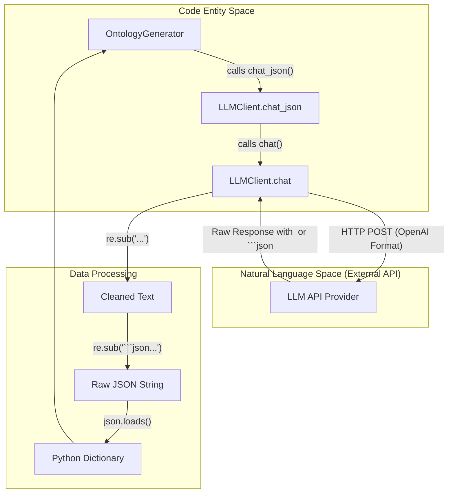
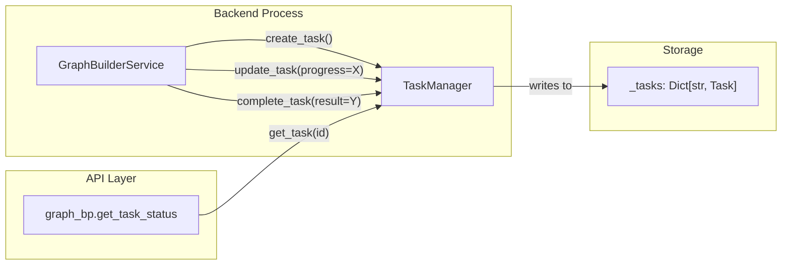

# Backend Utilities & Infrastructure

Relevant source files

The following files were used as context for generating this wiki page:

- [backend/app/api/__init__.py](https://github.com/666ghj/MiroFish/blob/1536a793/backend/app/api/__init__.py)
- [backend/app/config.py](https://github.com/666ghj/MiroFish/blob/1536a793/backend/app/config.py)
- [backend/app/models/task.py](https://github.com/666ghj/MiroFish/blob/1536a793/backend/app/models/task.py)
- [backend/app/services/ontology_generator.py](https://github.com/666ghj/MiroFish/blob/1536a793/backend/app/services/ontology_generator.py)
- [backend/app/utils/__init__.py](https://github.com/666ghj/MiroFish/blob/1536a793/backend/app/utils/__init__.py)
- [backend/app/utils/file_parser.py](https://github.com/666ghj/MiroFish/blob/1536a793/backend/app/utils/file_parser.py)
- [backend/app/utils/llm_client.py](https://github.com/666ghj/MiroFish/blob/1536a793/backend/app/utils/llm_client.py)
- [backend/app/utils/logger.py](https://github.com/666ghj/MiroFish/blob/1536a793/backend/app/utils/logger.py)
- [backend/app/utils/retry.py](https://github.com/666ghj/MiroFish/blob/1536a793/backend/app/utils/retry.py)
- [backend/requirements.txt](https://github.com/666ghj/MiroFish/blob/1536a793/backend/requirements.txt)
- [backend/run.py](https://github.com/666ghj/MiroFish/blob/1536a793/backend/run.py)
- [backend/uv.lock](https://github.com/666ghj/MiroFish/blob/1536a793/backend/uv.lock)

The MiroFish backend infrastructure provides foundational services for Large Language Model (LLM) interaction, asynchronous task tracking, robust file parsing, and system-wide logging. These utilities ensure that high-level simulation logic remains decoupled from specific API implementations and environment configurations.

## LLM Client Wrapper

The `LLMClient` class acts as a unified interface for interacting with OpenAI-compatible APIs. It handles authentication, model selection, and specific post-processing requirements for model outputs.

### Key Features
*   **Unified Interface**: Wraps the `openai` Python library to provide standard `chat` and `chat_json` methods [backend/app/utils/llm_client.py:14-33](https://github.com/666ghj/MiroFish/blob/1536a793/backend/app/utils/llm_client.py#L14-L33).
*   **Response Cleaning**: Automatically removes `<think>` tags (used by models like MiniMax M2.5 or DeepSeek) from the response content [backend/app/utils/llm_client.py:65-67](https://github.com/666ghj/MiroFish/blob/1536a793/backend/app/utils/llm_client.py#L65-L67).
*   **JSON Enforcement**: The `chat_json` method utilizes `response_format={"type": "json_object"}` and includes regex-based cleaning to strip Markdown code blocks before parsing [backend/app/utils/llm_client.py:70-102](https://github.com/666ghj/MiroFish/blob/1536a793/backend/app/utils/llm_client.py#L70-L102).
*   **Config Integration**: Automatically loads `LLM_API_KEY`, `LLM_BASE_URL`, and `LLM_MODEL_NAME` from the central `Config` class [backend/app/utils/llm_client.py:23-25](https://github.com/666ghj/MiroFish/blob/1536a793/backend/app/utils/llm_client.py#L23-L25).

### LLM Data Transformation Flow

The following diagram illustrates how the `LLMClient` bridges the gap between the application's request for structured data and the raw string output of an external API.

**Diagram: LLM Data Transformation**

Sources: [backend/app/utils/llm_client.py:14-102](https://github.com/666ghj/MiroFish/blob/1536a793/backend/app/utils/llm_client.py#L14-L102), [backend/app/services/ontology_generator.py:164-201](https://github.com/666ghj/MiroFish/blob/1536a793/backend/app/services/ontology_generator.py#L164-L201)

## Task & Status Management

MiroFish tracks long-running backend processes (such as knowledge graph construction) using a centralized task management system.

### TaskManager
The `TaskManager` is a thread-safe singleton used to track the lifecycle and progress of asynchronous operations [backend/app/models/task.py:54-71](https://github.com/666ghj/MiroFish/blob/1536a793/backend/app/models/task.py#L54-L71).
*   **Task Data**: Managed via the `Task` dataclass, which includes `task_id`, `status`, `progress` (0-100), and `progress_detail` [backend/app/models/task.py:22-35](https://github.com/666ghj/MiroFish/blob/1536a793/backend/app/models/task.py#L22-L35).
*   **Status Lifecycle**: Tasks transition through `PENDING`, `PROCESSING`, `COMPLETED`, and `FAILED` states [backend/app/models/task.py:14-19](https://github.com/666ghj/MiroFish/blob/1536a793/backend/app/models/task.py#L14-L19).
*   **Cleanup**: Includes a `cleanup_old_tasks` method to remove completed or failed tasks older than a specified threshold (default 24 hours) [backend/app/models/task.py:172-184](https://github.com/666ghj/MiroFish/blob/1536a793/backend/app/models/task.py#L172-L184).

**Diagram: Task Management Data Flow**

Sources: [backend/app/models/task.py:54-184](https://github.com/666ghj/MiroFish/blob/1536a793/backend/app/models/task.py#L54-L184), [backend/app/api/__init__.py:7-11](https://github.com/666ghj/MiroFish/blob/1536a793/backend/app/api/__init__.py#L7-L11)

## File Parsing & Text Processing

The `FileParser` utility provides a robust mechanism for extracting text from various document formats uploaded by users.

### Key Capabilities
*   **Multi-Format Support**: Supports `.pdf`, `.md`, `.markdown`, and `.txt` files [backend/app/utils/file_parser.py:64-66](https://github.com/666ghj/MiroFish/blob/1536a793/backend/app/utils/file_parser.py#L64-L66).
*   **PyMuPDF Integration**: Uses `fitz` (PyMuPDF) for high-quality text extraction from PDF documents [backend/app/utils/file_parser.py:97-111](https://github.com/666ghj/MiroFish/blob/1536a793/backend/app/utils/file_parser.py#L97-L111).
*   **Encoding Detection**: Implements a multi-level fallback strategy for text files:
    1.  Standard UTF-8 attempt [backend/app/utils/file_parser.py:29-33](https://github.com/666ghj/MiroFish/blob/1536a793/backend/app/utils/file_parser.py#L29-L33).
    2.  `charset_normalizer` detection [backend/app/utils/file_parser.py:35-43](https://github.com/666ghj/MiroFish/blob/1536a793/backend/app/utils/file_parser.py#L35-L43).
    3.  `chardet` detection [backend/app/utils/file_parser.py:45-52](https://github.com/666ghj/MiroFish/blob/1536a793/backend/app/utils/file_parser.py#L45-L52).
    4.  UTF-8 with `errors='replace'` as a final safety measure [backend/app/utils/file_parser.py:54-58](https://github.com/666ghj/MiroFish/blob/1536a793/backend/app/utils/file_parser.py#L54-L58).
*   **Text Chunking**: The `split_text_into_chunks` function divides long texts into manageable pieces for LLM processing, attempting to split at sentence boundaries (`。`, `！`, `\n\n`, etc.) to preserve semantic context [backend/app/utils/file_parser.py:147-188](https://github.com/666ghj/MiroFish/blob/1536a793/backend/app/utils/file_parser.py#L147-L188).

Sources: [backend/app/utils/file_parser.py:11-188](https://github.com/666ghj/MiroFish/blob/1536a793/backend/app/utils/file_parser.py#L11-L188)

## Infrastructure Utilities

### Centralized Logging
Configured in `backend/app/utils/logger.py`, the logging system ensures visibility into backend operations while preventing disk overflow.
*   **Rotating Logs**: Uses `RotatingFileHandler` to cap log files at 10MB, maintaining up to 5 backups [backend/app/utils/logger.py:68-73](https://github.com/666ghj/MiroFish/blob/1536a793/backend/app/utils/logger.py#L68-L73).
*   **Windows UTF-8 Support**: Explicitly reconfigures `sys.stdout` and `sys.stderr` to use UTF-8 on Windows platforms to prevent crashes when logging non-ASCII characters [backend/app/utils/logger.py:13-24](https://github.com/666ghj/MiroFish/blob/1536a793/backend/app/utils/logger.py#L13-L24).
*   **Dual Handlers**: A `detailed_formatter` is used for file logs (DEBUG level), while a `simple_formatter` is used for console output (INFO level) [backend/app/utils/logger.py:55-82](https://github.com/666ghj/MiroFish/blob/1536a793/backend/app/utils/logger.py#L55-L82).

### Retry Mechanism
The `retry_with_backoff` utility handles transient failures in external API calls (e.g., LLM rate limits or Zep Cloud timeouts).
*   **Exponential Backoff**: Implements a delay that increases by a `backoff_factor` after each failed attempt [backend/app/utils/retry.py:15-19](https://github.com/666ghj/MiroFish/blob/1536a793/backend/app/utils/retry.py#L15-L19).
*   **Jitter**: Adds random noise to retry timing to prevent synchronized "thundering herd" requests to external services [backend/app/utils/retry.py:60-62](https://github.com/666ghj/MiroFish/blob/1536a793/backend/app/utils/retry.py#L60-L62).
*   **Async Support**: Provides `retry_with_backoff_async` for use with `asyncio` based operations [backend/app/utils/retry.py:80-129](https://github.com/666ghj/MiroFish/blob/1536a793/backend/app/utils/retry.py#L80-L129).
*   **Batch Retries**: The `RetryableAPIClient` includes a `call_batch_with_retry` method to process lists of items with individual item retry logic [backend/app/utils/retry.py:195-234](https://github.com/666ghj/MiroFish/blob/1536a793/backend/app/utils/retry.py#L195-L234).

### Global Configuration
The `Config` class in `backend/app/config.py` centralizes all environment variables and system constants.
*   **Validation**: Includes a `validate()` method to ensure critical keys like `LLM_API_KEY` and `ZEP_API_KEY` are present at startup [backend/app/config.py:67-74](https://github.com/666ghj/MiroFish/blob/1536a793/backend/app/config.py#L67-L74).
*   **Path Management**: Dynamically resolves paths for `UPLOAD_FOLDER` and `OASIS_SIMULATION_DATA_DIR` relative to the backend root [backend/app/config.py:40-49](https://github.com/666ghj/MiroFish/blob/1536a793/backend/app/config.py#L40-L49).

Sources: [backend/app/utils/logger.py:1-108](https://github.com/666ghj/MiroFish/blob/1536a793/backend/app/utils/logger.py#L1-L108), [backend/app/utils/retry.py:1-234](https://github.com/666ghj/MiroFish/blob/1536a793/backend/app/utils/retry.py#L1-L234), [backend/app/config.py:20-74](https://github.com/666ghj/MiroFish/blob/1536a793/backend/app/config.py#L20-L74), [backend/run.py:25-34](https://github.com/666ghj/MiroFish/blob/1536a793/backend/run.py#L25-L34)
