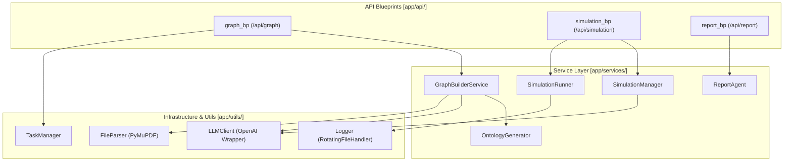

# Backend Services

Relevant source files

The following files were used as context for generating this wiki page:

- [backend/app/__init__.py](https://github.com/666ghj/MiroFish/blob/1536a793/backend/app/__init__.py)
- [backend/app/api/__init__.py](https://github.com/666ghj/MiroFish/blob/1536a793/backend/app/api/__init__.py)
- [backend/app/config.py](https://github.com/666ghj/MiroFish/blob/1536a793/backend/app/config.py)
- [backend/app/models/task.py](https://github.com/666ghj/MiroFish/blob/1536a793/backend/app/models/task.py)
- [backend/app/services/ontology_generator.py](https://github.com/666ghj/MiroFish/blob/1536a793/backend/app/services/ontology_generator.py)
- [backend/app/utils/logger.py](https://github.com/666ghj/MiroFish/blob/1536a793/backend/app/utils/logger.py)
- [backend/run.py](https://github.com/666ghj/MiroFish/blob/1536a793/backend/run.py)

The MiroFish backend is a Python Flask application that serves as the orchestration layer between the Vue.js frontend, the Zep Cloud GraphRAG memory, and the OASIS social simulation engine. It manages the complete lifecycle of a simulation—from document parsing and knowledge graph construction to parallel agent execution and automated report generation.

## System Architecture

The backend is structured into three primary API domains (Blueprints) supported by a service-oriented architecture. It uses a task-based approach for long-running processes (like graph building and simulation) to ensure the UI remains responsive.

### Backend Component Map
The following diagram maps high-level functional areas to specific code entities and files.

**Sources:** [backend/app/__init__.py:65-70](https://github.com/666ghj/MiroFish/blob/1536a793/backend/app/__init__.py#L65-L70), [backend/app/api/__init__.py:7-13](https://github.com/666ghj/MiroFish/blob/1536a793/backend/app/api/__init__.py#L7-L13), [backend/app/models/task.py:54-71](https://github.com/666ghj/MiroFish/blob/1536a793/backend/app/models/task.py#L54-L71), [backend/app/services/ontology_generator.py:158-165](https://github.com/666ghj/MiroFish/blob/1536a793/backend/app/services/ontology_generator.py#L158-L165)

## Core Subsystems

### 1. Knowledge Graph Construction (GraphRAG)
This subsystem handles the ingestion of raw documents (PDF, MD, TXT) and transforms them into a structured Knowledge Graph in Zep Cloud. It uses an `OntologyGenerator` to dynamically define entity types (e.g., `Professor`, `Company`) based on the simulation requirements, strictly enforcing a 10-entity schema including `Person` and `Organization` fallbacks.
*   **Key Components:** `FileParser`, `TextProcessor`, `OntologyGenerator`, `GraphBuilderService`.
*   **For details, see [Knowledge Graph Construction (GraphRAG)](3-1-knowledge-graph-construction-graphrag.md)**.

**Sources:** [backend/app/services/ontology_generator.py:77-85](https://github.com/666ghj/MiroFish/blob/1536a793/backend/app/services/ontology_generator.py#L77-L85), [backend/app/services/ontology_generator.py:167-183](https://github.com/666ghj/MiroFish/blob/1536a793/backend/app/services/ontology_generator.py#L167-L183), [backend/app/config.py:38-41](https://github.com/666ghj/MiroFish/blob/1536a793/backend/app/config.py#L38-L41)

### 2. Simulation Preparation & Management
Before a simulation starts, the system must extract relevant entities from the Knowledge Graph and generate detailed personas. The `OasisProfileGenerator` creates platform-specific profiles (Twitter/Reddit) using LLM-driven character synthesis, adhering to predefined action sets for each platform.
*   **Key Components:** `SimulationManager`, `OasisProfileGenerator`, `SimulationConfigGenerator`.
*   **For details, see [Simulation Preparation & Management](3-2-simulation-preparation-management.md)**.

**Sources:** [backend/app/config.py:51-59](https://github.com/666ghj/MiroFish/blob/1536a793/backend/app/config.py#L51-L59), [backend/app/config.py:48-49](https://github.com/666ghj/MiroFish/blob/1536a793/backend/app/config.py#L48-L49)

### 3. Simulation Execution Engine
The execution engine manages the lifecycle of parallel simulation processes. It uses a `SimulationRunner` to trigger platform-specific scripts. The backend ensures a clean lifecycle by registering cleanup functions to terminate orphan simulation processes upon server shutdown.
*   **Key Components:** `SimulationRunner`, `run_parallel_simulation.py`, `ParallelIPCHandler`.
*   **For details, see [Simulation Execution Engine](3-3-simulation-execution-engine.md)**.

**Sources:** [backend/app/services/simulation_runner.py:46-47](https://github.com/666ghj/MiroFish/blob/1536a793/backend/app/services/simulation_runner.py#L46-L47), [backend/app/__init__.py:45-47](https://github.com/666ghj/MiroFish/blob/1536a793/backend/app/__init__.py#L45-L47)

### 4. Zep Memory Integration
Zep Cloud acts as the long-term memory and GraphRAG provider. The integration supports hybrid search and retrieval, while utility modules handle cursor-based pagination for large graph datasets.
*   **Key Components:** `ZepGraphMemoryUpdater`, `ZepToolsService`, `zep_paging`.
*   **For details, see [Zep Memory Integration](3-4-zep-memory-integration.md)**.

**Sources:** [backend/app/config.py:35-36](https://github.com/666ghj/MiroFish/blob/1536a793/backend/app/config.py#L35-L36), [backend/app/config.py:72-73](https://github.com/666ghj/MiroFish/blob/1536a793/backend/app/config.py#L72-L73)

### 5. Report Agent & Analysis
Post-simulation, a ReACT-based `ReportAgent` analyzes the results. It uses specialized tools to query the Zep Knowledge Graph and generate a structured analytical report, with configurable reflection rounds and temperature.
*   **Key Components:** `ReportAgent`, `ReportManager`, `ZepToolsService`.
*   **For details, see [Report Agent & Analysis](3-5-report-agent-analysis.md)**.

**Sources:** [backend/app/config.py:61-64](https://github.com/666ghj/MiroFish/blob/1536a793/backend/app/config.py#L61-L64)

## Infrastructure & Configuration

### Application Entry Point
The backend is initialized via `create_app()` in `backend/app/__init__.py`. It configures CORS, registers the three main blueprints, and sets up request/response logging middleware.
*   **Entry Script:** `backend/run.py` [backend/run.py:25-45](https://github.com/666ghj/MiroFish/blob/1536a793/backend/run.py#L25-L45)
*   **Environment:** Configuration is managed via `backend/app/config.py`, which loads variables from a root `.env` file and validates critical keys like `LLM_API_KEY` and `ZEP_API_KEY`. [backend/app/config.py:9-14](https://github.com/666ghj/MiroFish/blob/1536a793/backend/app/config.py#L9-L14), [backend/app/config.py:67-74](https://github.com/666ghj/MiroFish/blob/1536a793/backend/app/config.py#L67-L74)

### Utility Modules
| Module | Responsibility | Key Code Entities |
| :--- | :--- | :--- |
| **Task Management** | Thread-safe tracking of long-running background tasks. | `TaskManager`, `Task`, `TaskStatus` |
| **Logging** | Provides rotating file logs and UTF-8 console output for Windows compatibility. | `setup_logger`, `RotatingFileHandler`, `_ensure_utf8_stdout` |
| **LLM Client** | Unified wrapper for OpenAI-compatible API calls with JSON mode support. | `LLMClient` |

**Sources:** [backend/app/models/task.py:14-35](https://github.com/666ghj/MiroFish/blob/1536a793/backend/app/models/task.py#L14-L35), [backend/app/utils/logger.py:13-24](https://github.com/666ghj/MiroFish/blob/1536a793/backend/app/utils/logger.py#L13-L24), [backend/app/utils/logger.py:66-75](https://github.com/666ghj/MiroFish/blob/1536a793/backend/app/utils/logger.py#L66-L75), [backend/run.py:8-16](https://github.com/666ghj/MiroFish/blob/1536a793/backend/run.py#L8-L16)

### Dependency Overview
The backend relies on several critical external frameworks:
*   **Flask**: Web framework for the API.
*   **Zep-Cloud**: GraphRAG and memory management.
*   **Camel-Oasis**: Social media simulation framework.
*   **PyMuPDF (fitz)**: High-performance PDF text extraction.

**Sources:** [backend/app/__init__.py:12-13](https://github.com/666ghj/MiroFish/blob/1536a793/backend/app/__init__.py#L12-L13), [backend/app/config.py:35-36](https://github.com/666ghj/MiroFish/blob/1536a793/backend/app/config.py#L35-L36), [backend/app/config.py:47-49](https://github.com/666ghj/MiroFish/blob/1536a793/backend/app/config.py#L47-L49)

---
**For details on specific subsystems, follow the links in the sections above.**
