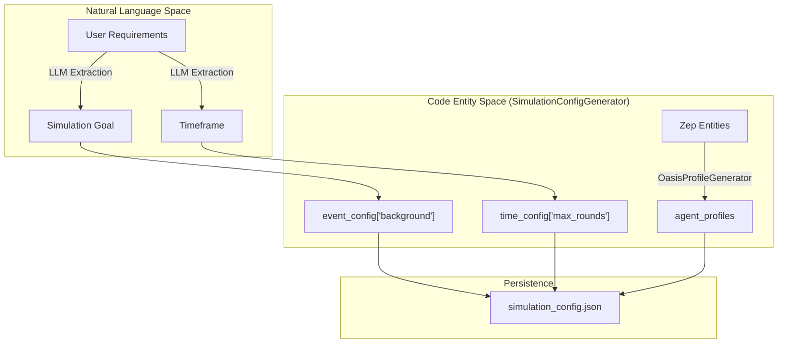
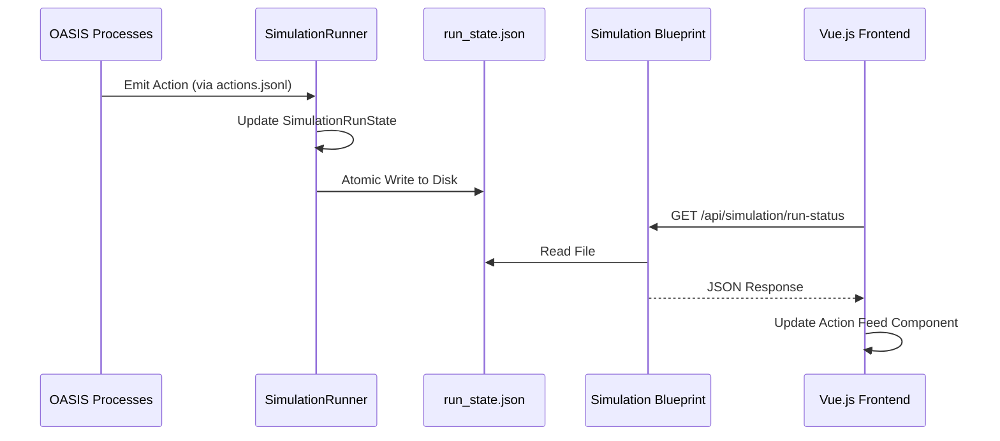

# Simulation State Files

<details>
<summary>Relevant source files</summary>

The following files were used as context for generating this wiki page:

- [backend/app/services/simulation_runner.py](https://github.com/666ghj/MiroFish/blob/1536a793/backend/app/services/simulation_runner.py)

</details>


This page details the JSON state files used throughout the MiroFish simulation lifecycle. These files serve as the primary persistence and inter-process communication (IPC) mechanism between the Flask backend, the OASIS simulation engine, and the Vue.js frontend.

## Overview of State Persistence

The simulation lifecycle is managed through three primary JSON files located within the simulation's specific directory in `uploads/simulations/{simulation_id}/`. These files track the transition from environment preparation to real-time execution and final reporting.

| File | Purpose | Primary Owner |
| :--- | :--- | :--- |
| `state.json` | Tracks preparation readiness (personas, profiles, configs). | `SimulationManager` |
| `simulation_config.json` | Full environment parameters and agent definitions. | `SimulationConfigGenerator` |
| `run_state.json` | Real-time runner progress, platform status, and action logs. | `SimulationRunner` |

---

## 1. Preparation State (`state.json`)

The `state.json` file tracks the "Step 2: Environment Setup" phase. It monitors the completion of sub-tasks required before a simulation can be launched.

### Data Structure
The state is managed by the `SimulationState` dataclass [backend/app/services/simulation_manager.py:34-60](https://github.com/666ghj/MiroFish/blob/1536a793/backend/app/services/simulation_manager.py#L34-L60).

```json
{
  "simulation_id": "sim_12345",
  "status": "preparing",
  "entities_extracted": true,
  "personas_generated": true,
  "twitter_profiles_generated": true,
  "reddit_profiles_generated": true,
  "config_generated": true,
  "updated_at": "2023-10-27T10:00:00.000Z",
  "error": null
}
```

### Lifecycle and Transitions
1.  **Initialization**: Created when a user enters the Environment Setup view via `SimulationManager.get_or_create_state` [backend/app/services/simulation_manager.py:108-129](https://github.com/666ghj/MiroFish/blob/1536a793/backend/app/services/simulation_manager.py#L108-L129).
2.  **Entity Extraction**: Marked `entities_extracted: true` after `ZepEntityReader` processes the graph [backend/app/services/simulation_manager.py:176-179](https://github.com/666ghj/MiroFish/blob/1536a793/backend/app/services/simulation_manager.py#L176-L179).
3.  **Profile Generation**: Updated as `OasisProfileGenerator` completes Twitter CSVs and Reddit JSONs [backend/app/services/simulation_manager.py:234-237](https://github.com/666ghj/MiroFish/blob/1536a793/backend/app/services/simulation_manager.py#L234-L237).
4.  **Ready**: Once `config_generated` is true, the frontend enables the "Start Simulation" button [frontend/src/views/SimulationView.vue:350-365](https://github.com/666ghj/MiroFish/blob/1536a793/frontend/src/views/SimulationView.vue#L350-L365).

**Sources:**
- [backend/app/services/simulation_manager.py:34-60](https://github.com/666ghj/MiroFish/blob/1536a793/backend/app/services/simulation_manager.py#L34-L60) (SimulationState definition)
- [backend/app/services/simulation_manager.py:108-129](https://github.com/666ghj/MiroFish/blob/1536a793/backend/app/services/simulation_manager.py#L108-L129) (State initialization)
- [frontend/src/views/SimulationView.vue:350-365](https://github.com/666ghj/MiroFish/blob/1536a793/frontend/src/views/SimulationView.vue#L350-L365) (Frontend state polling)

---

## 2. Environment Configuration (`simulation_config.json`)

This file contains the exhaustive parameters for the OASIS engine. It is generated by the `SimulationConfigGenerator` [backend/app/services/simulation_config_generator.py:16-18](https://github.com/666ghj/MiroFish/blob/1536a793/backend/app/services/simulation_config_generator.py#L16-L18).

### Key Components
-   **Time Config**: Defines `start_time`, `max_rounds`, and `hours_per_round` [backend/app/services/simulation_config_generator.py:38-45](https://github.com/666ghj/MiroFish/blob/1536a793/backend/app/services/simulation_config_generator.py#L38-L45).
-   **Event Config**: Background context and "Breaking News" triggers used to influence agent behavior.
-   **Platform Config**: Specific settings for Twitter and Reddit (e.g., bot counts, interaction probabilities).

### Mapping Natural Language to Config Entities
The following diagram illustrates how user requirements are transformed into the structured `simulation_config.json`.

**Title: Configuration Synthesis Flow**


**Sources:**
- [backend/app/services/simulation_config_generator.py:16-80](https://github.com/666ghj/MiroFish/blob/1536a793/backend/app/services/simulation_config_generator.py#L16-L80) (Config generation logic)
- [backend/app/services/oasis_profile_generator.py:25-50](https://github.com/666ghj/MiroFish/blob/1536a793/backend/app/services/oasis_profile_generator.py#L25-L50) (Profile generation logic)

---

## 3. Runtime State (`run_state.json`)

The `run_state.json` file is the heartbeat of the active simulation. It is updated frequently by the `SimulationRunner` as it parses the `actions.jsonl` stream from the OASIS sub-processes.

### Data Structure
The state is encapsulated in the `SimulationRunState` class [backend/app/services/simulation_runner.py:101-144](https://github.com/666ghj/MiroFish/blob/1536a793/backend/app/services/simulation_runner.py#L101-L144).

| Field | Type | Description |
| :--- | :--- | :--- |
| `runner_status` | `Enum` | `running`, `paused`, `completed`, or `failed`. |
| `twitter_running` | `bool` | Independent status of the Twitter sub-process. |
| `reddit_running` | `bool` | Independent status of the Reddit sub-process. |
| `recent_actions` | `List` | A rolling buffer of the last 50 `AgentAction` objects. |
| `progress_percent`| `float`| Calculated as `current_round / total_rounds`. |

### Data Flow: Engine to Frontend
The `SimulationRunner` monitors the simulation via an IPC (Inter-Process Communication) client.

**Title: Runtime State Update Loop**


### Key Functions
-   `SimulationRunner.get_run_state(sim_id)`: Loads the state from disk or memory [backend/app/services/simulation_runner.py:230-250](https://github.com/666ghj/MiroFish/blob/1536a793/backend/app/services/simulation_runner.py#L230-L250).
-   `SimulationRunState.add_action(action)`: Appends a new action and updates the `updated_at` timestamp [backend/app/services/simulation_runner.py:146-158](https://github.com/666ghj/MiroFish/blob/1536a793/backend/app/services/simulation_runner.py#L146-L158).
-   `SimulationRunState.to_dict()`: Serializes the state for the frontend API [backend/app/services/simulation_runner.py:159-185](https://github.com/666ghj/MiroFish/blob/1536a793/backend/app/services/simulation_runner.py#L159-L185).

**Sources:**
- [backend/app/services/simulation_runner.py:101-144](https://github.com/666ghj/MiroFish/blob/1536a793/backend/app/services/simulation_runner.py#L101-L144) (SimulationRunState definition)
- [backend/app/services/simulation_runner.py:146-158](https://github.com/666ghj/MiroFish/blob/1536a793/backend/app/services/simulation_runner.py#L146-L158) (Action update logic)
- [backend/app/api/simulation.py:240-265](https://github.com/666ghj/MiroFish/blob/1536a793/backend/app/api/simulation.py#L240-L265) (Run status endpoint)

---

## 4. File System Organization

All state files are stored in a hierarchical structure to support multi-project isolation.

```text
uploads/simulations/
└── {simulation_id}/
    ├── state.json              # Preparation progress
    ├── simulation_config.json  # Environment parameters
    ├── run_state.json          # Real-time execution status
    ├── actions.jsonl           # Raw action stream (input for run_state)
    ├── twitter/
    │   ├── twitter_profiles.csv
    │   └── oasis_twitter.db    # SQLite database for OASIS
    └── reddit/
        ├── reddit_profiles.json
        └── oasis_reddit.db     # SQLite database for OASIS
```

**Sources:**
- [backend/app/services/simulation_runner.py:207-210](https://github.com/666ghj/MiroFish/blob/1536a793/backend/app/services/simulation_runner.py#L207-L210) (Directory constants)
- [backend/app/services/simulation_manager.py:65-70](https://github.com/666ghj/MiroFish/blob/1536a793/backend/app/services/simulation_manager.py#L65-L70) (Base directory logic)
