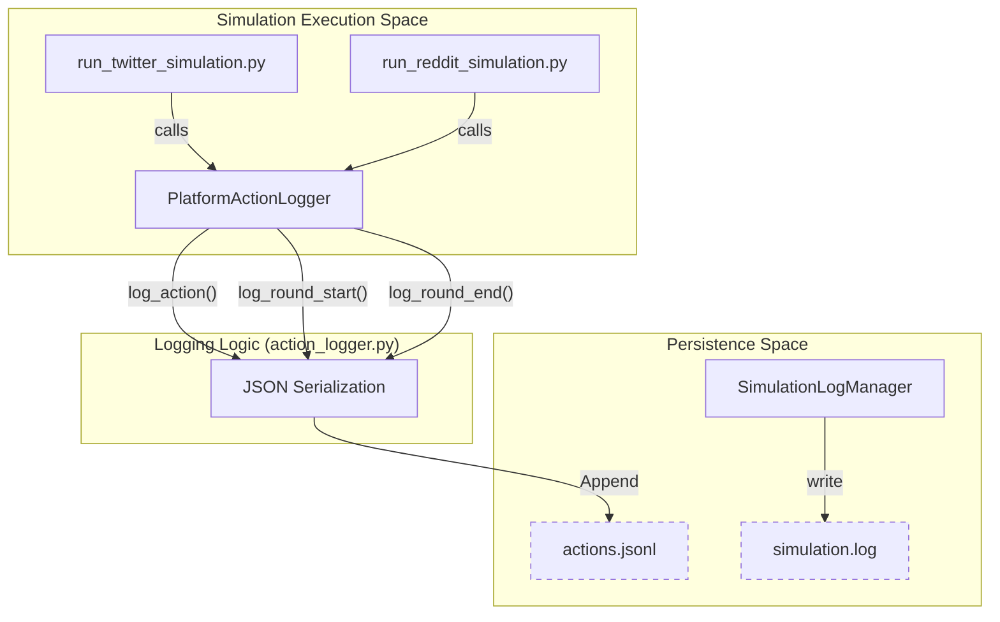
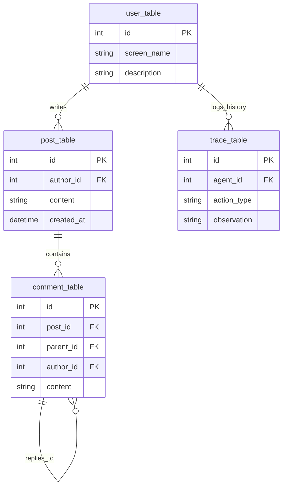
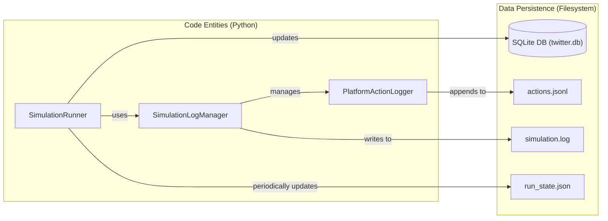

# Agent Profiles & Action Logs

<details>
<summary>Relevant source files</summary>

The following files were used as context for generating this wiki page:

- [backend/scripts/action_logger.py](https://github.com/666ghj/MiroFish/blob/1536a793/backend/scripts/action_logger.py)

</details>


This page documents the data formats and persistence layers used to represent agent identities and their behavioral history within the MiroFish simulation environment. It covers the transformation of LLM-generated personas into platform-specific profile formats, the real-time event stream logging, and the underlying SQLite schema used by the OASIS engine for state persistence.

## Agent Profile Formats

Agent profiles are generated by the `OasisProfileGenerator` and stored within the simulation project directory. Depending on the target platform (Twitter or Reddit), the engine requires specific schemas to initialize the agent's initial state, such as bio, follower counts, and historical metadata.

### Twitter Profiles (`twitter_profiles.csv`)
Twitter agents are defined in a CSV format compatible with the OASIS Twitter module. Each row represents a unique agent and their social graph context.

| Column | Description |
| :--- | :--- |
| `id` | Unique integer identifier for the agent. |
| `name` | Display name of the agent. |
| `screen_name` | The `@handle` used for mentions. |
| `description` | The agent's bio, derived from the generated persona. |
| `followers_count` | Initial number of followers. |
| `friends_count` | Initial number of accounts the agent follows. |
| `statuses_count` | Historical post count. |
| `created_at` | Account creation timestamp (ISO 8601). |

### Reddit Profiles (`reddit_profiles.json`)
Reddit agents utilize a JSON array of objects, reflecting the platform's nested structure (e.g., subreddit subscriptions).

```json
[
  {
    "id": 1,
    "name": "User_Name",
    "description": "Agent persona and interests...",
    "karma": 150,
    "created_utc": 1672531200,
    "subscribed_subreddits": ["technology", "science"]
  }
]
```

**Sources:**
- `backend/scripts/action_logger.py` [1-13]() (Directory structure context)
- `backend/services/simulation_manager.py` (Logic for generating these files)

---

## Action Event Stream (`actions.jsonl`)

The simulation records every agent decision and platform event into an append-only `actions.jsonl` file. This file serves as the primary data source for the frontend's "Simulation Execution UI" and the Zep Memory synchronization process.

### Data Flow: Action Logging
The following diagram illustrates how the `SimulationLogManager` captures events from the parallel execution scripts and persists them to the filesystem.

**Action Logging Architecture**

**Sources:**
- `backend/scripts/action_logger.py:22-37` (PlatformActionLogger definition)
- `backend/scripts/action_logger.py:119-139` (SimulationLogManager definition)

### Event Schema
Each line in `actions.jsonl` is a standalone JSON object. There are two primary categories of entries: **Action Entries** and **Lifecycle Entries**.

#### 1. Action Entry
Recorded when an agent performs a specific task (e.g., posting, replying).
| Field | Type | Description |
| :--- | :--- | :--- |
| `round` | int | The simulation hour/round number. |
| `timestamp` | string | ISO 8601 wall-clock time of the event. |
| `agent_id` | int | ID of the acting agent. |
| `agent_name` | string | Name of the acting agent. |
| `action_type` | string | The action performed (e.g., `post`, `reply`, `quote`). |
| `action_args` | dict | Parameters (e.g., `{"text": "Hello world", "reply_to": 123}`). |
| `success` | bool | Whether the action was accepted by the platform engine. |

#### 2. Lifecycle Entry
Recorded by the `SimulationRunner` to mark phase transitions.
| `event_type` | Description | Additional Fields |
| :--- | :--- | :--- |
| `simulation_start` | Simulation initialized. | `platform`, `total_rounds`, `agents_count` |
| `round_start` | A new round has begun. | `simulated_hour` |
| `round_end` | All agents finished the round. | `actions_count` |
| `simulation_end` | Simulation completed. | `total_actions` |

**Sources:**
- `backend/scripts/action_logger.py:43-66` (log_action implementation)
- `backend/scripts/action_logger.py:68-116` (Lifecycle logging methods)

---

## OASIS SQLite Database Schema

While `actions.jsonl` provides a human-readable stream, the OASIS engine maintains a relational SQLite database (typically `twitter.db` or `reddit.db`) to manage stateful interactions, such as thread hierarchies and user relationships.

### Core Tables
The engine relies on four primary tables to maintain the simulated world state.

**Entity Relationship Mapping**


### Implementation Details
- **`post` / `comment` Tables**: Store the actual text generated by LLMs. The `comment` table uses a `parent_id` to support recursive threading in Reddit or reply chains in Twitter.
- **`user` Table**: Mirror of the agent profiles, updated dynamically if the simulation allows for profile changes.
- **`trace` Table**: Internal OASIS log that stores the "Thought" process of the agent (the reasoning before the action), which is distinct from the public `action_args` found in `actions.jsonl`.

**Sources:**
- `backend/scripts/action_logger.py:1-13` (Context on simulation directory structure)
- `backend/services/simulation_runner.py` (Usage of database files during execution)

---

## Data Flow: From Execution to Persistence

The following diagram bridges the gap between the Python execution logic and the physical files on disk.

**Code Entity to File System Mapping**


**Sources:**
- `backend/scripts/action_logger.py:125-139` (SimulationLogManager initialization)
- `backend/scripts/action_logger.py:25-37` (PlatformActionLogger path construction)
- `backend/scripts/action_logger.py:142-156` (Main logger file handler setup)
